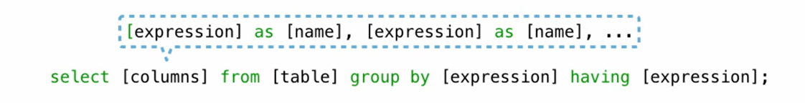
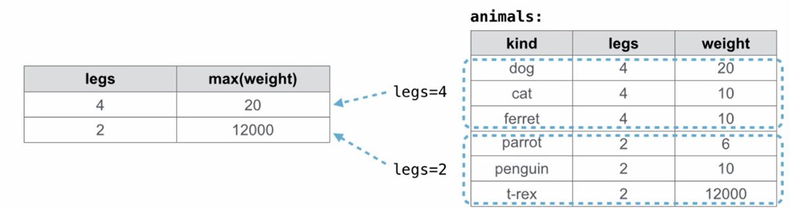
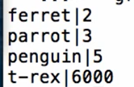

```SQL
create table animals as
	select "dog" as kind, 4 as legs, 20 as weight unioun
	select "cat"         ,4        ,10           unioun
	select "ferret"      ,4        ,10            unioun
	select "parrot"      ,2         ,6           unioun
	select "penguin"     ,2         ,10           unioun
	select "t-rex"       ,2         ,12000        unioun
```
- can find a spcific object
	```SQL
	select max(legs) from animals;  # forms one row and one column( called max(legs))
	select max(legs),min(weight) from animals; # two rows and one columns
	select min(legs), max(weight) from animals where kind!="T-rex";# 除去极端值
	select max(weight), kind from animals; # 在用max的是否 返回的其实是整个row  还可以挑出它对应的一个值
	```
- overall characters
```SQL
select avg(legs) from animals;       

select count(*) from animals; # 数列的数量
select count(distinct weight) from animals; # 只数 不同值的数量
select sum(distinct weight) from animals; #只把不同值 累加起来
```

**Groups**
rows in a table can be grouped and agrregation is performed on each group

The number for groups is the number of unique values of an expression

`group by`
e.g:
`select legs, max(weight) from animals group by legs`

`select max(kind), weight/legs from animals group by weight/legs;`



`having`: filters the set of group tat are aggregated
`select weight/legs, count(*) from animals group by weight/legs having count(*)>1`
 `group by`+聚合函数
 e.g group by ...   having sum(..)>...
 在每一个组里面都用一次sum 
 
