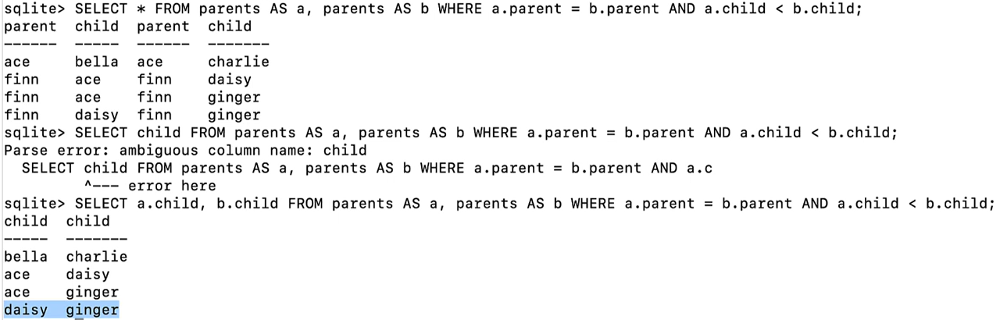
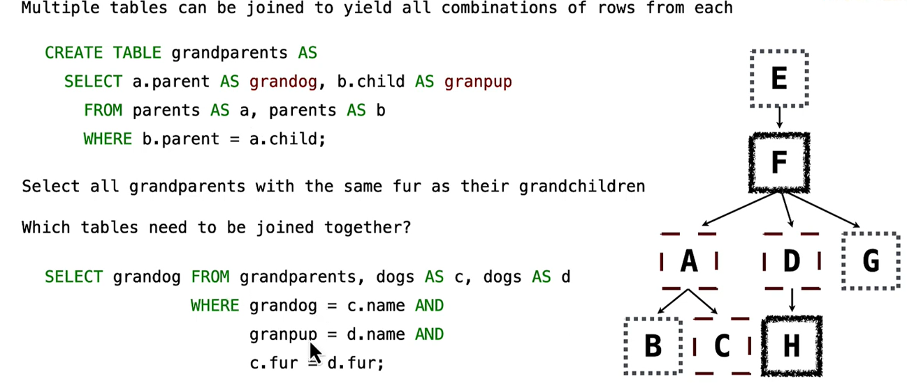

Dot expressions: distinguish whichn column
Aliases: ditinguish tables `AS`( same as giving new names to a column)
often used together: when we need to use a same table twice

often we need to combine two same tables
```SQL
CREATE TABLE siblings AS

  SELECT a.child AS first, b.child AS second 
  From parents AS a, parents AS b 
  WHERE a.parent=b.parent and a.child<b.child; # remove duplicates
```


find grandparents
```SQL
SELECT a.parent,b.chile FROM parents AS a, parents AS b WHERE a.child=b.parent;
```

**Join Multiple Tables**

WHERE 后面两行： 在毛里找granddog 和grandpup的名字！！！
