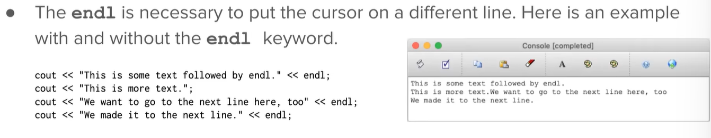

```cpp
//  comments


#include <iostream>
#include "console.h" // a header file, equivilant to 'implort' in python
```


**counsole output**: 控制台



==**All programming statements must end in a ;**==