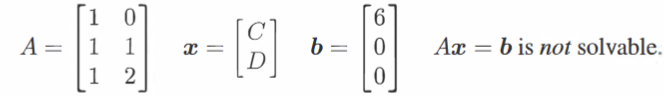
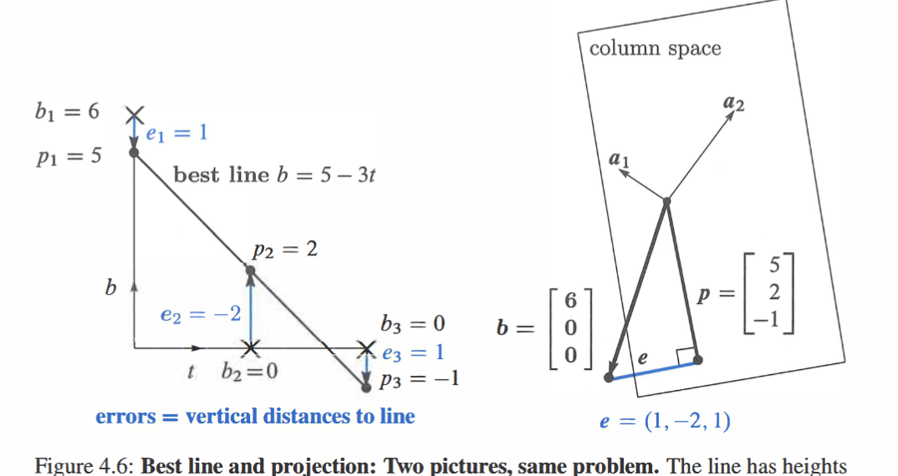

for $Ax=b$:  error$=e=b-Ax$
e.g: find the closet line to points $(0,6)(1,0)(2,0)$
if a line $b=C+Dt$ all goes through the three points
$C+{D}\cdot{0}=6$
$C+{D}\cdot{1}=0$
$C+{D}\cdot{2}=0$
$\iff$ 
but we can find the minimal of $(C+{D}\cdot{0}-6)^{2}+(C+{D}\cdot{1})^{2}+(C+{D}\cdot{2})^{2}$
by finding the min of $(||Ax-b||)^{2}$
$Ax$: the column space  $\implies$  look for a point in the space colsest to $b$ $\implies$ the point is the projection of $b$ [4.2 Projections](../Sources/数学/MIT%2018.06%20Linear%20Algebra/notes/4.2%20Projections.md)

**The closest solution  is $\hat{x}=(A^{T}A)^{-1}A^{T}b$
- [[By geometry]]
- [[By algebra]]
- [[By calculus]]

two persepctives of the example

