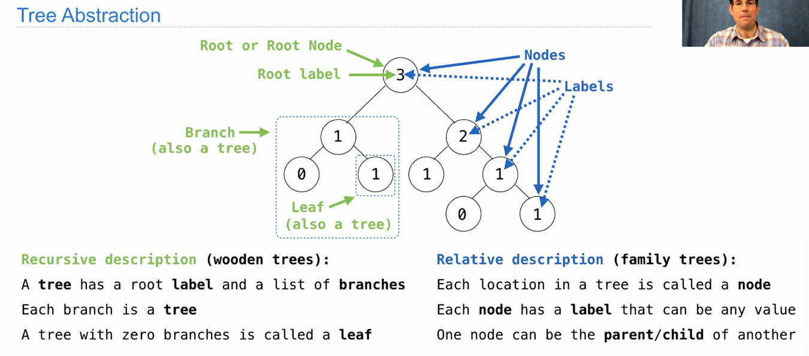

The data abstraction for a tree consists of the constructor tree and the selectors label and branches. We begin with a simplified version.
```python
def tree(root_label, branches=[]):
        for branch in branches:
            assert is_tree(branch), 'branches must be trees'
        return [root_label] + list(branches)
def label(tree):
        return tree[0]

def branches(tree):
        return tree[1:]
```
A tree is well-formed only if it has a root label and all branches are also trees. The is_tree function is applied in the tree constructor to verify that all branches are well-formed.
```python
def is_tree(tree):
        if type(tree) != list or len(tree) < 1:
            return False
        for branch in branches(tree):
            if not is_tree(branch):
                return False
        return True
```
The is_leaf function checks whether or not a tree has branches.
```python
def is_leaf(tree):
        return not branches(tree)
```


the  form of a tree:
