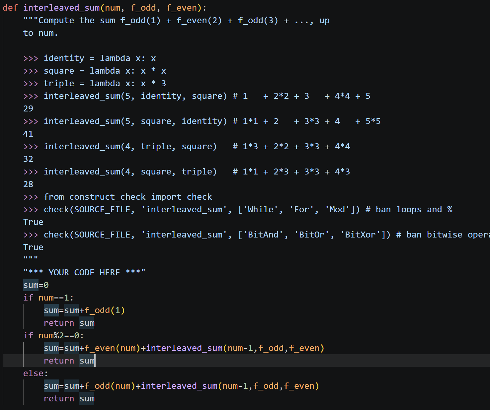

[problem](https://cs61a.org/hw/hw03/#:~:text=%E2%9C%82%EF%B8%8F-,Q3%3A%20Interleaved%20Sum,-Write%20a%20function)
### M1 use %
>[!code]-
>


==**M2 most abstract method==
```python
  

def interleaved_sum(num, f_odd, f_even):

    def sum_odd(k):

        if k==num:

            return f_odd(k)

        elif k>num:

            return 0

        else:

            return f_odd(k)+sum_even(k+1)

    def sum_even(k):

        if k==num:

            return f_even(k)

        elif k>num:

            return 0

        else:

            return f_even(k)+sum_odd(k+1)

    return sum_odd(1)  #从1开始不一定要表达成i=1....i=i+1的形式！！
```