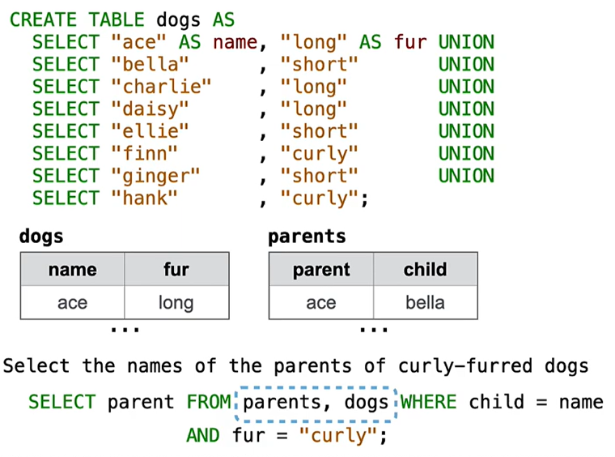
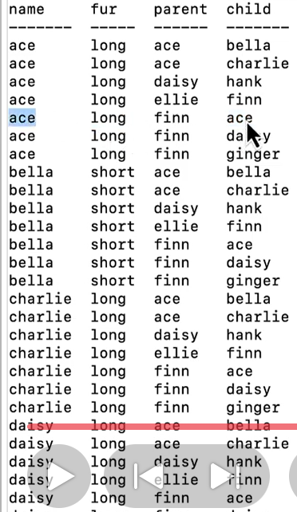

`A & B` are joined by a comma  (or `JOIN`) to form all combos of a row from A & a row from B

`child=name`: the colomns an be in both sides of the 判断


it combines the rows together
v.s `UNION` : combines columns together
e.g:
```SQL
SELECT * FROM dogs,parents
```

v.s 
result:

 it extends into four columns & the number fo rows:$row(dogs)\times row(parents)$  the forst row matches with the rows of others in the next time
 $\implies$  we need to filter the resullts to make the imformation effective
 ```SQL
 SELECT * FROM dogs,parents WHERE name=child
 SELECT * FROM dogs,parents WhERE name=parents
  SELECT * FROM dogs,parents WHERE name=child AND fur ="curly"
 ```
 
or: **explist syntax**
```SQL
FROM ___ JOIN __ ON __  # mathing conditions after ON

SELECT parent FROM parents JOIN dogs ON child=name WHERE fur="curly"
```
``


