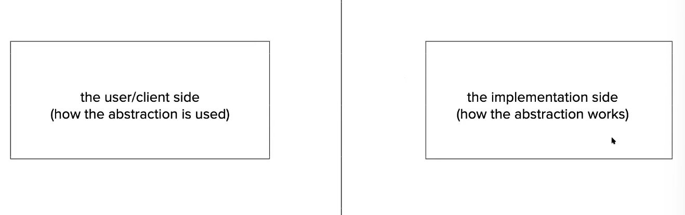
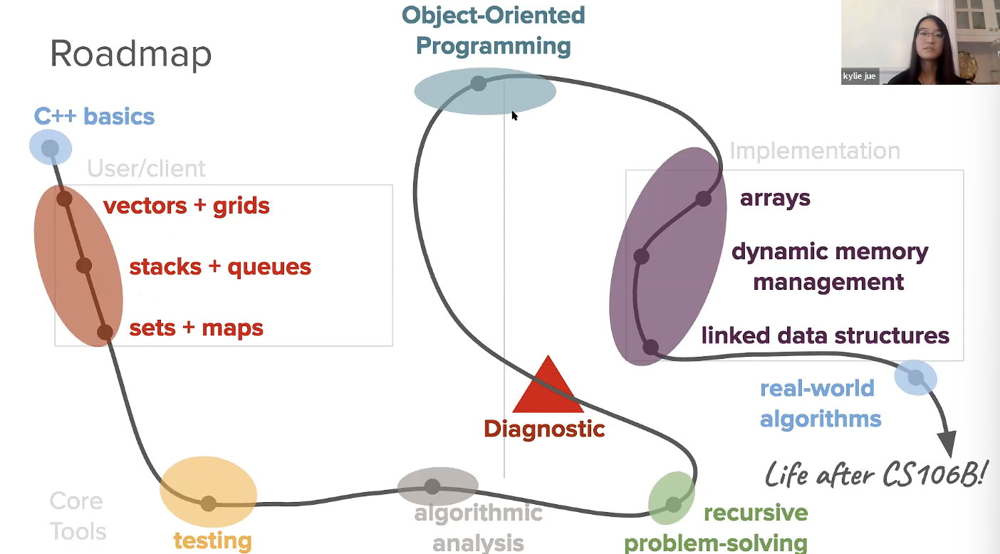

---
tags:
  - "#coding/CS106B"
created: 2026-07-09
---
**Why CS106B?**
coding: technical skill
computer science: academic disipilne
computational thinking: problem solving process
 
not teaching the specifics of the C++ language

gives u computation thingking skills through C++
**What is an abstraction**
we do not actally knows how it works,but we use it
focus on the design/use of abstraction

**Why C++**
