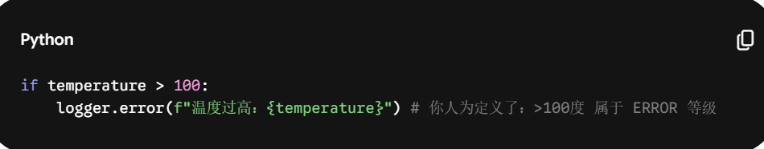

## Log=日志
three types: 1.content log(e.g in python: import log) 2.complier log(common in C++, not in python);3. ==-v flag to show log== 

complier log: used to find grammar mistakes(but can not find for python; python mistakes is in the terminal)

content log: for finding logic bugs!
[[C++ vs python complile and logs]]

-v log: tell the problem when u r using a tool or an environment(the problem is not in coding! like the previous two!)    it is just a flag!! in linux [Arguements](../Sources/Coding/Missing%20Semestar/L2%20Command-Line%20environment.md#Arguements)
https://missing.csail.mit.edu/2026/debugging-profiling/#:~:text=Third%2Dparty%20logs,variables%20or%20configuration.

for the top two:
### 1. 日志的定义与本质：程序的“黑匣子”

日志（Log）是系统、软件或硬件自动生成的、**按时间顺序排列**的记录文件。

- **航海起源**：词源来自 17 世纪航海中用来测量船速的木头（Chip log），后来演变为记录航行数据的“日志簿”（Logbook）。
    
- **计算机定义**：它是程序运行过程中的“黑匣子”，记录了状态转移、错误发生及关键操作的**数字足迹**。
    
- **与 Print 的区别**：`print` 是临时的、非结构化的“草稿”；而 `logging` 是专业的、可过滤、可重定向且带上下文的“正式记录”。

### 2. 日志的划分：严重等级（Severity Levels）

为了在海量信息中快速定位问题，日志被划分为不同的严重等级，这不仅是“分类”，更是“过滤器”：

- **DEBUG**：最细碎的调试信息，仅在开发阶段关注变量的具体数值。
    
- **INFO**：描述程序的正常生命周期，如“系统启动成功”、“用户已登录”。
    
- **WARNING**：潜在的问题，虽不影响当前运行，但需要警惕（如内存占用过高）。
    
- **ERROR / FATAL**：程序发生了严重的错误或崩溃，必须立即处理。

   [[Log Level and picking output]]

### 3. 日志的记录单位与判断逻辑

日志的最小单位被称为 **Log Entry（日志条目）** 或 **Log Event（日志事件）**。

- **判断动作的标准**：
    
    - **状态改变**：当程序从一个状态转移到另一个状态时。
        
    - **边界交互**：当程序与外部（数据库、传感器、网络）进行数据交换时。
        
    - **异常捕获**：当代码进入 `if-else` 的错误分支或捕获到 `Exception` 时。

- e.g python中对log 的人为划分

`logger.error: 定义出触发时的level为ERROR`

- **四要素模型**：一条合格的日志必须包含 **时间戳**（何时）、**严重等级**（多重要）、**上下文**（在哪儿）以及 **有效载荷**（发生了什么）;the log can choose out wht to print from the four elements。

    
    > **数学表达**：
    > 
    > $$Entry = \{Timestamp, Level, S_{old} \rightarrow S_{new}, ErrorCodecontent\}$$