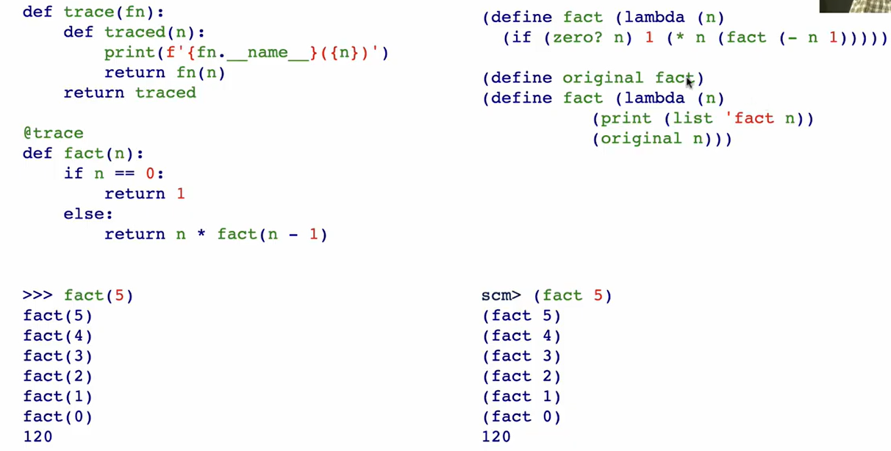

A macro is an operation performed on the source code of a program before evaluation；
A macro's goal is to write out code and then evalueate it!
 Scheme： has a `define-macro` spcial form that defines a source code transformation
 e.g
 ```scheme
(define-macro (twice expr)
	(list 'begin expr expr))


 ```

different from defing a function: the expression gets dupicated before it is evaluated; it can also be achieved by function defination but needs a lot of quotations
```scheme
scm> (define-macro (twice expr) (list 'begin expr expr)) 
twice 
scm> (twice (print 2)) 
2 
2 
scm> (define-macro (twice expr) (list begin expr expr))   # begin is not quoted! it is regareded as 变量
twice 
scm> (twice (print 2)) 
Traceback (most recent call last): 0 (twice (print 2)) 1 (list begin expr expr) 2 
begin Error: unknown identifier: begin
```


process:


#### Create a for macro:
evaluates an expression for each vaue in a sequence
```scheme
(define (map fn vals)
	(if (null? vals)
	( )
	(cons (fn (car vals))
		(map fn (cdr vals))
	)))
	
	
(define-macro (for sym vals expr)
	list 'map(list 'lambda(list sym) expr) vals)  # The list outside is to write the () outside the map!
	
scm> (for x '(2 3 4 5) (* x x))
```

### Tracing Recursive Calls

the problem of scheme: the `fact` and `original` are not independent!
 also  the fact function is changed
 ```scheme
 (define fact
  (lambda (n)
    (if (zero? n)
        1
        (* n (fact (- n 1))))))
        


(define-macro (trace expr)   ; (trace (fact 5))
  (define operator (car expr))   ; fact
  
  `(begin     ; the code generated by macro is `(begin .....)
     (define original ,operator) ; original=fact
     (define ,operator   ; ,operator==fact=facr_trace_version
       (lambda (n)
         (print (list (quote ,operator) n))
         (original n)))
     (define result ,expr)  ; result=,expr=(fact 5)  此时fact指向的是facr_trace_version
     (define ,operator original)  ; 将fact指向原先的fact
     result)) ; 执行result:facr_trace_version
     
 ```
 **没有修改阶乘函数的源码**，而是利用宏：

1. 保存原来的函数；
2. 临时用一个“包装器（wrapper）”替换函数，在调用前打印参数，再调用原函数；
3. 执行目标表达式；
4. 恢复原来的函数。

这种“**包装（wrap）→执行→恢复**”