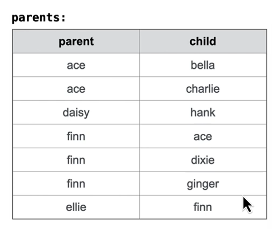

Thre result of it is displayed to the user, but not stored
`CREATE TABLE` stores it and gives it a name
`CREATE TABLE [name] AS [select statement]`

```SQL
CREATE TABLE parents AS
  SELECT "daisy" AS parent, "hank" AS child UNION
  SELECT "ace"          , "bella"         UNION
  SELECT "ace"          , "charlie"       UNION
  SELECT "finn"         , "ace"           UNION
  SELECT "finn"         , "dixie"         UNION
  SELECT "finn"         , "ginger"        UNION
  SELECT "ellie"        , "finn";
```


