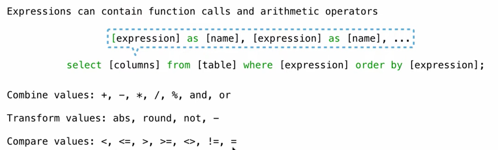
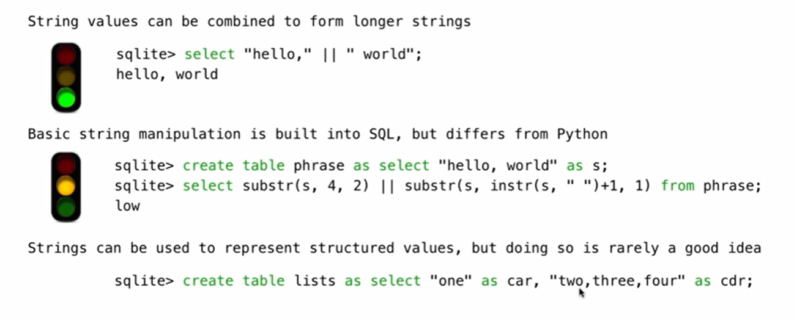
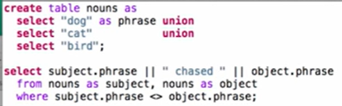

calculation can be achived in sql


/ sum
```SQL
-- 创建城市表
CREATE TABLE cities AS
  SELECT 38 AS latitude, 122 AS longitude, "Berkeley" AS name UNION
  SELECT 42, 71, "Cambridge" UNION
  SELECT 45, 93, "Minneapolis" UNION
  SELECT 33, 117, "San Diego" UNION
  SELECT 26, 80, "Miami" UNION
  SELECT 90, 0, "North Pole";

-- 自连接查询：计算距离并按距离排序
CREATE TABLE distances AS
  SELECT a.name AS first, b.name AS second,
         60 * (b.latitude - a.latitude) AS distance
  FROM cities AS a, cities AS b;

-- 运行结果查询
SELECT second FROM distances 
WHERE first = "Minneapolis" 
ORDER BY distance;  # 按照距离排序
```


#### String Expressions
 
 `||` combine strings together
 
 
 