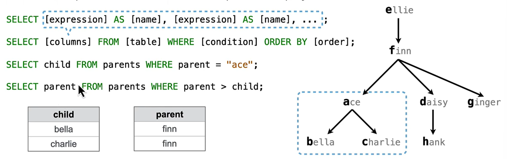

dont need `UNION` any more

A `SELECT` statment can specify an input table using a `FROM` clause
it selects from the columns of the `FROM` table

the subset of rows of the input table can be selected by using a `WHERE` clause

An ordering over the remaining rows can be declared using an `ORDER BY` clause

the `SELECT [columns]`: can be some operations of the columns of the original tabel