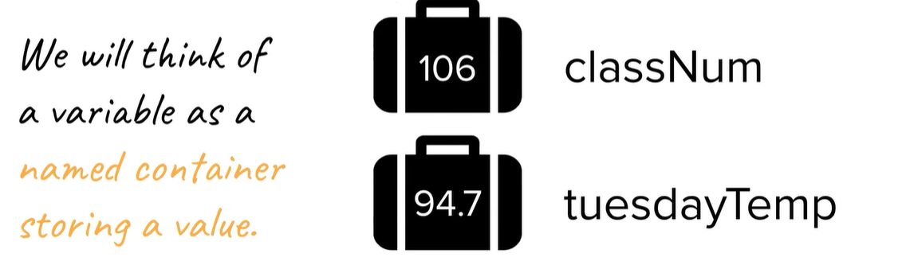

variables: a way for code to store information by associating a value with a name

C++ use `classNum` instead of `class_Num`

**Type**
describes the representation of the variable
e.g:
`int` /`long`
`double`: floating point numbers
`string`
`char` indevidual parts of string

==must explicitly define its type when creating a variable, and variable can not change its type==
