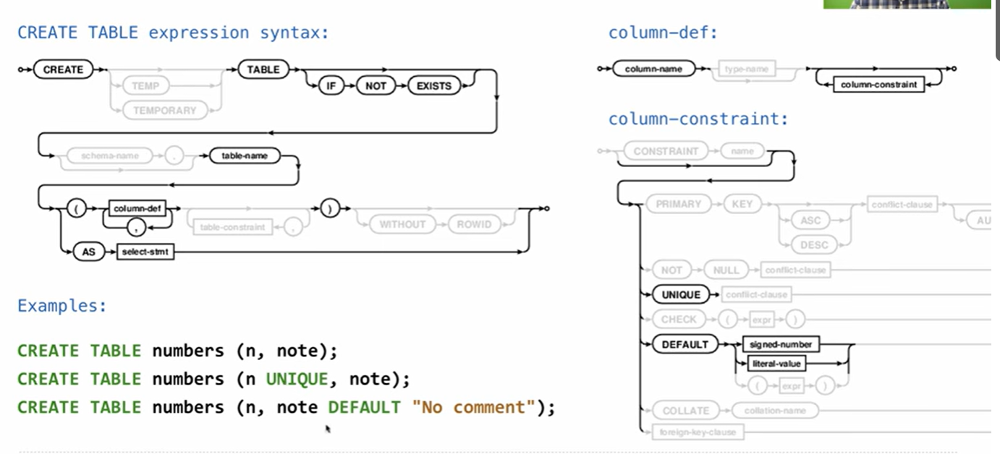
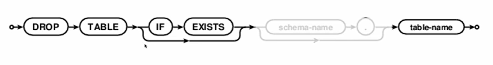

**Create table**
create an empty table
besides `CREATE TABLE...AS..`
there is another way of creating tables:

all creates two columns, `UNIQUE`: ensures no equal values
DEFALUT: means the defult value in that column
`CREATE TABLE [table-name]([column-def column constraint(,column-def column constraint)])`

**Drop Table**

deletes a table
e.g:
`drop table if exists [table name]`

