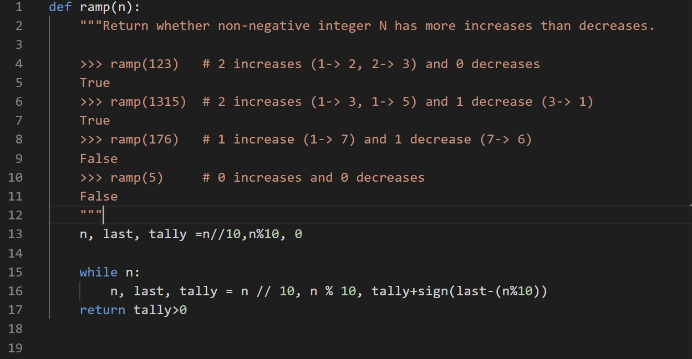
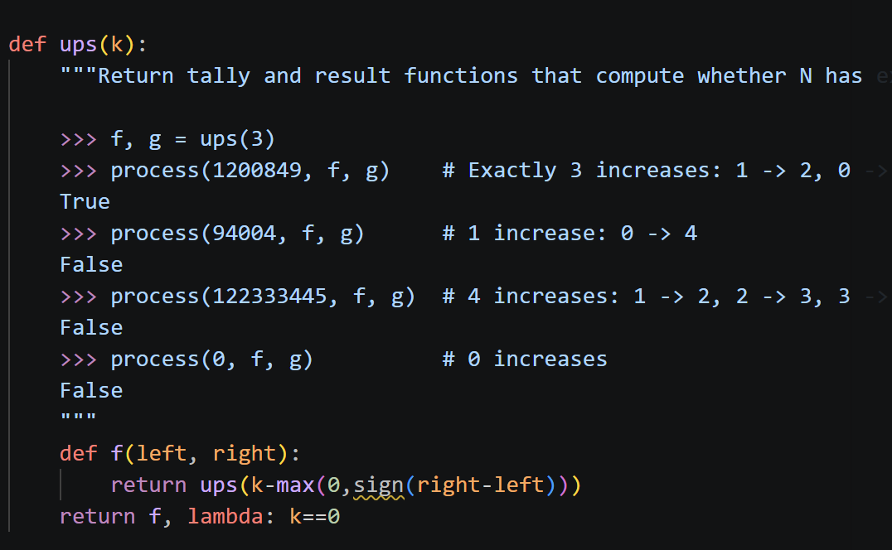

### Q5: Ups and Downs A

**Definition.** Two adjacent digits in a non-negative integer are an _increase_ if the left digit is smaller than the right digit, and a _decrease_ if the left digit is larger than the right digit.

For example, 61127 has 2 increases (1 → 2 and 2 → 7) and 1 decrease (6 → 1).

You may use the sign function defined below in all parts of this question.

```
def sign(x):
    if x > 0:
        return 1
    elif x < 0:
        return- 1
    else:
        return 0
```

Implement `ramp`, which takes a non-negative integer `n` and returns whether it has more _increases_ than _decreases_ when reading its digits from left to right (see the definition above).

**Solution**



### Q6: Ups and Downs C

The process function below uses `tally` and `result` functions to analyze all adjacent pairs of digits in a non-negative integer `n`. A `tally` function is called on each pair of adjacent digits.

```
def process(n, tally, result):
    """Process all pairs of adjacent digits in N using functions TALLY and RESULT.
    """ 

    while n >= 10:
        tally, result = tally(n % 100 // 10, n % 10)
        n = n // 10
    return result()
```

Implement `ups`, which returns two functions that can be passed as `tally` and `result` arguments to `process`, so that `process` computes whether a non-negative integer `n` has exactly `k` _increases_.

**Hint:** You can use `sign` from the previous page and the built-in `max` and `min` functions.




===`return ups(k-max(0,sign(right-left)))`=== iteration: 3 reqired$\implies$ 2reqired$\implies$ 1$\implies$ 0
关键思维！！！
