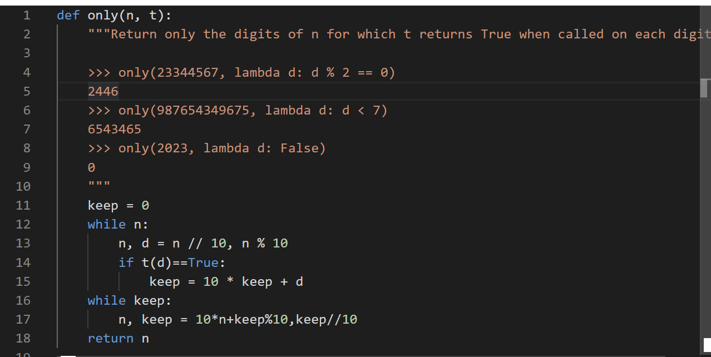

### Q7: Choose Wisely A

**Definition**: A _digit test_ is a function that takes a non-negative integer less than 10 and returns `True` or `False`.

Implement `only` which takes a non-negative integer `n` and a _digit test_ `t`. It returns a non-negative integer containing only the digits of `n` for which `t` returns `True` when called on each of those digits. The digits should appear in the same order as they did in `n`. The number 0 has no digits. **You may not use `str` or `repr` or `[` or `]` or `for`.**

两个while：第一次算完是次序颠倒版本的
so, 颠倒两次就可以倒回来
