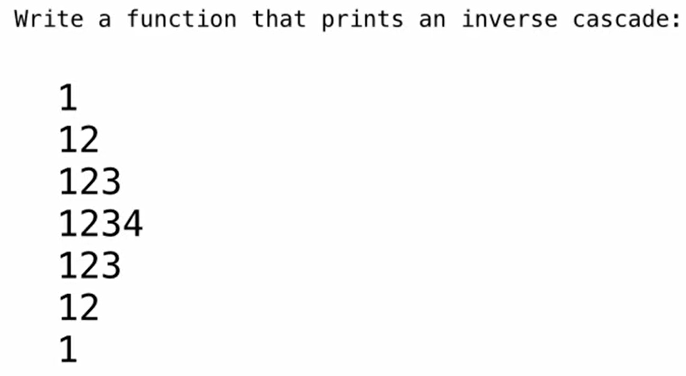

M1:
```python
def number(n):
    """计算数字的位数"""
    if n < 10:
        return 1
    else:
        return number(n // 10) + 1

def inv_print(n):
    """原代码修复版"""
    m = number(n)  # 算出身高（位数）
    
    # 定义辅助函数：chop 代表当前需要“砍掉”右边几位数字
    def helper(n, chop):
        if chop == 0:
            # 刹车点（Base Case）：一刀都不用砍了，说明到了最中间，打印本体！
            print(n)
        else:
            # 1. 打印上半部分：砍掉右边的 chop 位
            print(n // pow(10, chop))
            
            # 2. 递归：往中间走，少砍一位
            helper(n, chop - 1)
            
            # 3. 打印下半部分：从中间退出来时，再次打印
            print(n // pow(10, chop))
            
    # 如果数字是 4 位数（比如 1234），第一次切分需要砍掉 3 位（除以 1000 得到 1）
    helper(n, m - 1)
```

M2
```python
def inverse_cascade(n):
	grow(n)
	print(n)
	shrink(n)
def f_then_g(f,g,n):
	if n:
		f(n)
		g(n)
grow=lambda n: f_then_g(grow,print,n//10)
shrink=lambda n: f_then_g(print,shrink,n//10)
inverse_cascade(1234)
```
