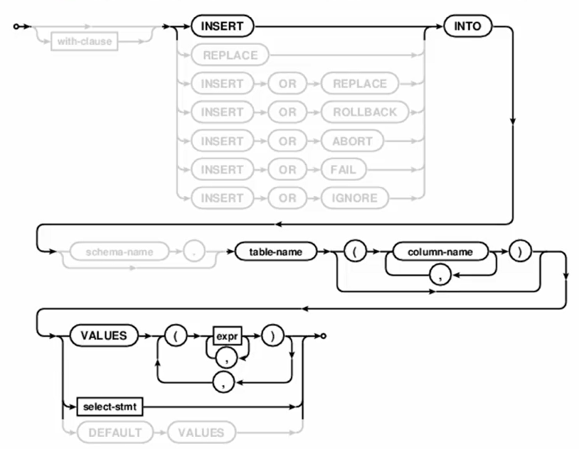
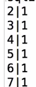
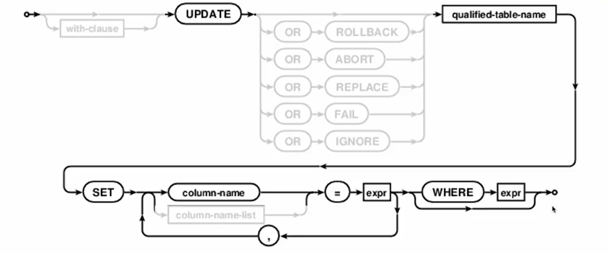
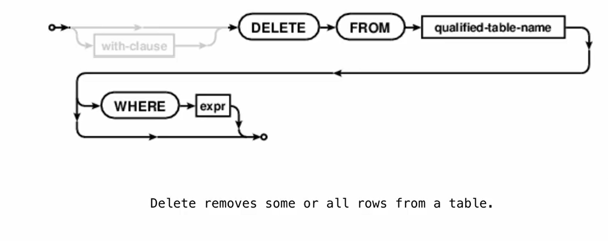

 **Insert**
 
 Insert into one column:
 `INSERT INTO t(column) VALUES (value)`;   the others become default values
 Insert into both columns:
 `INSERT INTO t VALUES (value0,value1)`
 e.g:
 ```SQL
 create table primes(n UNIQUE, prime DEFAULT 1); # create empty list
 INSERT INTO prime VALUES (2,1),(3,1);
 
 INSERT INTO primes(n) VALUES (4),(5),(6),(7);
 ```
 
 **Update**
 modify the values 
 
 
 e.g
 `UPDATE primes SET prime=0 WHERE n>2 AND n%2=0;`

**Delete**
remuve some rows  but does not delete the table itself

