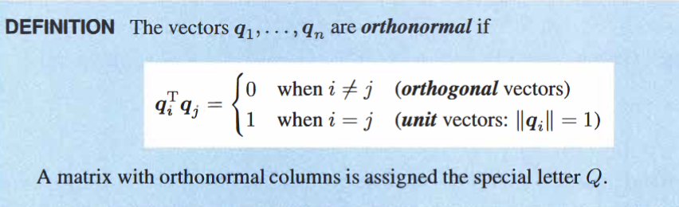
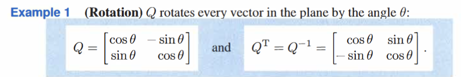
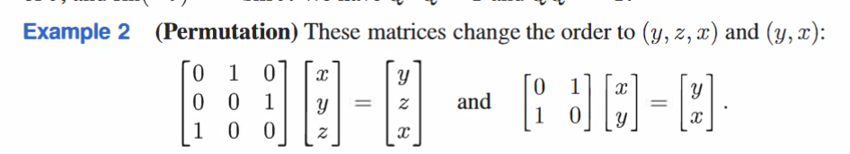
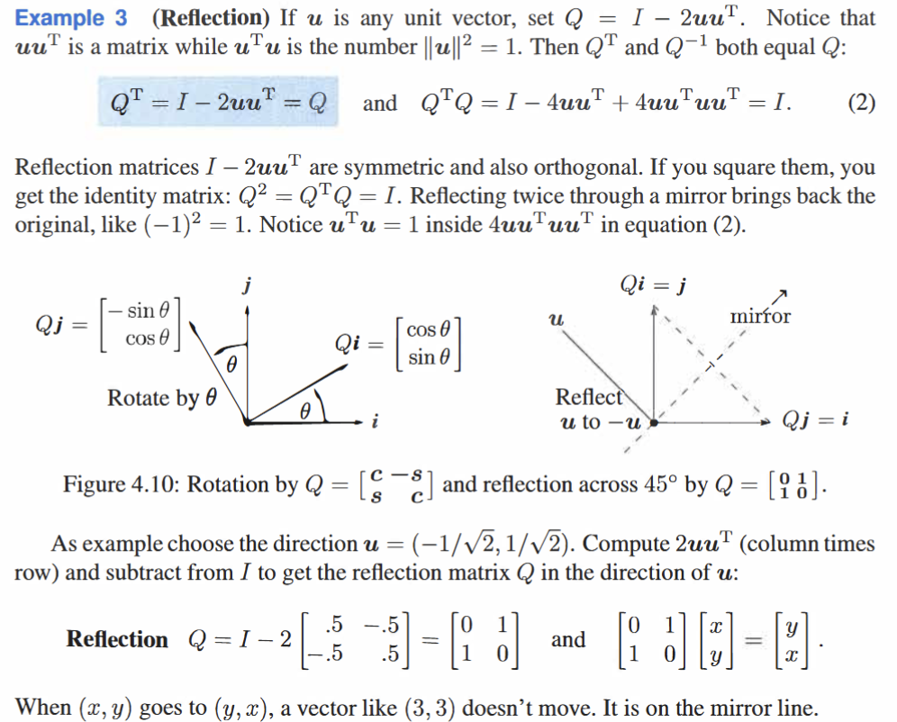
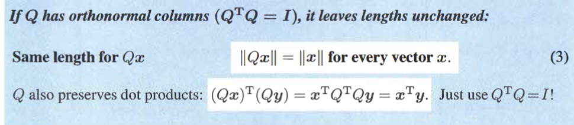

orthogonal: $q_{i}^{T}q_{j}=0$
when $q$ are unit vectors
the basis formed by these vectors are orthonormal

$Q^{T}Q=I$  when $Q$ is square $\implies$ $Q^{T}=Q^{-1}$; $QQ^{T}=I$

when $q$ are not unit vectors: 
$Q^{T}Q$ is diagnal matrix

e.g:

**Geographically, rotation/permutation/reflection do not change the length of the original vector**
proof in Linear Algebra:

