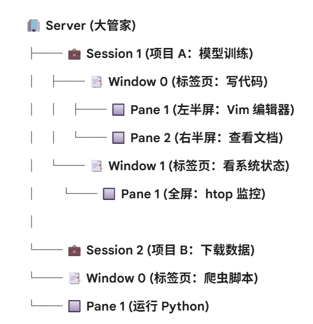
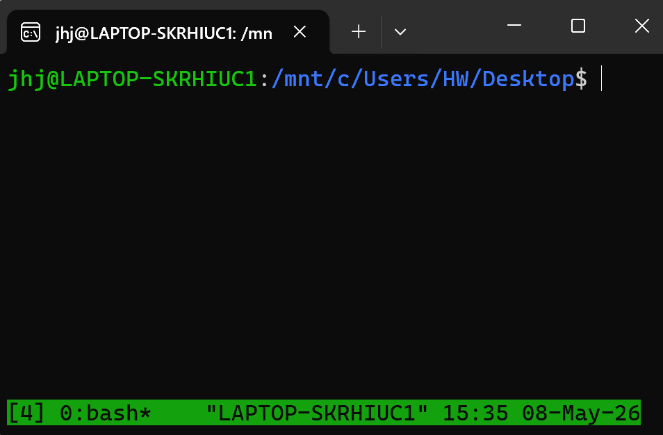

run programs in parallel: can open a new terminal; or: **use terminal mulyiplexer**----Tmux
download tmux server
### logical relationships:

- create a new Session: `Tmux`
- rename a session(whe u r in it!) `ctrl+b $`
	>[!example]-
	
- 

- in default window:`0:bash`
	- split windows into pane: `cntrl+b`+operation
	- create new pane: `ctrl+b c`


	>[!tip]- operation
	>split panes into a left and a right pane: `ctrl b`+`%`
	>
	>split into top and bottom pane: `ctrl b`+`"`
	>
	>naviagting through Panes: `ctrl b`+ arrow key
	>
	>`C-b z`: make a pane go full screen. Hit again to shrink it back to its previous size`C-b z`
	>
	>`ctrl+b +window number`: switch from windows
	>
	>`C-b C-<arrow key>`: Resize pane in direction of <arrow key>[4](https://hamvocke.com/blog/a-quick-and-easy-guide-to-tmux/#user-content-fn-4); `ctrl-b ,`: Rename the current window


- `exit` delets&ends the progress of the pane


- ==detach a ***Session***==: `ctrl+b d`
- ==re-attch a session==: `tmux attch -t [session name]`
	v.s: create a new name session:`tmux new -s [name]`
- see the currently running sessions: `tumx ls`


### Highly Connected with SSH

only difference: the server is a remote shell
 - ordinary ssh: while running remotely, network problems may ruin the whole process!
 >[! tip]- combined with SSH: 
 >**Connect to server**: 
 >```bash 
 >ssh username@remote_host
 >```
 >start a new session: `tmux new -s work`
 >*command whatever u want to operate on the
 >remote machine
 >==even if disconnescted==: the job on the remote
 >server is still on!
 >reattach to the session on the remote server: get the result!

