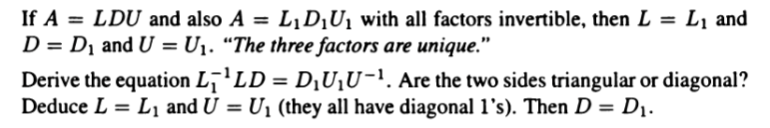

prove the first line!

$LDU=L_{1}D_{1}U_{1}$
==左乘$L_{1}^{-1}$; 右乘$U^{-1}$;==  有区别！！
get: $L_{1}^{-1}LD=D_{1}U_{1}U^{-1}$
the right: all lower triangular matrices
the left: all upper 
$\implies$ can only be diagnal matrices
L,U,L1,U1: all have diagnal 1
so left= right= $I$
so: $L=L_{1}$ $U=U_{1}$ $D=D_{1}$

