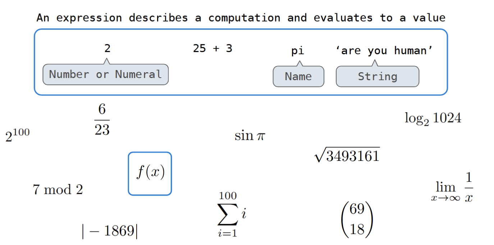
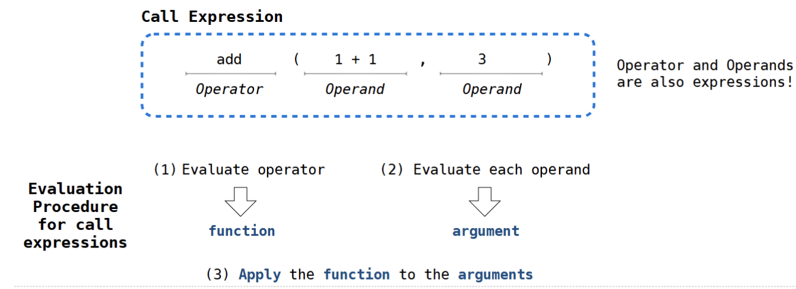
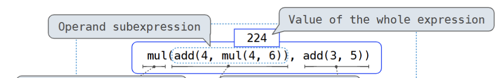
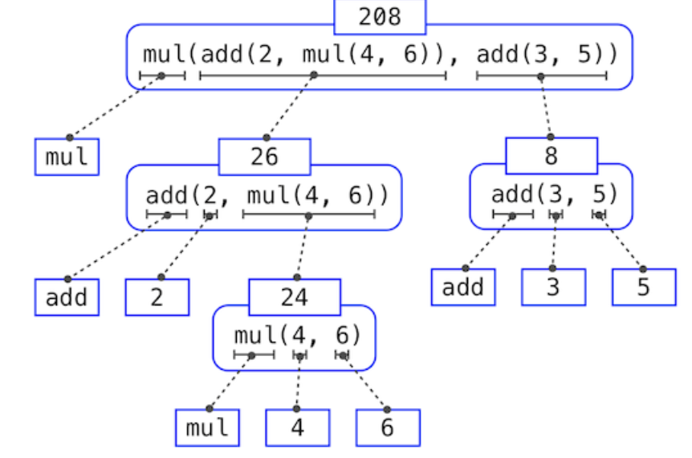

### Course content
- managing complexity
	 abstraction
	Iso and solving problems
	Thecniques for organizing complex problems
- an introduction to programming
	Full understanding of python
	large projects to manage complexity
	How computers interpret programming languages

## Problem-Solving Practice
Lab&Discussions prepare u for homework&projects;

## Values,Operators and expressions

 
all the things above r expressions;
==add,mul== are also expressions!

2/'are u a human'/ names: two meanings; it can be seen as an expression; and its result/entity is a value(its value and expression happen to be the same)； they are primitive expressions!

**key: expressions are the name of a thing with an entity in the computer**;
e.g: add--->an expression that evalutes into a operator
2---->an expression that evaluates into 2
```python
>>> add
<built-in function add># the evalution process
>>> 2
2
```
==expression==: describes how to compute something, evaluates to a value

==Call expression==:applies a function to some arguments


also: operands can also be call expressions!$\implies$ nested expressions:
; 

the illustration: expression tree  
 The objects at each point in a tree are called nodes; in this case, they are expressions paired with their values.

 ### Error&Tracebacks
 1. syntex errors: causeb by expressions that are not formed well!
 2. runtime erroer: erroes that are wrong when is computed
 3. logical error: grammarly right
 