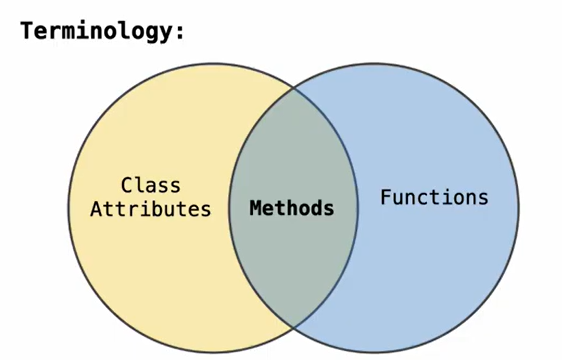

### Method Calls
- Dot expresstions to invoke methods `<object expression>.<method name>`
```python
>>>a=Account('Alen')
>>>a.deposit(5)
5
>>>a.deposit(5)
10
>>>a.deposit
<a bound method(the self arguments are already filled in!# self=a) Account.deposit of ...># 默认指向性
>>> m=map(a.deposit,range(10,20)) #lazy computation
>>> next(m)
20
>>>next(m)
31
>>>next(m)
43
```
### Attribute lookup
`<object expression>.<method name>`
1. evaluate the `<object expression>` it yields the object(instance) of the dot expression(e.gAccount('Alen'))
2. `<method name>` is matched with the instance attributes; if it exists in it ; it uses it
3. if it is not in the instance attributes; search it in the class attribute!
4. in orocess 3,4: if it find a value: it is returned directly; if it is a function(`def(self,a):`) the self is automatically bounded; `a` is bounded to the other value!
### Class attributes
the `def` function/`self.***` outside the the `def`;  A variable that belongs to a class and is accessed via dot notation
v.s ***instance attribute***: the `self.***` inside the `def`; A variable that belongs to a particular object.
```python
class <name>:
	<suite>
```
the suite is executed directly when the class statment is executed; it is in the first frame of the current envronment

==are shared across all instance classes==


but *Functions* !=*Bound Methods*(=Object+Function)
```python
>>>type(Account.deposit)
<function>
>>>type(tom_account.deposit)
<method>
>>>Account.deposit(tom_account,1001)# use it as a function
1001
>>>tom_account.deposit(1007) # use it as a bound method
2018
```

### Attribute Assignment
Assignment statements with a dot expression on their left-hand side afffect attributes for the object of that dot expression
- If object is instance: it sets an instance attribute
- If object is class: assignments sets a class attrbute:
```python
Account.intrest=0.04 # resets a class attribute
tom_account.interest=0.08 # resets a spcific instance value; 覆盖 the original class attribute!!!
```


[[object_programming problems]]