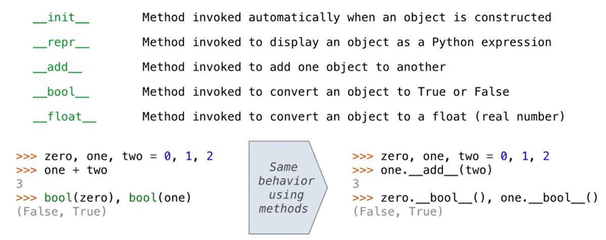
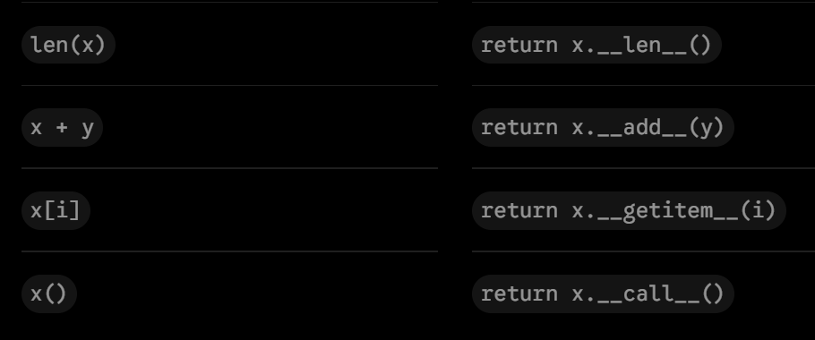
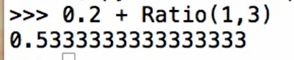

### String representation
An object values should behave lke the kind of data it is meant to represent
we can produce a string representation of itself:
- `str()`: legible to humans
- `repr()`: legible to Python interpreter
the `str` and `repr` ==strings== are often the same, but not always

The `repr` function returns a Python expression that evaluates to an equal object
the result of it is what Python prints in an interactive session
eval(repr(object))==object
```python
>>> repr(12e12)
'12000000000000.0'
>>> repr(min)
'<built-in function min>'
>>> print(repr(12e12))
12000000000000.0
```

The `str` function returns what python prints using the `print` function
```python
>>> from fractions import Fraction
>>> half=Fraction(1,2)
>>> repr(half)  #(eval:对于字符串： 扒掉外面的一层引号 运行里面的内容)
'Fraction(1, 2)'  # its str is different fron repr
>>> str(half)
'1/2'
>>> print(half)
1/2
```

e.g:
```python
s="H W"
>>> s
'H W'
>>> repr(s)
"'H W'"
>>> eval(repr(s))  # repr 是eval的逆运算(eval:对于字符串： 扒掉外面的一层引号 运行里面的内容)
>>> print(repr(s)) # 只是正好 二者不互逆
'H W'
>>> print(s)
H W
>>> str(s)
'H W'
>>> print(str(s)) # 真实内容
H W
>>> eval(s)
Traceback (most recent call last):
  File "<stdin>", line 1, in <module>
  File "<string>", line 1
    H W
      ^
SyntaxError: invalid syntax
>>> eval(str(s))
Traceback (most recent call last):
  File "<stdin>", line 1, in <module>
  File "<string>", line 1
    H W
      ^
		SyntaxError: invalid syntax      # 扒掉最外层引号后发现里面的H W 不符合语法
```

### String Interpolation
involves a string literal that contains expressions
f-strings: the expression in{} is evaluated
the frist two:  using str to connect strings
the final two: using the inverse of repr+ str string of the value to connect things


```python
>>> f'2+2=2+2'
'2+2=2+2'
>>> f'2+2={2+2}'
'2+2=4'
>>> f'2+2={(lambda x:x+x)(2)}'
'2+2=4'
>>>f'half of half is {half*half}'
'half of a half is 1/4'
>>>f'half of a half is {repr(half*half)}'
'half of a half is Fraction(1,4)'

```
### Polymorphic Functions
Polymorphic function: A function that applies to many (poly) different forms (morph) of data.
e.g: `repr` can deal with both strings and functions
#### Interfaces
接口：Objects interact by looking up attributes on each other (passing messages)
当 Python 执行 `repr(half)` 时，它其实只是在做一件非常机械的事情：**向 `half` 这个对象发送一条固定的消息——“请调用你的 `__repr__` 方法！”**
`len==object.__len__()`  A behavior contract is signed and the method operation on objects; and len() can deal with any object that defined it
$\implies$ makes it easy to communicate with objects
#### How to create an interface
```python
def repr(x): # 对于 class attributes
	return type(x).__repr__()
def len(obj):   # 对于 instance attributes
	return obj.__len__()
```


### Special Method Names
special methods all have two underscores; they are commonly used so they already have an interface

`__radd__`:  a,b 位置颠倒
 they are commonly used so they already have an interface:
 

e.g:
```python
class Ratio:
    def __init__(self, n, d):
        self.numer = n
        self.denom = d

    def __repr__(self):
        return 'Ratio({0}, {1})'.format(self.numer, self.denom)

    def __str__(self):
        return '{0}/{1}'.format(self.numer, self.denom)

    def __add__(self, other):
        if isinstance(other, int):   # 处理分数+整数
            n = self.numer + self.denom * other
            d = self.denom
        elif isinstance(other, Ratio):
            n = self.numer * other.denom + self.denom * other.numer
            d = self.denom * other.denom
        elif isinstance(other, float): # 处理分数+小数
            return float(self) + other
        g = gcd(n, d)
        return Ratio(n//g, d//g)

    __radd__ = __add__   # 保证顺序反过来的时候也不报错

    def __float__(self):
        # 幻灯片里这里只有 return，帮你补全了转换浮点数的逻辑
        return self.numer / self.denom 

def gcd(n, d):
    while n != d:
        n, d = min(n, d), abs(n-d)
    return n
```


and: realized the equality of computation: add() float() interfaces can be used for any instances of this class