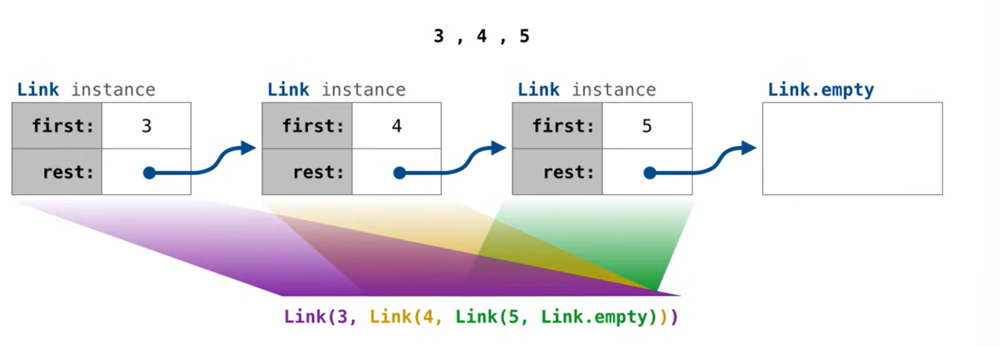
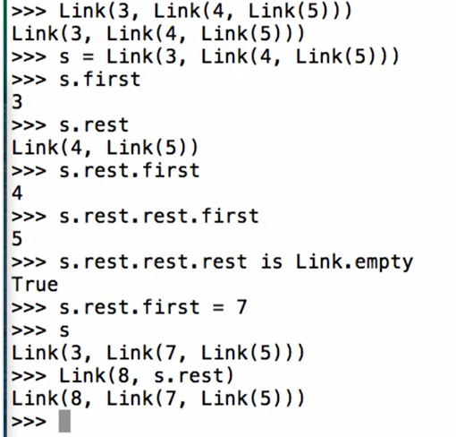
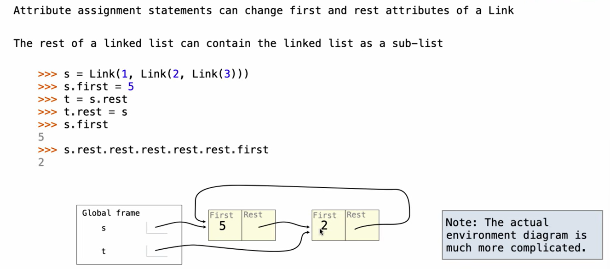
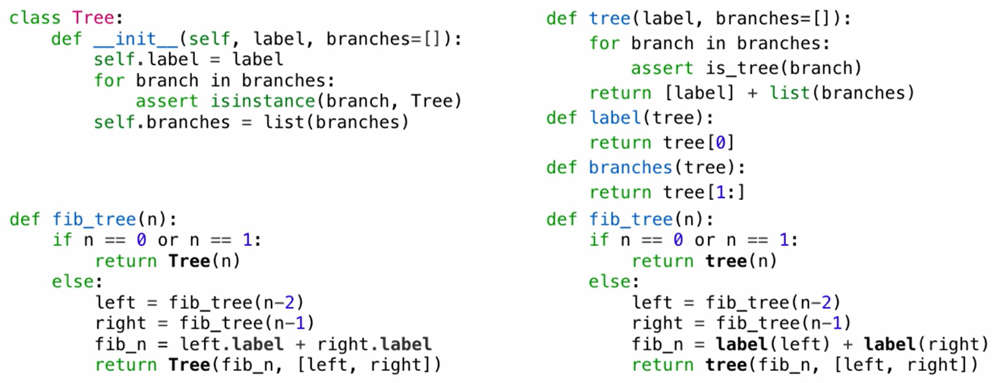

在面向对象编程（OOP）中，对象和对象之间建立关系主要有两种最核心的方式：**继承(has a...)（Inheritance）** 和 **组合(is a..)（Composition）**
Linked lists&trees a composition; and also a recursive composiion
### Linked List Structure
A l l is either empty or a first value and the rest of the linked list

#### Linked List Class
```python
class Link:
	empty=()
	def __init__(self,first,rest=empty):
		assert rest is Link.empty or isinstance(rest,Link)
		self.first=first
		self.rest=rest
```

### Linked List Peocessing
e.g: Range/Map/Filter for Lined lists:
using recursion
```python
def map_link(f,s):
	if s in Link.empty:
		return s
	else:
		return Link(f(s.first),map_link(f,s.rest))
def range_link(start,end):
	if start>=end:
		return Link.empty
	else:
		return Link(start,Link(start+1,end))
def filter_link(f,s):
	if s is Link.empty:
		return s
	filtered_rest=filter_link(f,s.rest)
	if f(s.first):
		return Link(s.first,filtered_rest)
	else:
	return filtered_rest
```
### Linked Lists Mutation

it does not create a new one when mutated!
e.g:
add v to linked list s in number order:
using the fact that it does not create a new one when mutated!
```python
def add(s,v):
	assert s is not List.empty
	if s.first>v:
		s.first,s.rest=v,Link(s.first,s.rest)
	elif s.first<v and empty(s.rest):
		s.rest=Link(v)   # v 为最大值 加到末尾
	elif s.first<v:
		add(s.rest,v)  # 迭代
	return s
```
[[problem_L12]]

##### Notice:
```python
>>> link.rest = link.rest.rest
>>> link.rest.first
? 3
-- OK! --

>>> link = Link(1)
>>> link.rest = link
>>> link.rest.rest is Link.empty
? True
-- Not quite. Try again! --

? False
-- OK! --  # 向上递归和向下递归的区别  左边是个死循环
```

```python
def duplicate_link(s, val):
    if s.first==val:
        s.rest=Link(val,s.rest)

        duplicate_link(s.rest.rest,val)# true mutation: chaning the object that s represents by s.first/s.rest; instead of moving s to a new object
        #s=Link(val,s)  只是改变了标签的指向

        #duplicate_link(s.rest.rest,val)

    if s is Link.empty:

        return None

    else:

        duplicate_link(s.rest,val)
```


### Tree Class
 ```python
 class Tree
	 def __init__(self,label,branches=[]):
		 self.label=label
		 for branch in branches
			 assert isinstance(branch,Tree)
		self.branches=list(branches)
 ```
 >[!example: class vs data abstraction]-
 >

classes makes it easier to displar/write code than data abstraction
```python
    def __repr__(self):
        if self.branches:
            branch_str = ', ' + repr(self.branches) # 迭代
        else:
            branch_str = ''
        return 'Tree({0}{1})'.format(repr(self.label), branch_str)
        # 呈现的时候直接变成tree!而非列表 用

    def __str__(self):
        # 将 indented() 返回的字符串列表，用换行符拼接起来
        return '\n'.join(self.indented())
        #可以直接打印出有序的版本

    def indented(self):
        lines = []
        for b in self.branches: # 已经包含base case了 当b 为leaf的时候 self.branches=[]  这段循环自动跳过
            for line in b.indented(): # 对于每个子分支缩进两个空格+ 默认b.indented帮你已经把之前派的任务完成了
                lines.append('  ' + line)
        # 把当前节点的 label 放在第一行，后面跟着缩进后的子节点
        return [str(self.label)] + lines

    def is_leaf(self):
        # 如果 branches 列表为空，则返回 True（证明是叶子节点）
        return not self.branches

def fib_tree(n):
    """A Fibonacci tree."""
    if n == 0 or n == 1:
        return Tree(n)
    else:
        left = fib_tree(n-2)
        right = fib_tree(n-1)
        fib_n = left.label + right.label
        return Tree(fib_n, [left, right])

def leaves(t):
    """Return a list of leaf labels in Tree T."""
    if t.is_leaf():
        return [t.label]
    else:
        # 幻灯片在这里截断了，我帮你补全了递归收集叶子的逻辑：
        all_leaves = []
        for b in t.branches:
            all_leaves.extend(leaves(b))
        return all_leaves
```