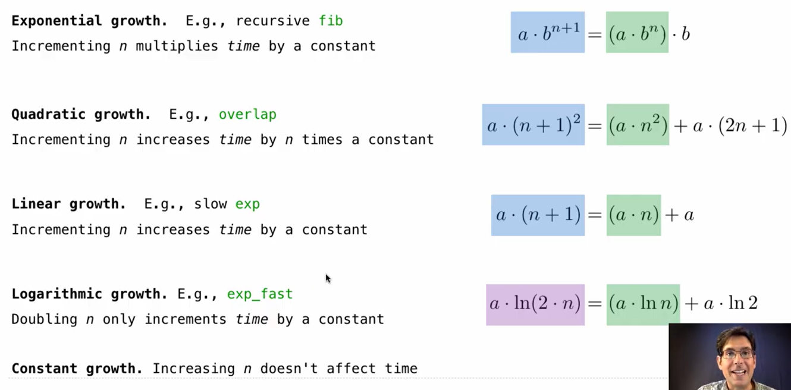
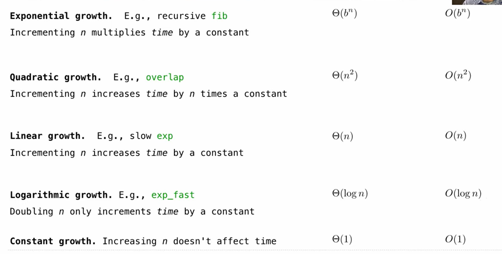

### Measuring Efficiency
e.g: the recursive computation for the Fib Sequence
```python
def fib(n):
	if n==0 or n==1:
		return n
	else:
		return fib(n-2)+fib(n-1)
def count(f):
	def counted(n):
		counted.call_count+=1
		return f(n)
	counted.call_count=0  # 对此函数加一个计数的attribute
	return counted
	
>>>fib=count(fib)  # 将原函数替换为一个新的counted 函数
>>>fib(5)   # fib(5)=fib(3)+fib(4): 每分裂一次都调用一次新的fib; 此时counted.call_count都会+1
5        #  'return f(n)'
>>>fib.call_count
15
>>>fib(5)
5
>>>fib.call_count   # 是累加的！
30
 
```

### Memoization
Remember the results that has been computed before
```python
def memo(f):
	cache={}
	def memoized(n):
		if n not in cache:
		 cache[n]=f(n)
		return cache[n]  # 还是返回f(n)
	return memorized    # 依旧是顶替原函数
>>> fib=count(fib)  
>>> counted_fib=fib
>>> fib=memo(fib)
>>> fib=count(fib)
>>> fib(30)
832040
>>> fib.call_count
59

指向关系：
fib
 ↓
counted2
   │
   └──f→ memoized
            │
            └──f→ counted1
                     │
                     └──f→ 原始fib

counted_fib   # counted_fib指向内部的counted1  表示memoized之后的简化计算频率！
 ↓
counted1 （与上面的└──f→ counted1指向的是同一个）
   │
   └──f→ 原始fib
```

### Exponentiation
对乘方运算 有简化算力的方法
```python
def exp(b, n):  # linear growth
    if n == 0:
        return 1
    else:
        return b * exp(b, n-1)

def exp_fast(b, n):  #logarithmic growth
    if n == 0:
        return 1
    elif n % 2 == 0:
        return square(exp_fast(b, n//2))  # 对于可被2整除的number: 剪掉了一半的算力
    else:
        return b * exp_fast(b, n-1)

def square(x):
    return x * x
```

### Orders of Growth
how time scale with input size





### Space
Which environment frames do we need during evaluation?
 in the pytho  tutor: the unused frames are deleted

```python
def count_frames(f):
	def counted(n):
		counted.open_count+=1
		if counted.open_count>counted.max_count:
			counted.max_xount=couned.open_count
		result=f(n)   # 运算会在这里卡住 调出两个fib() 函数 然后counted.每个加一；这个过程是frame展开的过程
		counted.open_count-=1   # frame 收缩的过程
		return result
	counted.open_count=0
	counted.max_count=0
	return counted
```
 