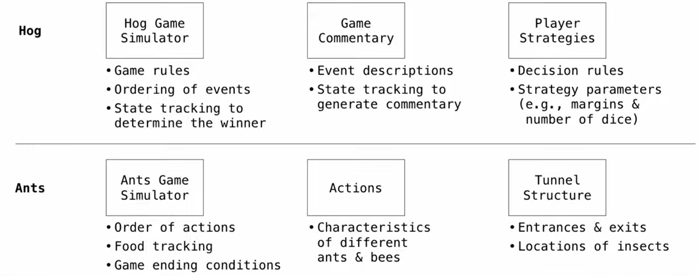
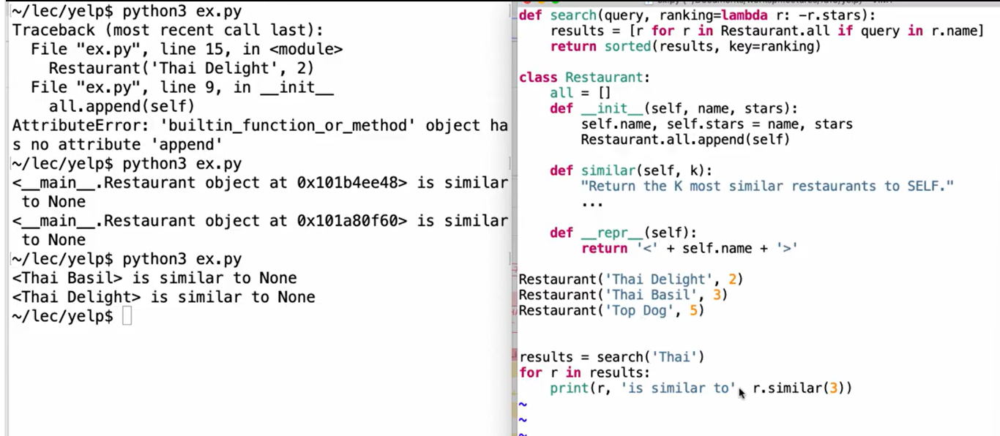

### Modular Design

principle: Isolate different parts of a program that address different concerns
A modular component can be developed and tested independently


try to make every part independent!

####  example:  resturant
**Restruant Search**


when printing: u have to def a represntation or it will error
**Similar Reasturants**
```python
import json
def reviewed_both(r,s):
	return len([x for x in r.reviewers if x in s.reviewers])
class Restaurant:
    all = []
    
    def __init__(self, name, stars, reviewers):
        self.name = name
        self.stars = stars
        self.reviewers = reviewers
        Restaurant.all.append(self)
        
    def similar(self, k, similarity=reviewed_both):
        """Return the K most similar restaurants to SELF."""
        others = Restaurant.all
        others.remove(self)
        # 使用 lambda 函数作为排序键，按相似度从高到低排序
        different = lambda r: -similarity(r, self)
        return sorted(others, key=different)[:k]
        
    def __repr__(self):
        return '<' + self.name + '>'

# 数据处理部分
reviewers_for_restaurant = {}

# 读取 reviews.json 并统计每家餐厅的评论者列表
for line in open('reviews.json'):
    r = json.loads(line)
    biz = r['business_id']
    if biz not in reviewers_for_restaurant:
        reviewers_for_restaurant[biz] = [r['user_id']]
    else:
        reviewers_for_restaurant[biz].append(r['user_id'])

# 读取 restaurants.json 并实例化 Restaurant 对象
for line in open('restaurants.json'):
    r = json.loads(line)
    # 获取该餐厅对应的评论者列表
    reviewers = reviewers_for_restaurant[r['business_id']]
    Restaurant(r['name'], r['stars'], reviewers)

# 执行搜索并打印结果
results = search('Thai')
for r in results:
    print(r, 'shares reviewers with', r.similar(3))
```


**Refined computation version**
时间复杂度从 $O(n^2)$ 降低到 $O(n)$ 尽可能少地用循环结构
```python
def fast_overlap(s, t):
    """Return the overlap between sorted S and sorted T.
    S &T is already sorted"""
    i, j, count = 0, 0, 0
    
    # 当两个指针都没有超出列表范围时，持续循环
    while i < len(s) and j < len(t):
        if s[i] == t[j]:
            # 找到一个相同元素，计数器加1，两个指针同时后移
            count, i, j = count + 1, i + 1, j + 1
        elif s[i] < t[j]:
            # S 中的元素较小，说明 S 指针需要后移以寻找更大的值
            i = i + 1
        else:
            # T 中的元素较小，说明 T 指针需要后移以寻找更大的值
            j = j + 1
    return count
    
# 此时reviewed_both换为：
def reviewed_both(r,s):
	return fast_overlap(r.reviewers,s.reviewers)
```

