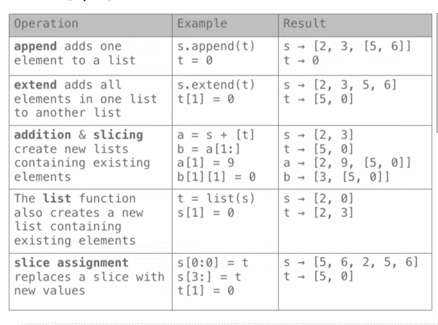
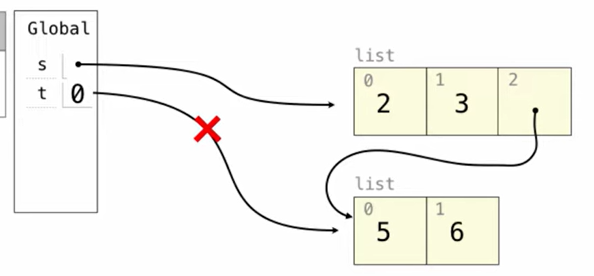
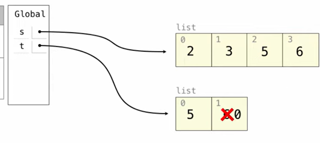
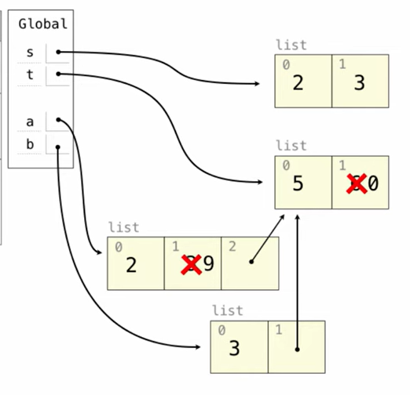
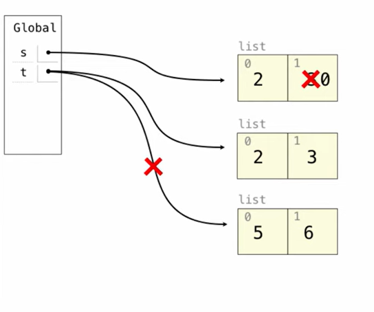
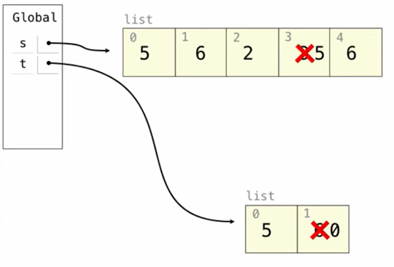
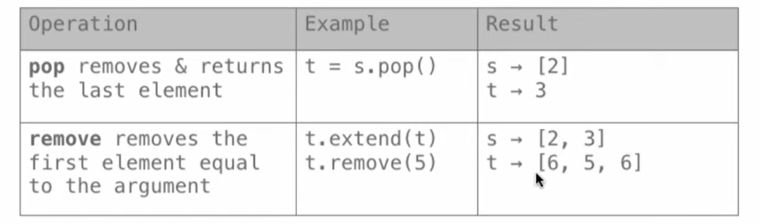
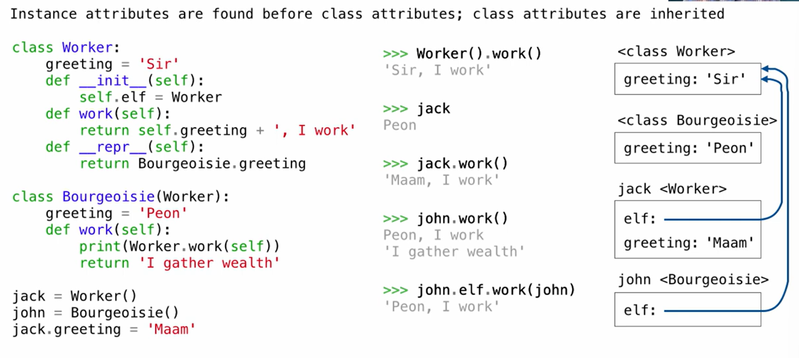

### Example:Lists
e.g: `s=[2,3]  t=[5,6]`
different operations on Lists:

operation 1:

operation 2:

it copies a new list to s!
operation3:

`[t]`: list and list: it does not copy a nuw list but points a new list$\implies$ `b[1][1]`changes everything directly
`list[1:]`: creates a new list
operation4:

  List(): creates a new one!
  operation5:
  
  removing operations:
  

### Objects


### Iterables& Iterations
 [functions on iterators](../../../../Concepts/functions%20on%20iterators.md)
 ```python
 def min_abs_indices(s):
    """Indices of all elements in list s that have the smallest absolute value."""
    # 先找到列表中绝对值的最小值
    min_abs = min(map(abs, s))
    # 使用列表推导式找出所有等于这个最小值的索引
    return [i for i in range(len(s)) if abs(s[i]) == min_abs]

def largest_adj_sum(s):
    """Largest sum of two adjacent elements in a list s."""
    # 使用列表推导式遍历相邻元素对，并求和，最后取最大值
    return max([s[i] + s[i+1] for i in range(len(s) - 1)])

def digit_dict(s):
    """Map each digit d to the lists of elements in s that end with d."""
    # 使用字典推导式创建一个映射，过滤出个位数为 d 的元素
    return {d: [x for x in s if x % 10 == d] 
            for d in range(10) 
            if any([x % 10 == d for x in s])}  # if:滤去空列表的键值对

def all_have_an_equal(s):
    """Does every element equal some other element in s?"""
    # 对于 s 中的每个元素 x，检查在 s 中是否存在另一个 y 使得 x == y
    # 注意：这里的逻辑是检查元素是否在列表中出现了至少两次
    return all([s.count(x) > 1 for x in s])
	return all(s[i] in s[:i]+s[i+1:] for i in range(len(s)))
 ```

### Linked Lists
sort the values in list in a certain order:
```python
def merge_in_place(s, t):
    """Return a sorted Link with the elements of sorted s & t."""
    if s is Link.empty:
        return t
    elif t is Link.empty:
        return s
    elif s.first <= t.first:
        s.rest = merge_in_place(s.rest, t)
        return s
    else:
        t.rest = merge_in_place(s, t.rest)
        return t

def ordered(s, key=lambda x: x):
    """Is Link s ordered?"""
    if s is Link.empty or s.rest is Link.empty:
        return True
    elif key(s.first) > key(s.rest.first):
        return False
    else:
        return ordered(s.rest, key=key)
```

 