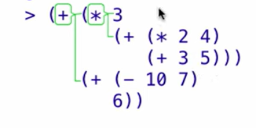
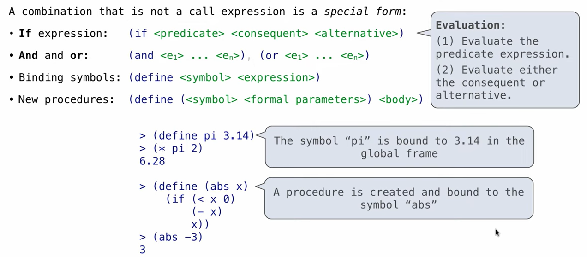
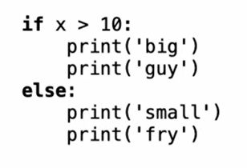
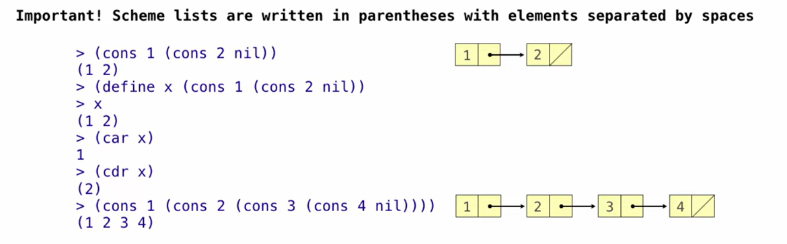
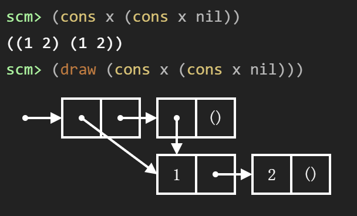
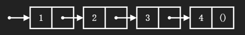
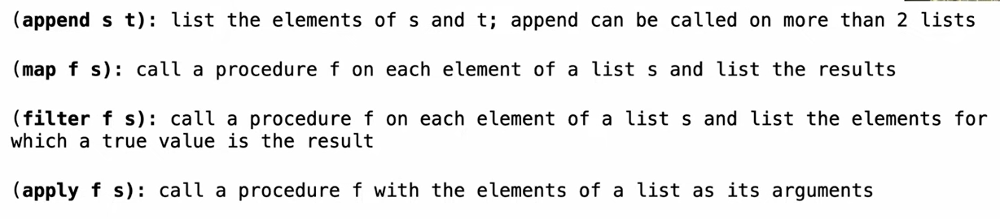

Sceme is a Dialect of Lisp
Lisp: one of the oldest languages
### Scheme Fundamentals
consist of expressions:
- Primitive expressions
- combinations: `(quotient 10 2)`
e.g:`>(quotient (+ 8 7) 5)`

the paraephsis is placed in different places
`>(integer? (- 2 2))`: `#t`: means true
### Special Forms
A combination thst is not a call expression is a special form

 new procedure= define a new function 

```Scheme
(if <条件判断> 
    <条件为 True 时执行的表达式> 
    <条件为 False 时执行的表达式>)
```

### Lambda Expressions
Lambda expressions evaluate to anonymous procedures
`lambda (<formal-patameters>) <body>`

e.g: two equivilant expressions:
```Scheme
(define (plus4 x)(+ x 4))  # 定义函数和定义变量的统一性
(define plus4 (lambda(x) (+ x 4)))
it can also directly call an expression
(lambda (x y z) (+ x y (* z z)) 1 2 3)
```
[[deep understanding aboun scheme]]
### More special Forms
#### Cond& Begin
`cond`:  like if-elif-else in python
```python
(cond ((> x 10) (print 'big))
	 ((> x 5) (print 'medium))
	 (else (print 'small)))
```
`begin`: special form combines multiple expressions into one expression
```Scheme
(cond ((> x 10) (begin (print 'big) (print 'guy)))
	  (else (begin (print 'small) (print 'fry))))
```

### Scheme Lists
`cons`: Two-arguement procedure that creates a linked list
`car`: returns the first element of the list
`cdr`: returns the rest of the list ==it returns a list!!!==
`nil`: The empty list

the display and the actual is different




```scheme
scm> (list? x) #t 
scm> (list? (car x)) #f 
scm> (list? (cdr x)) #t

scm> (null? nil) #t 
scm> (null? x) #f 
scm> (list 1 2 3 4) 
(1 2 3 4) 
scm> (draw (list 1 2 3 4))
```


### Symbolic Programming
how do we refer to symbols?
symbols normally refer to values; we refer to symbols by using quotation
symbol $\neq$ String
symbol: formed by $'$
string: formed by ""

- `100` ➡️ 返回数字 `100`
    
- `'100` ➡️ 依然返回数字 `100` （被保护了，但结果一样）
    
- `"hello"` ➡️ 返回字符串 `"hello"`
    
- `'"hello"` ➡️ 依然返回字符串 `"hello"` （被保护了，但结果一样）
    
- `a` ➡️ 💥 **报错！** 找不到名为 `a` 的变量
    
- `'a` ➡️ 返回**符号** `a` （魔法生效，变量名被冻结成了纯数据！）
    
- `(+ 1 2)` ➡️ 返回数字 `3` （函数被执行了）
    
- `'(+ 1 2)` ➡️ 返回**列表** `(+ 1 2)` （函数不仅没执行，连加号 `+` 都被冻结成了一个符号！）


```scheme
scm> (define a 1) 
a 
scm> (define b 2) 
b 
scm> (list 'a 'b) 
(a b)
# quotations can also be applied to combinations to form lists
# "立刻停止你的计算！不要去管括号里写了什么函数，直接把这团东西当成一块毫无生命的‘标本’扔给我"
scm> '(a b c)
(a b c)
scm> '((a b) c d (e)) # right version
scm>'( (quote (quote (a b) c d quote (e))) ) # wrong version: the quotes in are displayed into quote directly
((quote (quote (a b) c d quote (e)))) # result

scm> (list 2 (+ 3 4)) 
(2 7) 
scm> '(2 (+ 3 4)) 
(2 (+ 3 4))
# difference between list and quotation
```
### List Processing

in `apply`: f is coly calld once
e.g 
```scheme
scm> (define s (cons 1 (cons 2 nil))) 
s 
scm> s 
(1 2) 
scm> (append s s) 
(1 2 1 2) 
scm> (append s s s s) 
(1 2 1 2 1 2 1 2) 
scm> (list s s s s) 
((1 2) (1 2) (1 2) (1 2)) 
scm> (map even? s) 
(#f #t) 
scm> (filter even? s) 
(2)
scm> (filter even? '(5 6 7 8 9)) 
(6 8) 
scm> (filter list? '(5 (6 7) 8 (9))) 
((6 7) (9)) 
scm> (map (lambda (s) (cons 5 s)) (filter list? '(5 (6 7) 8 (9)))) 
((5 6 7) (5 9)) 
scm> (apply quotient '(10 5)) 
2 
scm> (apply + '(1 2 3 4)) 
10 
scm> (+ 1 2 3 4) 
10 
# these two are eqivilent
scm> (map + '(1 2 3 4)) 
(1 2 3 4) 
scm> (list (+ 1) (+ 2) (+ 3) (+ 4)) 
(1 2 3 4)
# these two are eqivilent
```
### e.g Even Subsets

in a list  return the sublist that its sum is odd or even 
```scheme
(define (even-subsets s)
  (if (null? s) nil
      (append (even-subsets (cdr s))  # 不用s 的第一个元素
              (subset-helper even? s))))  # 需要s的第一个元素

(define (odd-subsets s)
  (if (null? s) nil
      (append (odd-subsets (cdr s))
                  (subset-helper odd? s))))

(define (subset-helper f s)
  (append (map (lambda (t) (cons (car s) t))   
               (if (f (car s))
                   (even-subsets (cdr s))
                   (odd-subsets (cdr s))))   # 将返回值批量加上第s的第一个元素
          (if (f (car s)) (list (list (car s))) nil))) # 如果本身就复合要求 单独把这个列表视为一个元素
```


