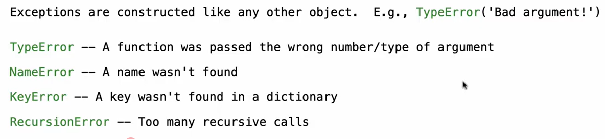
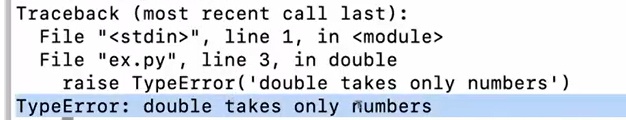
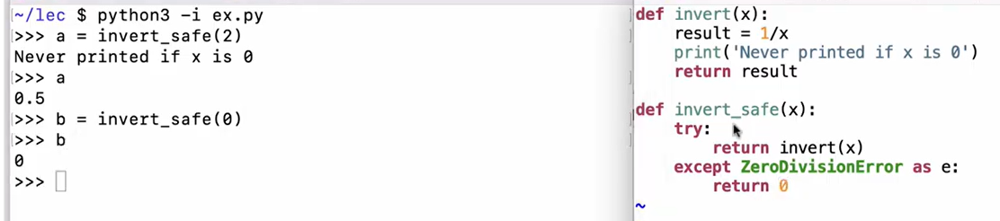
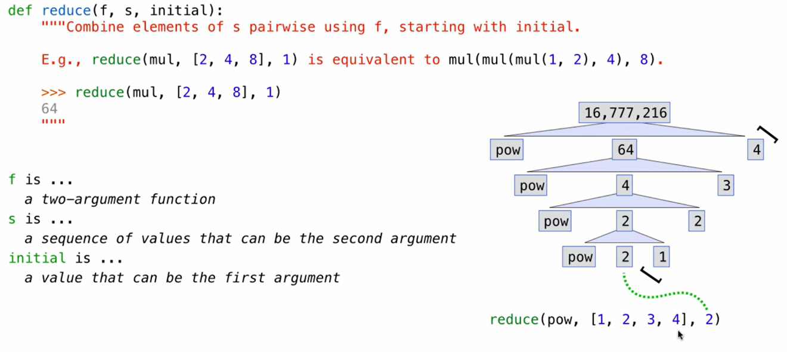
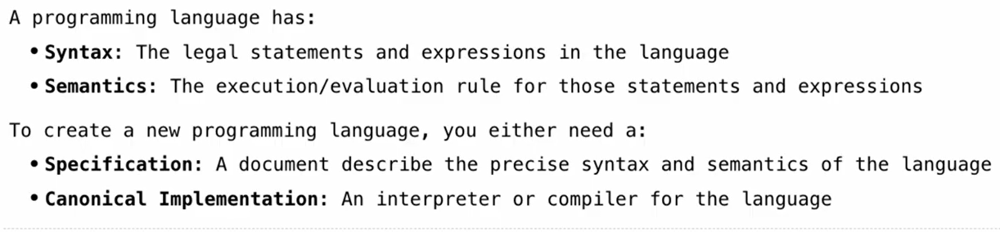
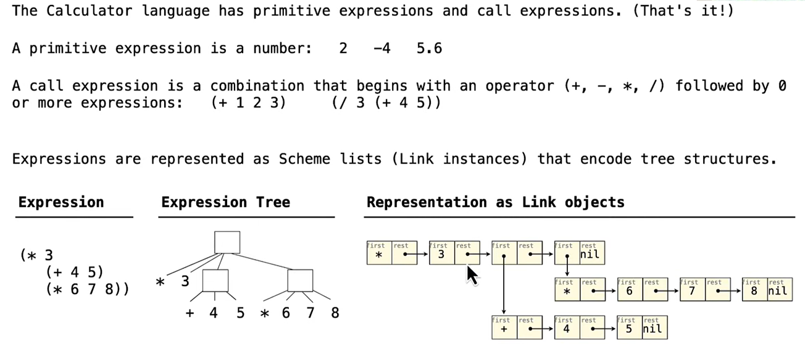
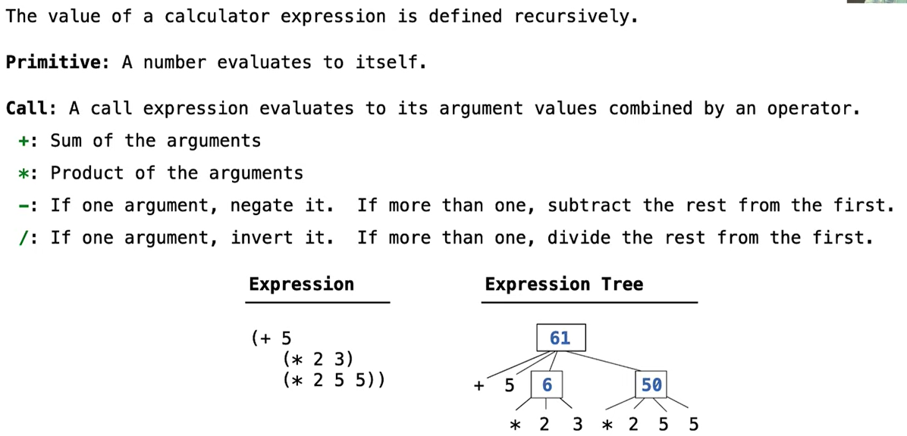
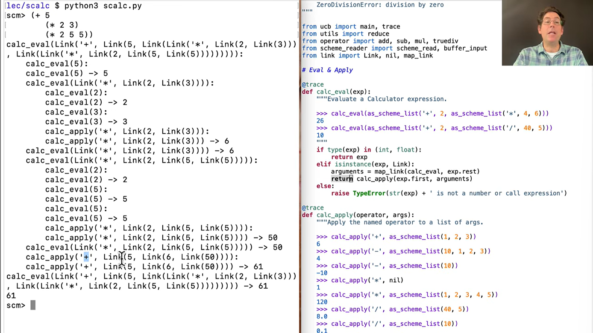

### Exceptions
**Raise Statements**
python exceptions are raised with a raise statement
`raise <expression>` 常放if结构中 标明符合语法的特殊情况 
`<expression>` must evaluate to a subclass of BaseException or an instance of one! the `<expression>` are instances of the classes below:
e.g:

e.g
```python
def double(x):
	if isinstance(x,str):
		raise TypeError('double takes only numbers')
	return 2*x
```


**Try Statemnets**
handles exceptions: place it in an outer function  which handles the error situation 当有语法错误的时候跳转
```python
try: 
	<try suite>
except <exception class> as name:
	<except suite>
```
rule:
`<try suite>` is executed first
if during `<try suite>` an exception is raised and its the class of the exception inherits from `<exception class>` then:
`<except suite>` is executed! with `<name>` bound to the exception


### e.g Reduce
 
 ```python
 from operator import add, mul, truediv

def divide_all(n, ds): # it does not have to know how it is calculated  it only handles the error situation
    try:
        return reduce(truediv, ds, n)
    except ZeroDivisionError:
        return float('inf')

def reduce(f, s, initial):
    for x in s:
        initial = f(initial, x)
    return initial

def reduce(f, s, initial):
    if not s:
        return initial
    else:
        return reduce(f, s[1:], f(initial, s[0])) # 这是截图底部缺失的一行
 ```

### Programming Lanugages
A computer typically executes programs written in many diffferent programming languages
**Machine languages** : statements are interpreted by the hardware itself(difficult to understand by human)
**High-level languages**: statement&expressions are interpreted ==by another program== or complied into another language
- provide means of abstraction such as naming/function defination/objects
- Absract away details to be independent of different hardware and operating system


A powerful form of abstraction can define a new languange to solve a particular type of appication 



### e.g Calculator
a sublanguage of scheme, created by abstractions of python
#### Calculator Syntax

#### Calculator Semantics

recursive: 想要算出这个大表达式的最终结果，你必须先用完全相同的规则，去算出它内部嵌套的小表达式的结果/ 不断套对应的python函数抽象
e.g:The process

[calculator]([Scalc](https://www.composingprograms.com/examples/scalc/scalc.html))
[3.4 Interpreters for Languages with Combination](https://www.composingprograms.com/pages/34-interpreters-for-languages-with-combination.html)