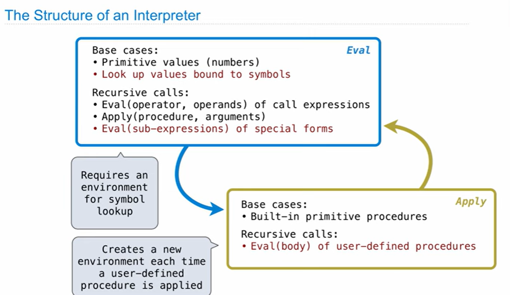
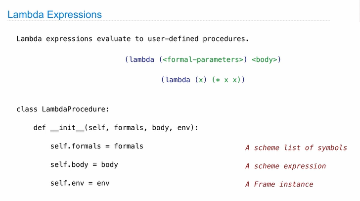
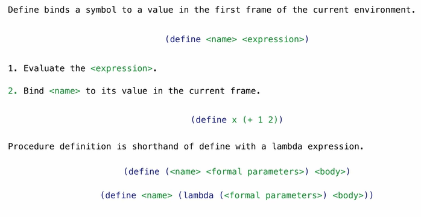
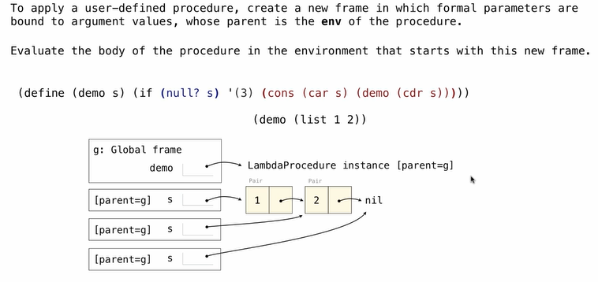
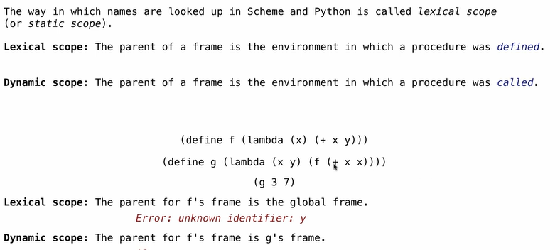

### Interpreting Scheme
 The Structure of an Interpreter: *Eval-Apply loop*
 
Eval: responsible for reading and comprehension; 拆解代码; gives the results to `Apply` 
e.g recursive calls: `(+ (* 2 3) 4)`
Apply: responsible for calculation, gives the results back to `Eval` to understand

### Special Forms
**Scheme Evaluation**
The scheme_eval function dispatches on expression form:
- Symbols are bound to values in the current environment( base cases)
- Self-evaluating expressions(我就是我e.g 5) (base cases)
- All other legal expressions are represented as Scheme Lists, called *combinations* (recursive calls)
	e.g: Special forms/Call expressions

### Quotation
 The `quote` special form evaluates to the quoted expression, but it is not evaluated
 `(quote <expression>)`: the `<expression>` itself is the value of the expression
 `'<expression>`: is a shorthand for it!; before going to  `eval`  it goes to the `scheme_read` parser and converts int into `quote`
 
 ### Lambda expressions
 
 **Frames and Environments**
 A frame represents an environment by having a parent frame
 Frames are python instances with methods `lookup` and `define`
 e.g
 ```python
 g=Frame(None)# create global frame
 f1=Frame(g) # g is the parent frame
 g.define('y',3)
 g.define('z',5)
 g.lookup('y') # 3
 f1.define('x',2) # {x:2}-><Global Frame>
 ```
### Define Expressions

**Applying User-defined Procedures**

a new environment is created!

### Dynamic Scope

redult: 13

do not mix Lexical Scope with Dynamic Scope!
Most languages are Lexical Scope!