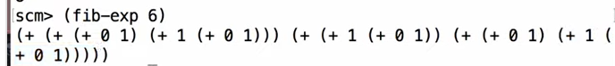
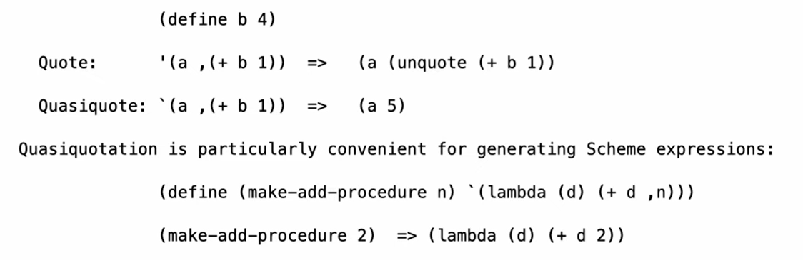

### Programs as Data
Scheme programs consist of expressions
- primitive expressions: 2 3.3 True
- combinations: e.g(quotient 10 2)
- The Scheme list data structure can represent combinations
```scheme
scm> (list 'quotient 10 2)
(quotient 10 2)
scm>(eval (list('quotient 10 2)))
5
```
In scheme it is straightforward to write a program that wirtes a program
Scheme 的代码本身，长得就跟 Scheme 的链表（List）一模一样（全都是括号套括号）
e.g
```scheme
define (fib-exp n)
	(if (<= n 1) n (list '+ (fib-exp(- n 2) fib-exp(- n 1))))
```


### Generating Code
since code is data  data is code:
**Quasiquotation**
``(a b)`=`(a b)`
different from quotation: it can be unquoted with `,`  !


e.g: for adding the x fulfilling a certain condition 
```scheme

(define (sum-while initial-x condition add-to-total update-x)
  `(begin
     (define (f x total)
       (if ,condition
           (f ,update-x (+ total ,add-to-total))
           total))
     (f ,initial-x 0)))
```


the eval evaluates the symbols of the list!!
the program generate code for spcific situations!

**different combinations of quasiquotion lead to different results**
e.g: to evaluate to `(+ (* a a) (* b b))`
```scheme
scm>(define (square-expr term) `(* ,term ,term))
scm>`( + ,(square-expr `a) ,(square-expr `b))
```
