## Names Assignment& User-defined functions
==name: a kind of expression==
### Assignment statements
name is generated by assignment; . If a value has been given a name, we say that the name _binds_ to the value.
$x=1+2$
the whole: an assignment statement
name: the $x$ in the left
==the value==(not the expression) of the expression $1+2$ is assigned to the name on the left


### name defination
1. import from modules(bulit-in name)
2. assignment statement
### User-defined functions
assign name to functions(在内存层面就是values:):
`f=max` (name f as the operator of the bulit-in function :max)
or `def ..` the name of the function
or `from ... import ...`

function v,s assignments
function: a call expression; be re-evaluated evey time it is called
assignments: be binded to a value 

*Assignment is our simplest means of abstraction, for it allows us to use simple names to refer to the results of compound operations*


## Environment Diagrams
### Environment
The possibility of binding names to values/functions and later retrieving those values by name means that the interpreter must maintain some sort of memory that keeps track of the names, values, and bindings. This memory is called an _environment_.

when doing evaluation: environment has to be specified


envrionemnt diagrams visualize the interpreter's process
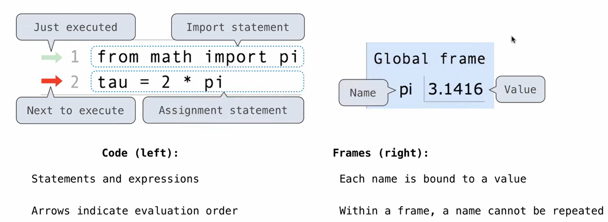

right: ==frame:keep track of the bindings between names&values==
>[!explanation]-
>frame 可视为：**映射表**（Mapping）。它唯一的任务是存储 **Name（变量名）** 和 **Reference（引用/指向）** 之间的关系。你可以把它想象成一个两列的表格：左边是名字，右边是一个“箭头”。

left: code

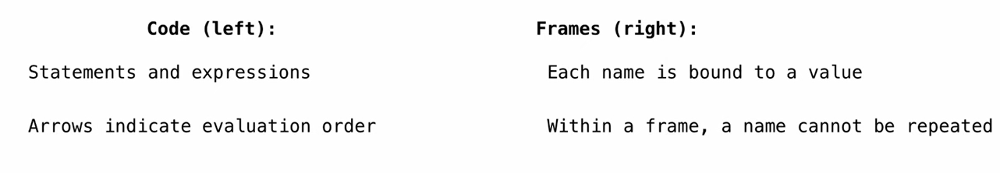

review assignment statements:
1. ==evaluate all expressions to the right of $=$ from left to right== 
2. Bind all names to the left of = to the resulting values in the current frame


? environment diagrams? objects?

## Defining function
Assignment is a simple means abstraction:  bind names to values
### Def func
Function definition is a more powerful means of abstraction: binds names to expressions
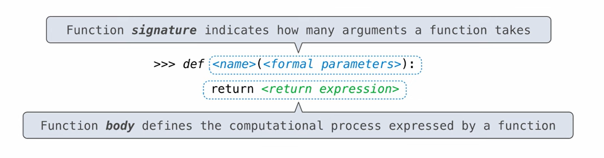

parameters:形参； arguement:实参
- the fuction body describes a comutation process that is evaluated every time it is called
- the function signature if important because it tells all the imformation needed to create a local frame; tells us how to construct the frame/ environment every time we call the function
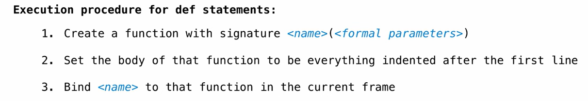

- the process is simply a statement!!! 
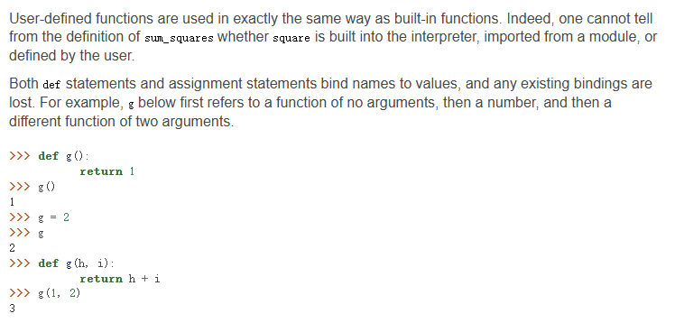

when defined: the body gets squirreled away as part of the function until the func is called


### Calling user-defined function
**Procedure for calling/applying user-defined functions(v1)**
1. Add a local frame, ==forming a new envrionment==
2. 1. Bind the arguments to the names of the function's formal parameters in a new _local_ frame.
3. excute the body of the function in that new envrionment that starts with this frame
e.g:
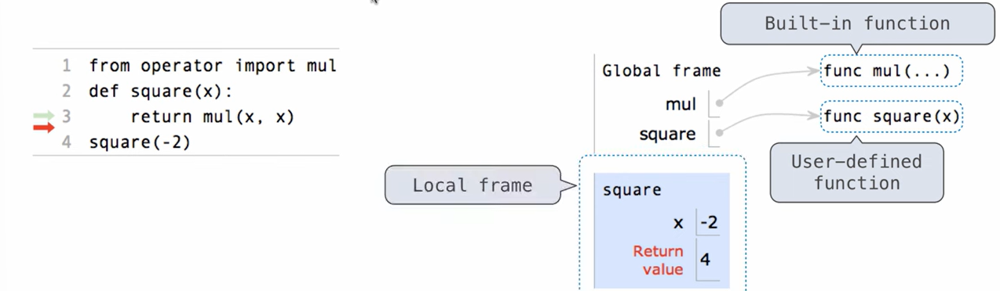
-2:arguments
x:parameter, x is binded to -2
bulit-in unctions such as mul do not have formal parameter names, and so ... is always used instead

return vaule: not a binding; just an annotation  that tells us what happened
### Looking Up Names in Envrionments
every expression is evaluated in the context of an environment
So far, the current environment is either:
- The global frame alone (v.s [L4 Higher-Order Functions](L4%20Higher-Order%20Functions.md))
- A local frame,==followed by the global frame==

Look-up process:
an environment is a sequence of frame: local frame--->parent frame---->......----->global frame(不是嵌套关系 是指针关系)
- An environment is a sequence of frames; a frame is the binding between names and values
- A name evaluates to the value bound to that name  in the earliest frame of the current environment where that name is found(找到/计算出); Names have no meaning without environments
- A new frame is created. Parameters bound to environments. Body id executed in thst new environmrnt

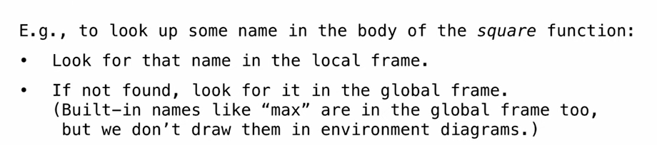
```python
def square(x):
    y=mul(x,x)
square(2)
```
mul: not in local, but in global
==x: in local==  the peremeter remains local to zhe body of a function
- the definition statement for the function square is executed. Notice that the entire def statement is processed in a single step. The body of a function is not executed until the function is called (not when it is defined).
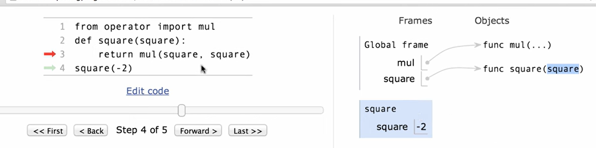

- why square(square) is legal:
	`mul(square,square)` square is first searched in the local frame, square=-2; stopped and will not continue to the next global frame wheresquare=func...

## Print and none
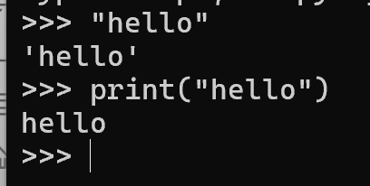
print is not just evaluating a string!
### None indication
None repesnt nothing in Python
A function that does not explicitly return a value will return  None
and  None will not be displayed by the interpreter as the value of an expression
### Pure Functions&None-pure Functions
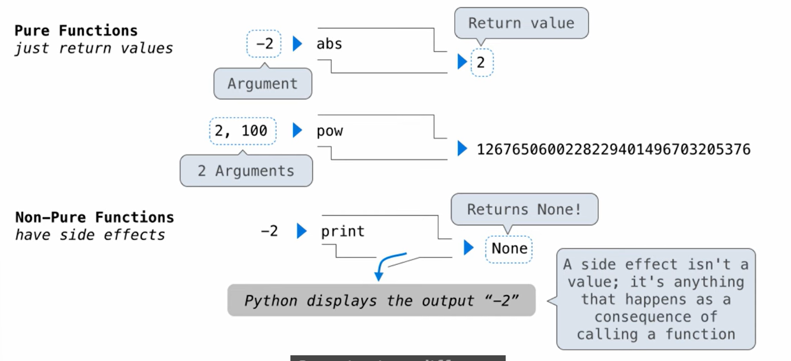


another example of Non-pure Functions:
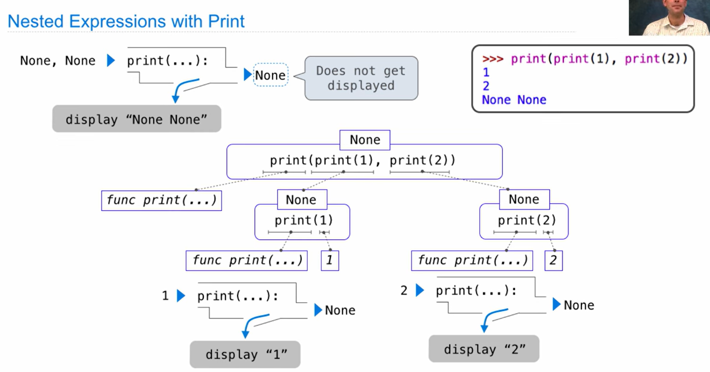


### Defining Functions II: Local Assignment

- the process of function application terminates whenever the first return statement is executed, and the value of the return expression is the returned value of the function being applied.
- assignment statements within a function body cannot affect the global frame
- pure functions interact only via the values they take and return


## Functions as abstractions

 able to suppress details; blackbox
 
**Aspects of a functional abstraction.** To master the use of a functional abstraction, it is often useful to consider its three core attributes. The _domain_ of a function is the set of arguments it can take. The _range_ of a function is the set of values it can return. The _intent_ of a function is the relationship it computes between inputs and output (as well as any side effects it might generate). Understanding functional abstractions via their domain, range, and intent is critical to using them correctly in a complex program.

For example, any square function that we use to implement sum_squares should have these attributes:

- The _domain_ is any single real number.
- The _range_ is any non-negative real number.
- The _intent_ is that the output is the square of the input.

These attributes do not specify how the intent is carried out; that detail is abstracted away.


## Python Features
python terminal v.s python file
python file: no execued untiell we say so
combination of interative interface and file:
`python3 -i ex.py`
opens an interactive session (with a `>>>` prompt). You can then evaluate expressions such as calling functions you defined. To exit, type `exit()`.


```python 
from operator import floordiv, mod

  

def divide(a, b):

    """Return the quotient and remainder of a by b.

    >>> q, r = divide(2013, 10)  # 重点：>>> 后面有空格，逗号后面也有空格
    >>> q
    200
    >>> r
    3
    """ # doctest if q really=200-->ok;
    return floordiv(a, b), mod(a, b)
m, n = divide (7, 2)
```
#### Testing
_Testing_ a function is the act of verifying that the function's behavior matches expectations.
**doctest**
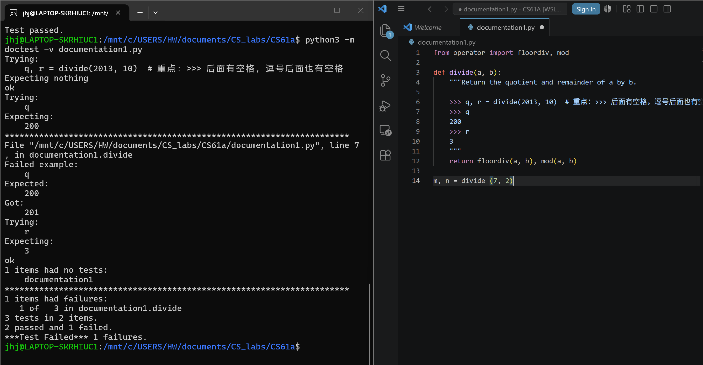
_Testing_ a function is the act of verifying that the function's behavior matches expectations.
>[!Assertions]-
>Programmers use assert statements to verify expectations, such as the output of a function being tested. An assert statement has an expression in a boolean context, followed by a quoted line of text (single or double quotes are both fine, but be consistent) that will be displayed if the expression evaluates to a >false value.
>e.g:
>assert fib(8) == 13, 'The 8th Fibonacci number should be 13'
>(也就是如果fib(8)不是13，会输出后面的文字)

`assert True/False, (False result)`


### How to def a function
Functions: essential ingredient of all programs; The qualitites of good functions all reinforce the idea that functions are abstractions
three tips for a good function
- each function should have one general job, instead of multiple jobs(not too big)
- if u find repeating yourself--->create a function
- functions should be general e.gSquaring is not in the Python Library precisely because it is a special case of the pow function(not to small)


difference between f, f(x), def f(x)
outside def f(x): f:fuction; f(x):value 
in def f(x):(while writing,not evaluating): a function f that takes x and returns f(x)
x:parameter, f(x): a function that can be modified by modifying x!