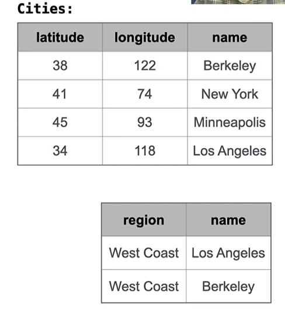

---
tags:
  - "#coding/CS61A"
截止: 2026-07-03
---
Database manmagment system:Structured Query Language
SQL: a declaritive programming language that interacts with tables/databases

[[Declarative Programmming & Imperative programming]]
e.g:
```SQL
SELECT "West Coast" AS region, name FROM cities
	WHERE longitude>=115
	ORDER BY latitude;
	# "West Coast" AS region and name are two seperated declarations
```




[[syntax_SQL]]
 so far, all SQL expressions have referred to the values in a single row at a time
 but aggregate functions can compute a value from groups of rows

 [[Aggregation]]

[[create&drop table]]
[[modifying tables]]
[[Python and SQL]]