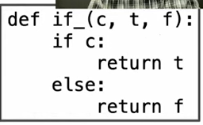

_Control statements_: make comparisons and to perform different operations depending on the result of a comparison; They r statements that control the flow of a program's execution based on the result of logic comparisons.

statements: differ from expressions; they have no value; instead, it determine what the interpreter should do next; executed by the interpreter to perform an action

### Statements:
already know three statements：assignment, def, and return
- they r not expressions, but contain expressions as their value
- statements r executed, not evaluated
- expressions can also be executed as statements,in which case they are evaluated, but their value is discarded
	 for executing a function
	e.g```
	
	```
	>>> def square(x):
        mul(x, x) # Watch out! This call doesn't return a value.
 
	```

	==expression by itself is a valid statement, but the effect of the statement is that the mul function is called, and the result is discarded==

	for a non-pure function:
```python
	def print_square(x):
        print(square(x))
```

** Statements goven the relationship between different expressions among a program and what happens to their results**
#### e.g: return statements:
completes the evaluation of a call expression and provides ites value for a user-defined func f; swich back to the previous environment; f(x) now has a value

### Compound statements
simple statement: a single line that does not end in a colon(e.g:Expressions, return statements, and assignment statements)
compound statement: composed of other statments(e.g else-if) typically span multiple lines and start with a one-line header ending in a colon
-  a header and an indented suite(代码块) of statements is called a clause. A compound statement consists of one or more clauses(e.g def statement)
- A *suite* is a sequence of statements. To execute a suite means to execute its sequence of stantements in order(will not be redirected)
	<header>:
	    <statement>
	    <statement>
    ...
	<separating header>:
	    <statement>
	    <statement>
	    ...
	...

(a unified form of `if` while def....)
The header controls the suite!

the perspective of a multi-line program:
$Execute(Sequence) = Execute(First) \rightarrow \text{If not redirected} \rightarrow Execute(Rest)$
a recursive perspective since $Execute(Rest)$ will be the next $Execute(Sequence)$

### Conditional Statements
if elif else
the effect of the header(statement)：
1. Evaluate the header's expression.
2. If it is a true value, execute the suite. Then, skip over all subsequent clauses in the conditional statement.

---> Boolean contexts & Boolean Values& Boolean logic operators(true and/or false)

from  the funtion perspective:
the difference is that the operends are operated before the function! 



### Iteration(迭代)
while/for...in...
To execute a while clause:
1. Evaluate the header's expression.
2. If it is a true value, execute the suite, then return to step 1.
e.g


return: can combine with and / or!!

1 and func--->func
0 and func---->0