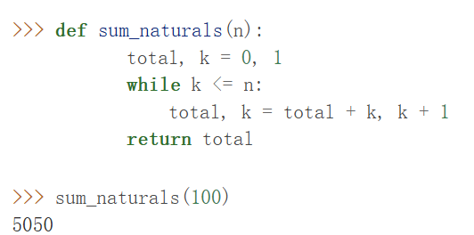
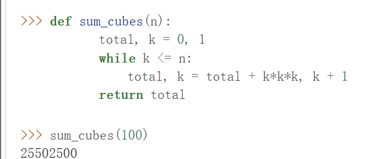
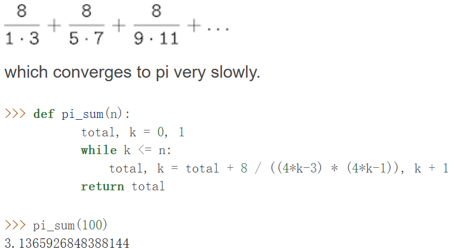
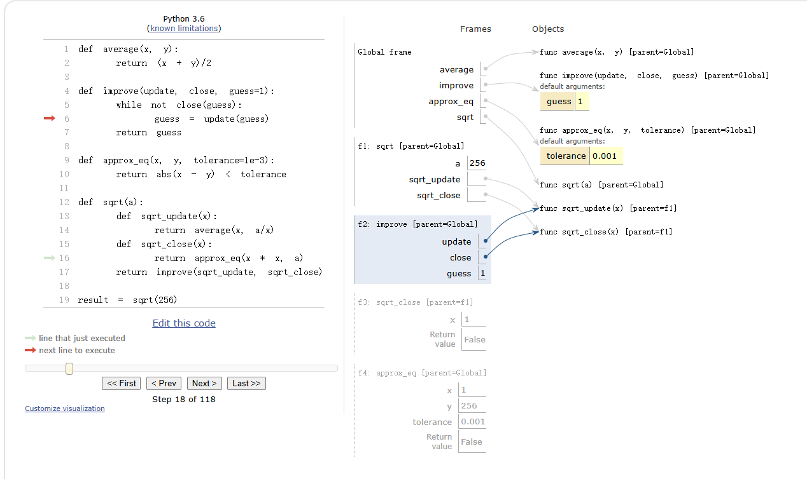
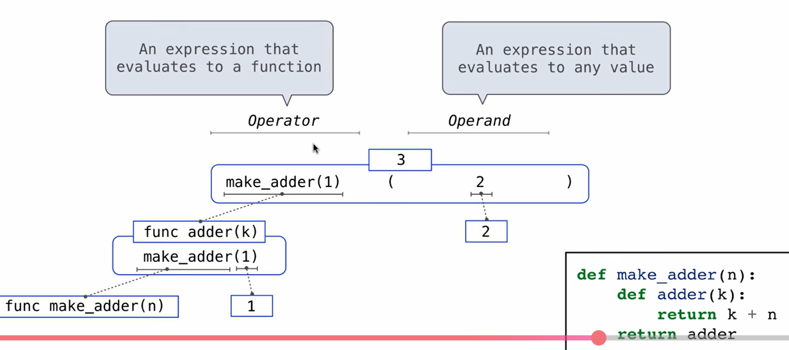
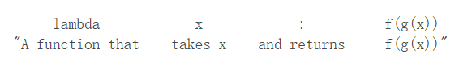
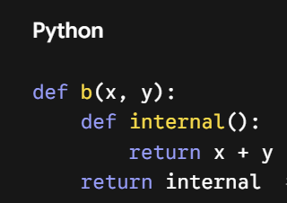
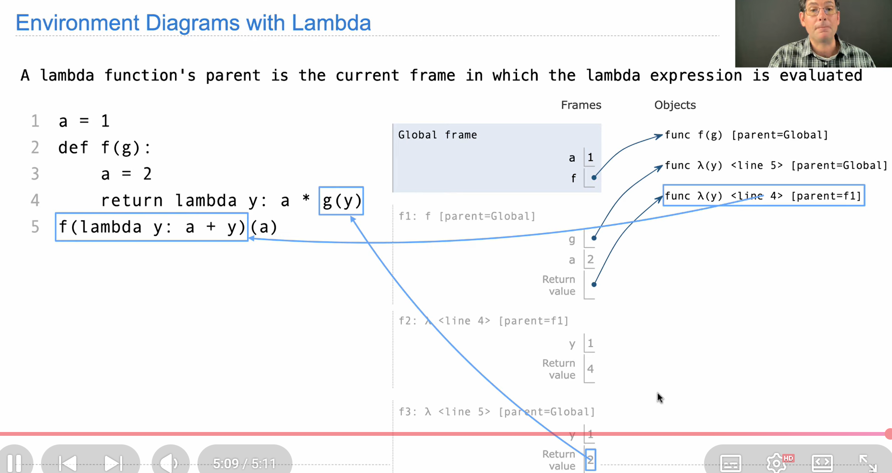
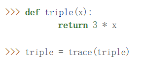

Functions that manipulate functions are called higher-order functions(高阶函数)；higher-order functions can serve as powerful abstraction mechanisms, vastly increasing the expressive power of our language; Generalizing patterns with arguements $\implies$ a higher level of abstraction!


==Notice! the return value and perameters can be a function==!
### Functions as arguments
e.g: computing summations
>[!example]-
>
>
>


share somthing in common:
general versiion of summation 
```python
def <name>(n):
    total, k = 0, 1
    while k <= n:
        total, k = total + <term>(k), k + 1
    return total
```
$\implies$ need a useful function! to abstract the summation process!   `term: functions as formula!`$\implies$ ==**generalize function process==


>>> def summation(n,term):
...     total,k=0,1
...     while k<=n:
...             total,k=total+term(k),k+1
...     return total
...
>>> def identity(x):
...     return(x)
...
>>> result=summation(10,identity)
>>> result
55


### Functions as General Methods

apart from patterns of abstracting numerical operations in the previous lessons; ==With higher-order functions, we begin to see a more powerful kind of abstraction: some functions express general methods of computation, independent of the particular functions they call==

#### Functions as arguements 
e.g: the process of calculating 黄金比例&correctness cheaking
https://www.composingprograms.com/pages/16-higher-order-functions.html#:~:text=of%20the%20steps%20to%20see%20the%20computational%20process%20that%20evolves%20to%20compute%20the%20golden%20ratio.


==notice how parenemter functions are binded to the arguement functions; and the return can also be a function!==; 
when returned, the new frame of the function can dissappear

- naming and functions allow us to abstract away a vast amount of complexity. While each function definition has been trivial, the computational process set in motion by our evaluation procedure is quite intricate.
-  Understanding the procedure of interpreting programs allows us to validate and inspect the process we have created

### Functions as nested functions
previously: Each general concept or equation maps onto its own short function; 单独一个函数 里面不创建新函数 可能只调用/返回新函数
problems:
- The global frame becomes full of names of functions; if place functions in functions$\implies$ simplify!
- my be  constrained by particular function signatures if the program have to be simple/ functions have to be general or portable


the neccessity?

e.g : squrt computation:
https://www.composingprograms.com/pages/16-higher-order-functions.html#:~:text=the%20environment%20first%20adds%20a%20local%20frame%20for%20sqrt%20and%20evaluates%20the%20def%20statements%20for%20sqrt_update%20and%20sqrt_close.

"the environment first adds a local frame for sqrt and evaluates the def statements for sqrt_update and sqrt_close."
即：给在def sqrt(a)中运行的函数统一配置好了一个参数：a;
且==每次使用不用再写update/determine了 因为已经在sqrt里面了==

sqrtv.s golden ratio:
the former requires $a$ and a starting guess:1(of course u can start from a too!)
golden ratio: start from 1


#### enrich our environment model


 The parent of a function value is the first frame of the environment in which that function was defined； when a user-defined function is called, the frame created has the same parent of that function(有一个指针指向定义它的环境)
 >[!example]-
 >so in def improve中的guess=update/sqrt_update(guess)中，变量a无需再定义； 其parent frame 中有a
 > the function carries with it some data;
 > Because they "enclose" information in this way, locally defined functions are often called _closures_(闭包).
 >The environment for this call to sqrt_update consists of ==three frames==: the local sqrt_update frame, the sqrt frame in which sqrt_update was defined (labeled f1), and the global frame.

Hence, we realize two key advantages of lexical scoping in Python.

- The names of a local function do not interfere with names external to the function in which it is defined, because the local function name will be bound in the current local environment in which it was defined, rather than the global environment.(名字先被找到)
- A local function can access the environment of the enclosing function, because the body of the local function is evaluated in an environment that extends the evaluation environment in which it was defined（可以一直把name从里到外找到底）


### Functions as returned values
creating functions whose returned values are themselves functions


e.g define h(x) = f(g(x))
```python
def compose1(f, g):
	def h(x):
		 return f(g(x)) # 未来加上x这个变量 制造出一个函数
	 return h
```
==def compose1_wrong(f, g): 
return f(g(x)) # 瞬间爆炸  name 'x' is not defined==
code example1:
https://www.composingprograms.com/pages/16-higher-order-functions.html#:~:text=The%20environment%20diagram%20for%20this%20example%20shows%20how%20the%20names%20f%20and%20g%20are%20resolved%20correctly%2C%20even%20in%20the%20presence%20of%20conflicting%20names.

2、 seach function defination ==interesting==! remind the differsenct of pereameter/return value=function&value
https://pythontutor.com/cp/composingprograms.html#code=def%20search%28f%29%3A%0A%20%20%20%20x%3D0%0A%20%20%20%20while%20not%20f%28x%29%3A%0A%20%20%20%20%20%20%20%20x%3Dx%2B1%0A%20%20%20%20return%28x%29%0Adef%20squre%28x%29%3A%0A%20%20%20%20return%20x*x%0Adef%20inverse%28f%29%3A%0A%20%20%20%20return%20lambda%20y%3A%20search%28lambda%20x%3A%20f%28x%29%3D%3Dy%29%0Asqurt%3Dinverse%28squre%29%0Asqurt%28256%29&cumulative=true&curInstr=20&mode=display&origin=composingprograms.js&py=3&rawInputLstJSON=%5B%5D

or:  ==make_adder(1)(2)   creates a f(x,y)== by returing fuctions!



### Example:Newton's method to find root of F(x)=0
f(x) 求切线 --->与x轴交点--->再求在交点处切线-->.....满足一定距离要求f(x)在距离0一定距离内--->终止循环
```python
def root(f,df):
    def line_root(x): # a must!!
        return x-f(x)/df(x)  # 对于x,求出在此的切线与z轴的交点
    return line_root(x)
def approachtol(a,b,tol=1e-3):
    return abs(a-b)<tol    # 距离门槛_通用函数
def improve(func,close,guess=1):
    while not close(guess):
        guess=func(guess)
    return guess   # 迭代器_通用函数
def find_zero(f,df): # 建一个函数把这些工具拼起来
    def near_zero(x):
        return approachtol(f(x),0)
    return improve(root(f,df),near_zero)  #求解函数
 
```
e.g:   
f(x)=xn−a and its derivative df(x)=n⋅xn−1.
```python
 def power(x, n):
        """Return x * x * x * ... * x for x repeated n times."""
        product, k = 1, 0
        while k < n:
            product, k = product * x, k + 1
        return product
        
  def nth_root_of_a(n, a):
        def f(x):
            return power(x, n) - a
        def df(x):
            return n * power(x, n-1)
        return find_zero(f, df)
```

### Currying
 convert a function that takes multiple arguments into a chain of functions that each take a single argument.
  More specifically, given a function f(x, y), we can define a function g such that g(x)(y) is equivalent to f(x, y). Here, g is a higher-order function that takes in a single argument x and returns another function that takes in a single argument y(此时x的值已经确定！)
  e.g pow function:
  ```python
   def curried_pow(x):
        def h(y):   # in its parent frame,x is already determined
            return pow(x, y)
        return h
    >>> curried_pow(2)(3)
8 
  ```
  a more common defination method:
  ```python
   def curry2(f):
        """Return a curried version of the given two-argument function."""
        def g(x):# in its parent frame,x is already determined
            def h(y):# in its parent frame,x and y are already determined
                return f(x, y) # value
            return h# the y function  h
        return g # the x,y function  g
  ```
  uncurry method:
```python
def uncurry2(g):
        """Return a two-argument version of the given curried function."""
        def f(x, y):
            return g(x)(y)
        return f
```

### Lambda Expression
Previously, each time we have wanted to define a new function, we needed to give it a name
**Lamba expression** enables us need not to give a new name! but when using lambda: it still creates a new frame with a parent!
==will not leave a name on the right, but will have a curresponding value when defined; and when called, it create a new frame!==
A lambda's parent is the current frame in which the lambda expression is evaluated.
e.g:  function compose1(f,g) is equivilant to:
```python
def complse1(f,g):
	return lambda x: f(g(x))
```
e,g:


the result of a lambda expression is called a lambda function! it behaves like any other function!

|                                                                                                        |
| ------------------------------------------------------------------------------------------------------ |
| g = (lambda y: y())(f)                                                                                 |
| lambda:does not automatically bind a name to the lambda defined!!$\implies$ g=h(f), in the frame,y=f!! |

In an environment diagram, the result of a lambda expression is a function as well, named with the greek letter λ (lambda)

>[!notice]-
>` b = lambda x, y: lambda: x + y # Lambdas can return other lambdas!`
> c = b(8, 4)
> c: a function!
> 
> $\implies$  `c=lambda:8+4`

example:
https://pythontutor.com/cp/composingprograms.html#code=n%20%3D%207%0A%0Adef%20f%28x%29%3A%0A%20%20%20%20n%20%3D%208%0A%20%20%20%20return%20x%20%2B%201%0A%0Adef%20g%28x%29%3A%0A%20%20%20%20n%20%3D%209%0A%20%20%20%20def%20h%28%29%3A%0A%20%20%20%20%20%20%20%20return%20x%20%2B%201%0A%20%20%20%20return%20h%0A%0Adef%20f%28f,%20x%29%3A%0A%20%20%20%20return%20f%28x%20%2B%20n%29%0A%0Af%20%3D%20f%28g,%20n%29%0Ag%20%3D%20%28lambda%20y%3A%20y%28%29%29%28f%29&cumulative=true&curInstr=20&mode=display&origin=composingprograms.js&py=3&rawInputLstJSON=%5B%5D

https://www.composingprograms.com/pages/16-higher-order-functions.html#:~:text=Our%20compose%20example%20can%20be%20expressed%20quite%20compactly%20with%20lambda%20expressions.



### Abstractions and First-class functions

 The significance of higher-order functions is that they enable us to represent these abstractions explicitly as elements in our programming language, so that they can be handled just like other computational elements.

def of first-class elements:

- Some of the "rights and privileges" of first-class elements are:
	1. They may be bound to names.
	2. They may be passed as arguments to functions.
	3. They may be returned as the results of functions.
	4. They may be included in data structures.

Python awards functions full first-class status, and the resulting gain in expressive power is enormous.


### Fuction decorators
a special syntax to apply higer-order functions as part of executing a def statement, called a decorator!
```python
def trace(fn):
        def wrapped(x):
            print('-> ', fn, '(', x, ')')
            return fn(x)
        return wrapped
@trace
    def triple(x):
        return 3 * x
>>> triple(12)
->  <function triple at 0x102a39848> ( 12 )
36
```

 In code, this decorator is equivalent to:
 
 https://pythontutor.com/cp/composingprograms.html#code=def%20trace%28fn%29%3A%0A%20%20%20%20%20%20%20%20def%20wrapped%28x%29%3A%0A%20%20%20%20%20%20%20%20%20%20%20%20print%28'-%3E%20',%20fn,%20'%28',%20x,%20'%29'%29%0A%20%20%20%20%20%20%20%20%20%20%20%20return%20fn%28x%29%0A%20%20%20%20%20%20%20%20return%20wrapped%0Adef%20triple%28x%29%3A%0A%20%20%20%20%20%20%20%20return%203%20*%20x%0Atriple%20%3D%20trace%28triple%29%0Atriple%2812%29&cumulative=true&curInstr=7&mode=display&origin=composingprograms.js&py=3&rawInputLstJSON=%5B%5D

### 错题&精华
[[111]]
[[disc02_Q5,6]]
[[disc02_Q7]]