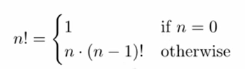
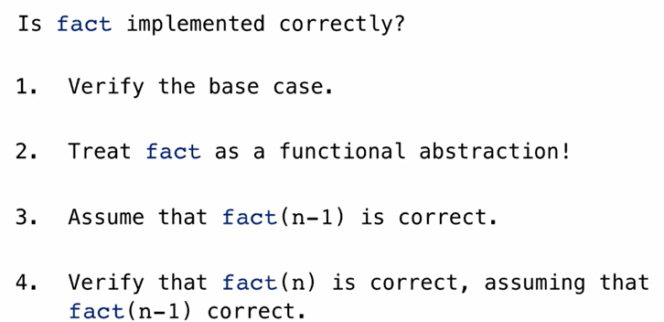
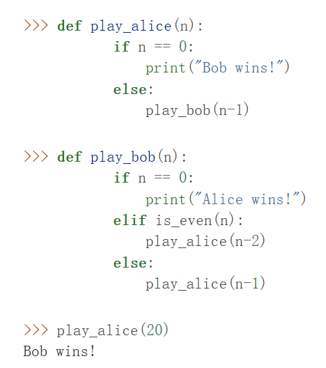

*recursive function*: the body of the function calls the function intself, either idrectely or indirectly

essence: simplify an f(large number) into f(simple)+number1+nunber2+$\dots$
/ using the frame to keep track of where we are in computation!

e.g: sum of digits:( can use recursive functions instead of 循环)

```python
def sum_digits(n):
        """Return the sum of the digits of positive integer n."""
        if n < 10:
            return n  # the real end of recursion! a must and need to be a must!
        else:
            all_but_last, last = n // 10, n % 10
            return sum_digits(all_but_last) + last
```


The problem of summing the digits of a number is broken down into two steps: summing all but the last digit(求前n-1位的各位数字之和）, then adding the last digit

==the return value is recursed too==!
>[!website]-
>https://pythontutor.com/cp/composingprograms.html#code=def%20sum_digits%28n%29%3A%0A%20%20%20%20if%20n%20%3C%2010%3A%0A%20%20%20%20%20%20%20%20return%20n%0A%20%20%20%20else%3A%0A%20%20%20%20%20%20%20%20all_but_last,%20last%20%3D%20n%20//%2010,%20n%20%25%2010%0A%20%20%20%20%20%20%20%20return%20sum_digits%28all_but_last%29%20%2B%20last%0A%0Asum_digits%28738%29&cumulative=true&mode=edit&origin=composingprograms.js&py=3&rawInputLstJSON=%5B%5D

[[knapsack]]

### The Anatomy of Recursive Functions
begins with a base case: a conditional statement that defines behaviour of the function for inputs that r the easiest to process
followed by some/one recrusive calls: aim: simplify compution
>[! example]-
>For example, summing the digits of 7 is simpler than summing the digits of 73, which in turn is simpler than summing the digits of 738. For each subsequent call, there is less work left to be done.

>[! example2]-
>https://pythontutor.com/cp/composingprograms.html#code=def%20fact%28n%29%3A%0A%20%20%20%20if%20n%20%3D%3D%201%3A%0A%20%20%20%20%20%20%20%20return%201%0A%20%20%20%20else%3A%0A%20%20%20%20%20%20%20%20return%20n%20*%20fact%28n-1%29%0A%0Afact%284%29&cumulative=true&mode=edit&origin=composingprograms.js&py=3&rawInputLstJSON=%5B%5D
>The recursive funcrtion constructs the results directly from the final term $n$ and the result of the simpler problem `fact(n-1)`

think about it in the persipective of abstraction: we should not care about how `fact(n-1)` is implemented in the body of fact; we should simply trust that it computes the factorial of $n-1$
the mathematical formula:

==similar to 数学归纳法==
the correction of recursive function:

### Mutual Recursion
A recursive procedure that is divided among two functions that call each other
>[!example]- Recursion in return value
>https://pythontutor.com/cp/composingprograms.html#code=def%20is_even%28n%29%3A%0A%20%20%20%20if%20n%20%3D%3D%200%3A%0A%20%20%20%20%20%20%20%20return%20True%0A%20%20%20%20else%3A%0A%20%20%20%20%20%20%20%20return%20is_odd%28n-1%29%0A%0Adef%20is_odd%28n%29%3A%0A%20%20%20%20if%20n%20%3D%3D%200%3A%0A%20%20%20%20%20%20%20%20return%20False%0A%20%20%20%20else%3A%0A%20%20%20%20%20%20%20%20return%20is_even%28n-1%29%0A%0Aresult%20%3D%20is_even%284%29&cumulative=true&mode=edit&origin=composingprograms.js&py=3&rawInputLstJSON=%5B%5D
>a number is even if it is one more than an odd number
 >a number is odd if it is one more than an even number
>0 is even
>or: another perspective: define two base cases:
>```python
>def is_even(n):
        if n == 0:
            return True
        else:
            if (n-1) == 0:
                return False
            else:
                return is_even((n-1)-1)
>```
>

>[!Recrution in body of the function]-
>As another example of mutual recursion, consider a two-player game in which there are n initial pebbles on a table. The players take turns, removing either one or two pebbles from the table, and the player who removes the final pebble wins. Suppose that Alice and Bob play this game, each using a simple strategy:
>- Alice always removes a single pebble
>-  Bob removes two pebbles if an even number of pebbles is on the table, and one otherwise
>
>multiple recursive calls may appear in the body of a function,  but can oly execute one of them!!!


simplifies the singal recursive program by mutual recursion
[[Interleaved Sum]]
### Printing in Recursive Functions

the recursion in the body of the function is different from recursion in the return value!!!
in the body: stops in the line;until the value of the function is returned!

>[!example]-
>```python
>def cascade(n):
        """Print a cascade of prefixes of n."""
        if n < 10:
            print(n)  (A)
        else:
            print(n)  (B)
            cascade(n//10)
            print(n)(C)
>```
>`cascade(2013)`
>2013  (B)
>201   (B)
>20   (B)
>2    (A)
>20    (C) (return none to this)
>201   (C) (return none to this)
>2013   (C) (return none to this)
>==**Has to wait until the return value before operating next lines**==
>[[inverse cascade]] 


### Tree Recursion
a function calls itself more than once: essence:how to seperate the next problem into differnt parts??
>[!Fibonacci numbers]
>https://pythontutor.com/cp/composingprograms.html#code=def%20fib%28n%29%3A%0A%20%20%20%20if%20n%20%3D%3D%201%3A%0A%20%20%20%20%20%20%20%20return%200%0A%20%20%20%20if%20n%20%3D%3D%202%3A%0A%20%20%20%20%20%20%20%20return%201%0A%20%20%20%20else%3A%0A%20%20%20%20%20%20%20%20return%20fib%28n-2%29%20%2B%20fib%28n-1%29%0A%0Aresult%20%3D%20fib%286%29&cumulative=true&mode=edit&origin=composingprograms.js&py=3&rawInputLstJSON=%5B%5D

>[!Partitions]-
>[problems](https://www.composingprograms.com/pages/17-recursive-functions.html#:~:text=The%20number%20of%20partitions%20of%20a%20positive%20integer%20n%2C%20using%20parts%20up%20to%20size%20m%2C%20is%20the%20number%20of%20ways%20in%20which%20n%20can%20be%20expressed%20as%20the%20sum%20of%20positive%20integer%20parts%20up%20to%20m%20in%20increasing%20order.%20For%20example%2C%20the%20number%20of%20partitions%20of%206%20using%20parts%20up%20to%204%20is%209)
>
> partitioning n can be divided into two groups: those that include at least one m and those that do not
> ```python
> def count_partitions(n, m):
        """Count the ways to partition n using parts up to m."""
        if n == 0:
            return 1
        elif n < 0:   # n-m is likely to be<0 ,when count_partitions(n-m, m) is invalid
            return 0
        elif m == 0:
            return 0
        else:
            return count_partitions(n-m, m) + count_partitions(n, m-1)
> ```


[[is_prime_recursion version]]

[[Circle]]

[[Dollar_count]]


### Y conbinator
e.g: write factorial function in one line:
```python
fact = lambda n: 1 if n == 1 else mul(n, fact(sub(n, 1)))
```
but: if u r not allowed to call the name `fact`???
$\implies$ a general way to do this by
```python
def Y(f):
	return f(lambda:Y(f))
```
the factorization becomes:
```python
def Y_factorization():
	return Y(lambda h: lambda n:1 if n==1 else mul(n,h()(sub(n-1))))#需要引入一个外围的反复调用函数lambda h!!
```
`h()`: the symbil that 重新调用函数
return f(lambda:Y(f)) 内部lambda无参数的原因：重复迭代调用而已，没有增加自变量！！

