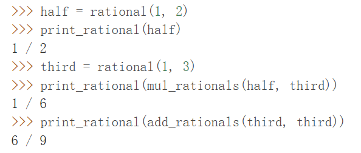
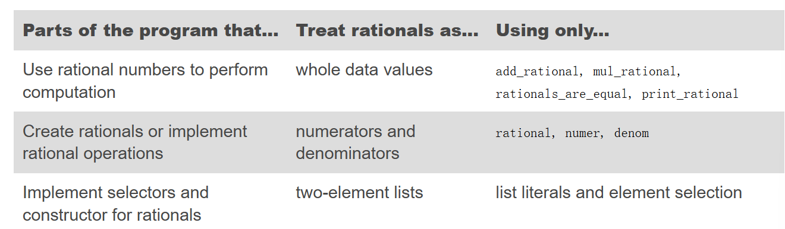

This lesson focuses on data. Goal: represent & manipulate imformation about many different domains

### Native Data Types
*class*: determines what typethe value is!   class= `type(value)`
>[!Native Data Types]-
>1. There are expressions that evaluate to values of native types, called _literals_.
>2. There are built-in functions and operators to manipulate values of native types.

Three Numeric Types:  integers (int), real numbers (float), and complex numbers (complex)
 float objects: should be treated as ==approximations to real values==(important)
 
 None-numeric Types: e.g: bool
 The following sections introduce more of Python's native data types, focusing on the role they play in creating useful data abstractions

### Data Abstraction

 e.g: may data we operate on have compound structure e.g $(x,y)$ $\implies$ can manipulate as a single conceptual unit, but which also has two parts that can be considered individually.
**Data Abstraction**: The general technique of isolating ==the parts of a program that deal with how data are represented== from ==the parts that deal with how data are manipulated==；represent and manipulate compound data as units

 >[!similar to function abstraction]-
>We can make an abstraction that separates the way the function is used from the details of how the function is implemented.
>Analogously, data abstraction isolates how a compound data value is used from the details of how it is constructed.

#### Understanding Data Abstraction in the lens of Rational numbers
==**Buld logical/closed rules for data**==

**Step1** manipulation roles r written in three functions: `numer denom rational`
assume that theses three r already known(*wishful thinking*)
- rational(n, d) returns the rational number with numerator n and denominator d.
- numer(x) returns the numerator of the rational number x.
- denom(x) returns the denominator of the rational number x.

We define four evaluation functions first; operations on rational numbers
```python
def add_rationals(x, y):
        nx, dx = numer(x), denom(x)
        ny, dy = numer(y), denom(y)
        return rational(nx * dy + ny * dx, dx * dy) # rational:constructor!
def mul_rationals(x, y):
        return rational(numer(x) * numer(y), denom(x) * denom(y))

def print_rational(x):
        print(numer(x), '/', denom(x))

def rationals_are_equal(x, y):
        return numer(x) * denom(y) == numer(y) * denom(x)
```

**Step 2**
define the wishful thingking: need to glue two numbers together
$\implies$ use lists!!
the returned value of defined value ==must be a **Native data**==
```python
def rational(n, d):  # constructor: build the value by native values
        return [n, d]
def numer(x):    # Selector: pick from the materials of the constructor to represent some attributes of the vaue
        return x[0]
def denom(x):      # Selector: pick from the materials of the constructor to represent some attributes of the vaue
        return x[1]
```

>[!results]-
>
>

**Step 3**
dealing with flaws: 无法约分！
```python
from fractions import gcd
def rational(n, d):
        g = gcd(n, d)  #取最大公约数 优化定义
        return (n//g, d//g)
```

**Step 4: tips in operation: abstration barriers


==three distinct level/barriers of abstraction!==
they can not be integrated/mixed
e.g define square rational:
```python
def square_rational(x):
        return mul_rational(x, x) # proper: the most abstract method!
def square_rational_violating_once(x):
        return rational(numer(x) * numer(x), denom(x) * denom(x))# not that good! Referring directly to numerators and denominators would violate one abstraction barrier.
def square_rational_violating_twice(x):
        return [x[0] * x[0], x[1] * x[1]] # not that good! Assuming that rationals are represented as two-element lists would violate two abstraction barriers
```
 A function that computes the square of a rational number is best implemented in terms of mul_rational, which does not assume anything about the implementation of a rational number; Knowing more may hit the abstraction barrier!!
**u can change your representations without changing any body of the data**

>[!reason]-
>Abstraction barriers make programs easier to maintain and to modify. The fewer functions that depend on a particular representation, the fewer changes are required when one wants to change that representation$\implies$ ==a more robust &clear&simple value defination==
>
>The square_rational function would not require updating even if we altered the representation of rational numbers. By contrast, square_rational_violating_once would need to be changed whenever the selector or constructor signatures changed, and square_rational_violating_twice would require updating whenever the implementation of rational numbers changed.


### The properties of data
In general, we can express abstract data using a collection of selectors and constructors, together with some behavior conditions; ==Also As long as the behavior conditions are met (such as the division property above), the selectors and constructors constitute a valid representation of a kind of data. The implementation details below an abstraction barrier may change, but if the behavior does not, then the data abstraction remains valid, and any program written using this data abstraction will remain correct==
(行为大于形式)

 e.g in the rational example: the data(list) used in defining values can even be replaced by functions!(defining a pair function!)
```python
def pair(x, y):
        """Return a function that represents a pair."""
        def get(index):
            if index == 0:
                return x
            elif index == 1:
                return y
        return get
def select(p, i):
        """Return the element at index i of pair p."""
        return p(i)
```
 or:
 ```python
 def rational(n,d)：
	 def select(name):
		 if name=='n':
			 return n
		else name=='d':
			return d
	return select
def numer(x):   
	return x('n')  # x: rational(n,d)!!! hier-order funtion 此时用了select()函数
def denom(x):
	return x('d')
 ```
the pair(m,n) can directly replace the list value while not needing to change other priror definations! e.g: evaluation definations
(用“函数”来充当“数据”)

(This use of higher-order functions corresponds to nothing like our intuitive notion of what data should be.)

==The practice of data abstraction allows us to switch among different representations easily!==, simplifies the effort to make changes&refining