seuqence: an ordered collection of values
#### Lists
index,lenths, index number=one for the value

**list calculation:**
 lists can be added together and multiplied by integers；
 but:  for sequences  add=combine sequences; multiply=replicate sequences
any values can be included in a list

**Sequence Iteration**
use for & while&range(左闭右开)
for: already unpacks the sequence one time


### Sequence Processing
#### List Comprehensions:
use lists already known to form a new list
```python
odds=[1,3,5,7,9]
[x+1 for x in odds if 25%x==0]
[<map expression> for <name> in <sequence expression> if <filter expression>]
```

>[!process]-
>To evaluate a list comprehension, Python evaluates the 
sequence expression, which must return an iterable value. Then, for each element in order, the element value is bound to name, the filter expression is evaluated, and if it yields a true value, the map expression is evaluated. The values of the map expression are collected into a list.


#### Aggregation
aggregate all values in a sequence into a single value via functions
e.g
sum()/min()/max()/len()/all(): inputs a sequence of nubers and returns a number
or `1 in list`   True or False
```python
def devisors(n)
	return [1]+[x for x in range(2,n) if n%x==0]
	[n for n in range(1,1000) if sum(divisors(n))==n]
or:another use of sum: sum(sequence,[start])
>>>sum([[2,3],[4]],[])
>>>[2,3,4]
or:another use of max:max(sequence,[key])
>>>max(range(10),key=lambda x: 7-(x-4)*(x-2))
```

 the sequence is determined by a number n
 the use of devisors():
	 e.g: already know area & height; find the minumun 周长(all are integers)
	 ```python
	 def width(area,height):
		 assert area%height==0
		 return area//height # gaiuntee that the return value is a int
	def perimeter(width,height)
		return 2*width+2*height
	def minimunperimeter(area):
			heights=divisors(area)
			perimeters=[perimeter(width(area,h),h) for h in heights]
			return min(perimeters)  # the use of aggregation
	```


#### Higher-Order Functions
we often use higher order function when creating a function that returns a sequence:
```python
def apply_to_all(map_fn,s):
	return []map_fn(x) for x in s]
```
```python
# or function can be used as filters
def keep_if(filter,s):
	return [x for x in s if filter_fn(x)]

e.g3: the use of aggregation functions:
many forms of aggregation can be expressed as repeatedly applying a two-argument function to the reduced value so far and each element in turn.
```python
	def reduce(aggregation_fn,s,initial):
		reduced=initial
		for x in s:
			reduced=aggregation_fn(reduced,x)  # the use of aggregation function in cycles
		return reduced
```
a computing function:
e.g `reduce(mul, [2, 4, 8], 1)`
[combination](https://www.composingprograms.com/pages/23-sequences.html#:~:text=can%20find%20perfect%20numbers%20using%20these%20higher%2Dorder%20functions%20as%20well.)
example: list recursion:
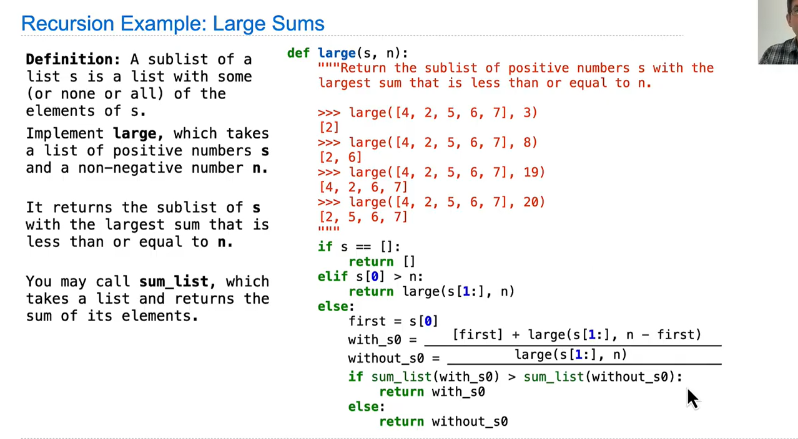


[[../../../../Concepts/Problem_L7]]


### Sequence abstraction

```python
digits[0:2]  # slicing
2 in digits
True            # membership
```
these r two abstractions! 
lists are sich in abstraction!

### Strings
also rich abstraction; an abstraction of textual data
also a sequence: **Has length and support element selection** same ways as lists

can also be combined via adding and multipication

for multiline strings: triple quoting
```python
 """The Zen of Python
claims, Readability counts.
Read more: import this."""
>>>'curry=lambda f: lambda x: f(x)'
>>>(returns a str)
>>>exec('curry=lambda f: lambda x: f(x)')
>>>return the function!
```


### Dictionary
看平板笔记
[[Dictionary Comprehensions]]
### Trees

a similar structure as git!


[list visualization in environment diagrams](https://pythontutor.com/cp/composingprograms.html#code=one_two%20%3D%20%5B1,%202%5D%0Anested%20%3D%20%5B%5B1,%202%5D,%20%5B%5D,%0A%20%20%20%20%20%20%20%20%20%20%5B%5B3,%20False,%20None%5D,%0A%20%20%20%20%20%20%20%20%20%20%20%5B4,%20lambda%3A%205%5D%5D%5D&cumulative=true&curInstr=4&mode=display&origin=composingprograms.js&py=3&rawInputLstJSON=%5B%5D)

#### Closure property of a dta type:
clcosure property of a data type: if the resulet of combination can itself be combined using the same method
$\implies$ can create hierarchical structures；and show how they r structured and manipulated
e.g: nested lists in lists
in environment diagrams: [[Box-and-pointer Notation]] is used
$\implies$: a *tree* is a data abstraction that describes/ imposes regularity on how hierarchical values r structured and manipulated

Tree:
- root label+[a sequence of branches(Each branch of a tree is a tree)]/ a tree with no branches is a leaf
- Any tree contained within a tree is called a sub-tree of that tree (such as a branch of a branch)
- The root of each sub-tree of a tree is called a node in that tree

[[Example for tree abstraction]]

e.g: under the tree abstraction model:
Trees can be constructed by nested expressions. The following tree t has root label 3 and two branches.
[label +list of branches]
```python
 t = tree(3, [tree(1), tree(2, [tree(1), tree(1)])]) #[tree(1), tree(2, [tree(1), tree(1)])] a list of branches
 [3,[1],[2,[1],[1]]]
 >>> label(t)
3
>>> branches(t)
[[1], [2, [1], [1]]]
>>> label(branches(t)[1])
2
>>> is_leaf(t)
False
>>> is_leaf(branches(t)[0])
True
```
t can be shown like this:
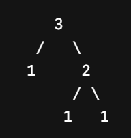


using this model for the $n^{th}$ tree in the Fibonacci tree(build the tree)

```python
def fib_tree(n):
        if n == 0 or n == 1:
            return tree(n)
          else:
            left, right = fib_tree(n-2), fib_tree(n-1)
            fib_n = label(left) + label(right) # 数值相加！
            return tree(fib_n, [left, right])

>>> fib_tree(5)
[5, [2, ==[1]==, [1, ==[0]==, ==[1]==]], [3, [1, ==[0]==, ==[1]==], [2, ==[1]==, [1, ==[0]==, ==[1]==]]]]
# 5=2+3
 
```
the label=the actual fib number

**Tree processing**
Tree-recursive functions are also used to process trees. For example, the count_leaves function counts the leaves of a tree.
```python
def count_leaves(tree):
	if is_leaf(tree):
		return 1
	else:
		branch_counts=[count_leaves(b) for b in branches(tree)]# important! a highly recursive operation!  returns a list with 1 & zero!
		return sum(branch_counts)

>>>count_leaves(fib_tree(5))
>>>8 # the egiht highlighted components!!; there are eight trees
```
vs: list out the labels of the trees
```python
def leaves(tree):
	if is_leaf(tree):
		return [label(tree)]
	else:
		return sum(leaves(b) for b in branches(tree))
# leaves(fib_tree(5))
# [1,0,1,0,1,1,0,1]
```
e.g3: **Partition Trees**
Use trees to represent the partitions of an integer
 A partition tree for n using parts up to size m is a binary (two branch) tree that represents the choices taken during computation
```python
 def partition_tree(n, m):
        """Return a partition tree of n using parts of up to m."""
        if n == 0:
            return tree(True)
        elif n < 0 or m == 0:
            return tree(False)
        else:
            left = partition_tree(n-m, m)
            right = partition_tree(n, m-1)
            return tree(m, [left, right])
>>> partition_tree(2,2)
```
`[2,[True],[1,[1,[True],[False]],[False]]]`

Tree-recursive process can be used to print the partition tree
 Whenever a `True` leaf is reached, the partition is printed
 ```python
 def print_parts(tree, partition=[]):
        if is_leaf(tree):
            if label(tree): # 判断是true/false
                print(' + '.join(partition)) #'签子'.join([山楂1, 山楂2, 山楂3])  把每个元素用+串起来！
        else:
            left, right = branches(tree)
            m = str(label(tree))
            print_parts(left, partition + [m]) # left: partition_tree(n-m, m)  使用了数字m
            print_parts(right, partition) # right: partition_tree(n, m-1) 没有使用数字m
 ```
`>>> print_parts(partition_tree(6, 4))`
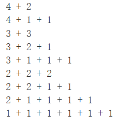

**Form a binary tree from an ordianry tree**
```python
def right_binarize(tree):
        """Construct a right-branching binary tree."""
        if is_leaf(tree):
            return tree
        if len(tree) > 2:
            tree = [tree[0], tree[1:]]
        return [right_binarize(b) for b in tree]
```
`right_binarize([1, 2, 3, 4, 5, 6, 7])`
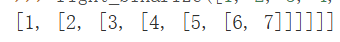
binary trees: a kind that is easier to compute


**create trees through recursing trees:**
```python
def incre_leaves(t):
# all the leaf labels r incremented
	if if_leaf(t):
		return tree(label(t)+1)
	else:
		bs=[incre_leaves(b) for b in branches]
		return tree(label(t),bs)
		
# all labels r incremented
def incre(t):
	return tree(label(t)+1,[incre(b) for b in branches(t)])
```


**count paths that have a total sum**
 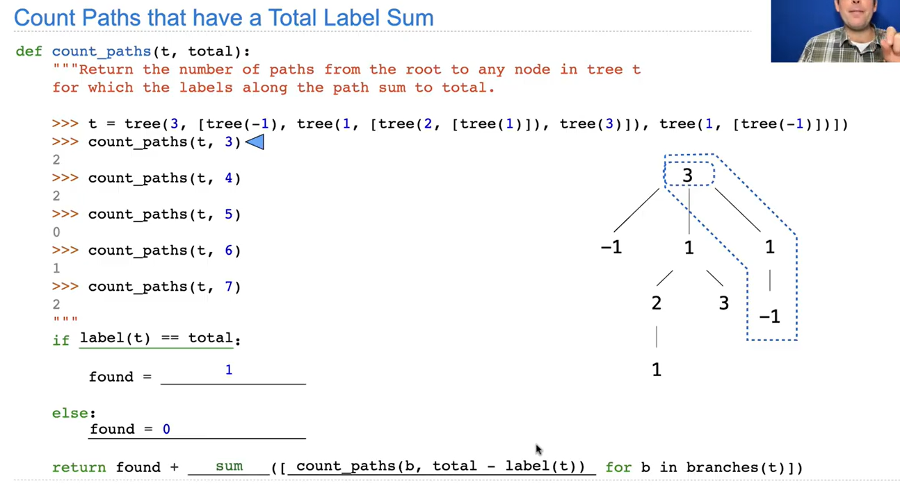


**Summing Paths**
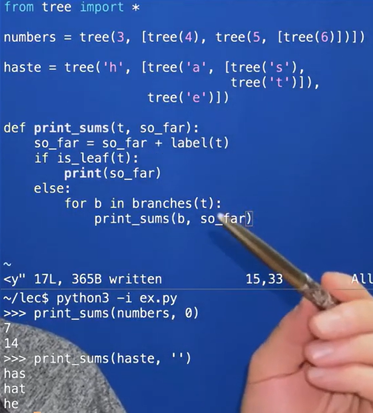


[[problems_hw05]]


**Linked Lists**
 we can also develop sequence representations that are not built into Python. A common representation of a sequence constructed from nested pairs is called a _linked list_.
 [example](https://pythontutor.com/cp/composingprograms.html#code=four%20%3D%20%5B1,%20%5B2,%20%5B3,%20%5B4,%20'empty'%5D%5D%5D%5D&cumulative=true&curInstr=1&mode=display&origin=composingprograms.js&py=3&rawInputLstJSON=%5B%5D)
 A linked list is a pair containing the first element of the sequence (in this case 1) and the rest of the sequence in another list

Linked lists have recursive structure
$\implies$ we can define an abstract data to validate, construct, and select the components of linked lists
```python
empty = 'empty'
 def is_link(s):
        """s is a linked list if it is empty or a (first, rest) pair."""
        return s == empty or (len(s) == 2 and is_link(s[1]))
def link(first, rest):
        """Construct a linked list from its first element and the rest."""
        assert is_link(rest), "rest must be a linked list."
        return [first, rest]
def first(s):
        """Return the first element of a linked list s."""
        assert is_link(s), "first only applies to linked lists."
        assert s != empty, "empty linked list has no first element."
        return s[0]
def rest(s):
        """Return the rest of the elements of a linked list s."""
        assert is_link(s), "rest only applies to linked lists."
        assert s != empty, "empty linked list has no rest."
        return s[1]
```
 e.g:`four = link(1, link(2, link(3, link(4, empty))))`
 从link(4, empty) 开始 由内而外算！

pairs/lists can also be implemented by functions $\implies$ linkk lists can also be formed by purely functions!

also: some behaviors can also be defined:
```python
def len_link(s): # returns the "length" of the list
        """Return the length of linked list s."""
        length = 0
        while s != empty:
            s, length = rest(s), length + 1
        return length
def getitem_link(s, i): # element selection
        """Return the element at index i of linked list s."""
        while i > 0:
            s, i = rest(s), i - 1
        return first(s)
```


**Recursive manipulation**
using recursive function an also def len_link/getitem_link properly
```python
def len_link_re(s):
	if s==empty:
		return 0
	return 1+len_link_re(rest(s))
def getitem_link_re(s,i):
	if i==0:
		return first(s)
	return getitem_link_re(rest(s),i-1)
```

or: use it to extend lists:
```python
 def extend_link(s, t):
        """Return a list with the elements of s followed by those of t."""
        assert is_link(s) and is_link(t)
        if s=empty:
	        return t  # 在s的末尾连上t
	    else:
		    return link(first(s),extend_link(rest(s),t))
```
use a  function to apply to all entities/select entities/join seperators:
```python
def apply_to_all(f,s):
	assert is_link(s)
	if s==empty:
		return s
	else:
		return link(f(first(s)),apply_to_all(f,rest(s)))

def keep_if_link(f,s):
	if s==empty:
		return s
	else:
		kept=keep_if_link(f,rest(s))  # rest 是对先前的处理后的结果
		if f(first(f)):
			return link(first(f),kept)
		else:
			return kept
def join_link(s,separator):
	if s==empty:
		return ""
	elif rest(s)==empty:
		return str(first(s))
	else:
		returm str(first(s))+seperator+ join_link(rest(s),seperator)
```

 [1, [2, [3, [4, 'empty']]]]

use recursion to solve partition:
```python 
 def partitions(n, m):  # the data layer
        """Return a linked list of partitions of n using parts of up to m.
        Each partition is represented as a linked list.
        """
        if n == 0:
            return link(empty, empty) # A list containing the empty partition; two empties because one empty needs to serve as an end! & look at the def of function apply_to_all
        elif n < 0 or m == 0:
            return empty
        else:
            using_m = partitions(n-m, m)
            with_m = apply_to_all_link(lambda s: link(m, s), using_m) # every m is linked out bof it
            without_m = partitions(n, m-1)
            return extend_link(with_m, without_m)
```


### Objects
objects: combine data and data manipulation!
trees and linked lists are all recursive objects
- objects represent information
- They consist of data and behavior,bundled together to create abstractions
- Objects can represent things, /properties/interactions/processes
- A type of objects is calles a *class* ; classes are first-class values in Python(means that classes can be manipulated like values)
- Object-oriented programming:
	- A metaphor for organizing large programs
	- Special syntax that can improve the composition of programs
>[!example]-
>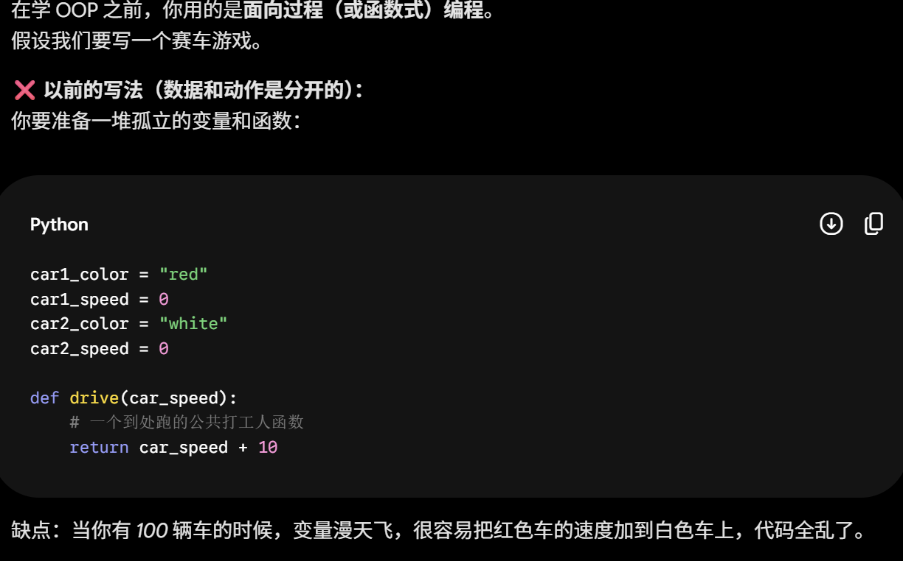
>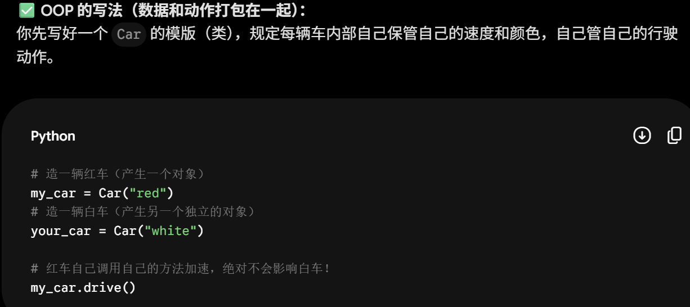
- In python, every value is an object
	- All objects have attributes(属性： 所有对象都有内部变量)
	- A lot of data manipulation happens through object methods
	- Functions(一种“动词主导”的设计思路。数据是数据，动作是动作，两者分离) do one thing (e.g:`shoot(player1)`)
	 objects(一种“名词主导”**的 OOP 设计思路。数据和处理数据的动作被**捆绑（bundled）在了一起。对象自己管理自己) do many related things!(e.g:`player1.shoot()`)

e.g: create class and objects:
```python
# 1. 制造图纸（类 Class）：定义所有球员应该长什么样
class Player:
    # 构造函数（图纸的初始化说明书）：每次造一个新球员时，必须要给名字和初始体力
    def __init__(self, name, stamina):
        # 数据（Attributes / 属性）
        self.name = name
        self.stamina = stamina
        self.points = 0  # 所有人一开始得分都是 0

    # 行为（Methods / 方法）：球员能做的动作
    def shoot(self):
        if self.stamina > 0:
            self.points += 2
            self.stamina -= 1
            print(f"{self.name} 投篮得分！当前得分: {self.points}, 剩余体力: {self.stamina}")
        else:
            print(f"{self.name} 没体力了，投不进！")

# -----------------------------------------

# 2. 制造实物（对象 Objects / 实例 Instances）
# 我们用 Player 这个图纸，造出了两个具体的人
player1 = Player("Curry", stamina=10)   # player1 是一个对象
player2 = Player("LeBron", stamina=5)   # player2 是另一个对象

# 3. 互不干扰的独立状态
player1.shoot()  # 输出: Curry 投篮得分！当前得分: 2, 剩余体力: 9
player1.shoot()  # 输出: Curry 投篮得分！当前得分: 4, 剩余体力: 8
e.g: l.append
s.upper(not functions but are manipulation of objects)
# player1 疯狂投篮，但这绝对不会影响 player2 的数据！
print(player2.points)  # 输出: 0 （LeBron 的得分依然是 0，体力依然是 5）
```


#### Mutation Operations
only objects of mutable(可变的) types can change: lists&dictionaries
mutable values can change, so when it is changed  it will not create a new object
immutable sequences: tuples; but it can still change if it has a mutable value  as an element!
 **mutable object** vs **immutable objects**
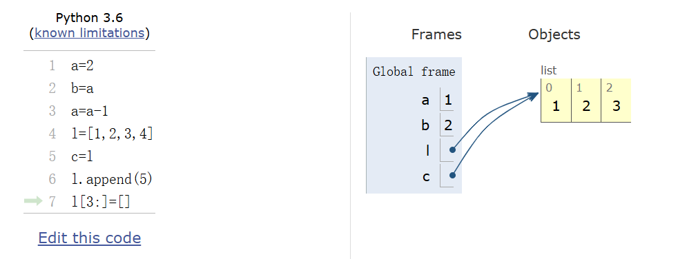

numbers: immuable object: a=a-1: creates a new value 1 for a
lists: mutable object append/swich:  changes the object itself; l and c changes at the same time!
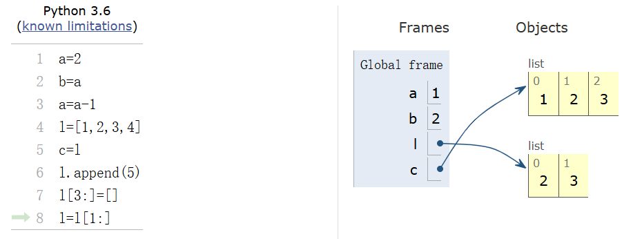
another example
```python
>>> s.extend([s.append(9),s.append(10)])
>>> s
[3, 4, 5, 9, 10, None, None]
```
line 7 and 8 r different meanings!! line 8: eqivilant to binding a new value/object to l!
another example:
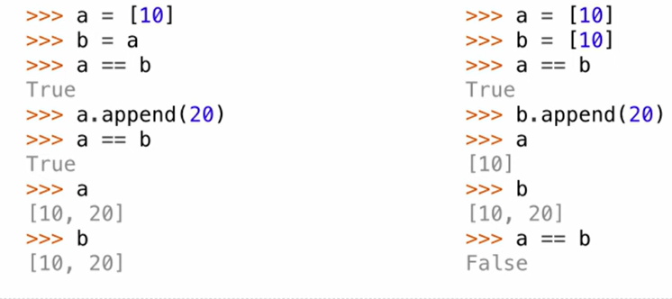
in both sides:
`a==b`$\implies$ true
`a is b`$\implies$ in the left: true  in the right: false

another example:
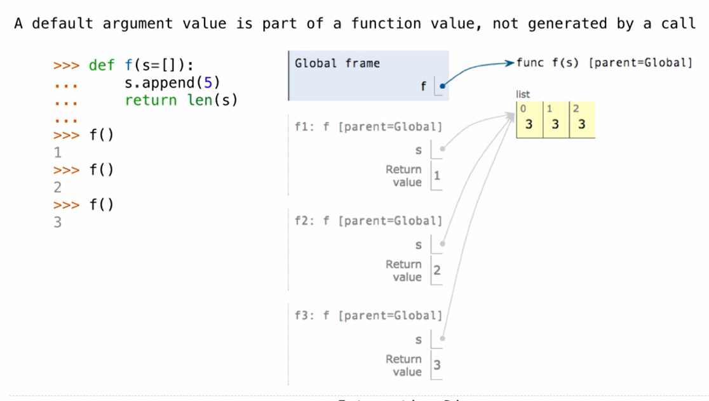


