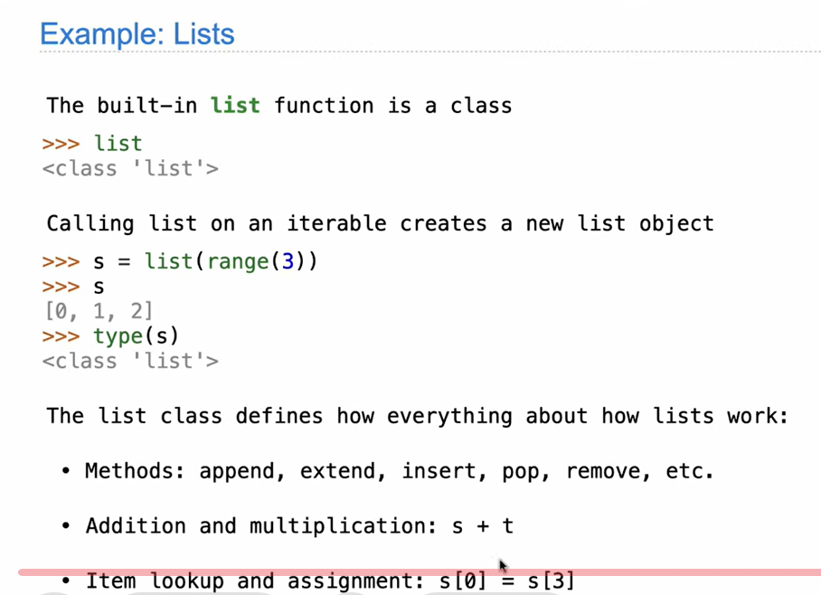
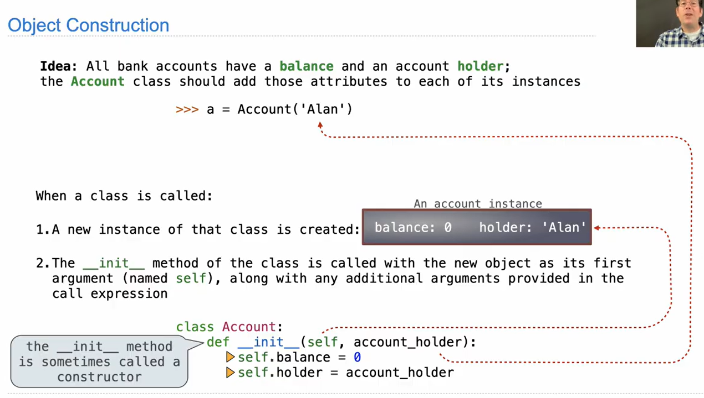
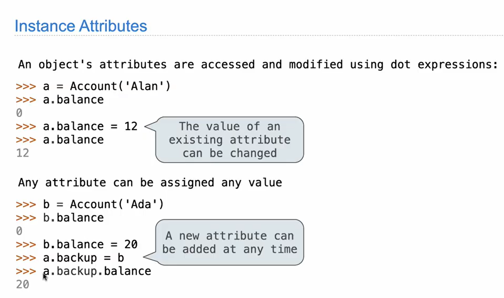
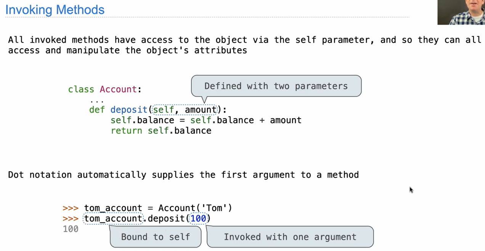
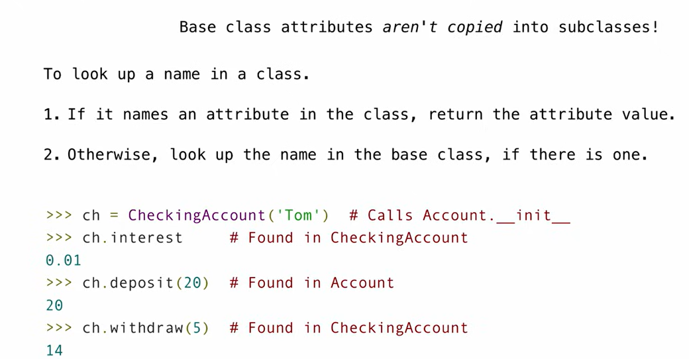
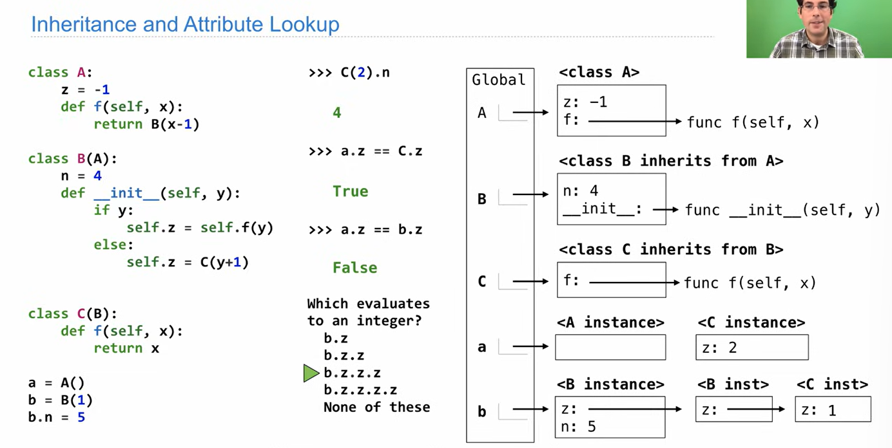
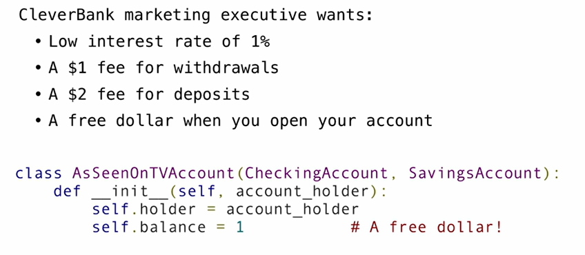

== valuable project== *Ants*
### Object-oriented programming:
A **class** defines how objects of a particular type behave(class is a type(or category) of objects)
An **object** is an instance of a class; the class is its type!
A method for organizaing programs
- Extends data abstraction
- bundles together information and related behavior
A metaphor for computation using distributed state(r distributed in different paces & have tu use a particular sytax to interact)
- Each **object** has its own local state
- Each object also knows how to manage its local state
- Interact with an object using its **methods**( is a ==function== called on an object using a dot expression: `s.append(5)`)
- Several objects may all be instances of a common **class**(做菜的谱子；object:做出的菜. Every object is an instance of some particular class;A class serves as a template for all objects whose type is that class.)
- Different classes may relate to each other
*Specialize syntax&vocabulary to support this metaphor*
>[!补充]-
>


### Class statements
e.g: ceeate a bank account class
```python
>>>a=Account('John') # create a new instance of a object!
>>>a.holder
'john'
>>>a.balance  # the balance and holder are all attributes!!
0
>>>a.deposit(15)  
15
>>>a.withdraw(10) # deposit & withdraw r methodss
5
>>>a.balance
5
>>>a.withdraw(10)
'Insufficient'
```
#### The Account Class
```python
class Account
	bank_name="中国人民银行"
	# Class Attrributes 
	
	# Instance(实例) attributes are defined here(只共享特征维度 不共享数值)
	def _init_(self,account_holder):  # _init_ is a special method nam for the func that constructs an Account instance; the first is bounded to the name of the object!
		self.balance=0
		self.holder=account_holder  # defined two atributes to the object!(balance&holder) all instance attributes!
	def deposit(self,amount):   # self is the instance of the Account class on which deposit was invoked: a.deposit(10)
# methods r functions defined in a class statement!
# the object is bound to the parameter `self` automaticlly  and u only need to type in `amount`
		self.balance=self.balance+amount
		return self.balance  # it returns a value!
	def withdraw(self,amount):
		if amount>self.balance:
		return "Inefficient"
		self.balance=self.balance-amount
		return self.balance
```


#### Creating instances
(the first def_init_)
>[!explanation]-
>
>

##### Object identity
Every object that is an instance of a user-defined class has a unique identity
Identity operators `is` &`is not` test if two expressions evaluate to the same object:
```python
>>> a= Account('John')
>>> b=Account('Jack')
>>> a is a # True 
>>> a is b  # False
```
#### Creating Methods
All invoked methods have access yo the object via the `self` parameter(参数）, and so they can all access & manipulate the object's attributes(the object is bound to the parameter self automatically)
>[!explanation]-
>


#### Dot Expressions
`<object expression>.<method name>`
e.g `a.withdraw(10)`
two built-in functions:
```python
getattr(spock_account, 'balance')   #returns an attribute for an object by name. It is the function equivalent of dot notation= spock_account.balance
hasattr(spock_account, 'deposit') #test whether an object has a named attribute  returns True/False
```

### Inheritance
relating classes together
If: Two classes have similar attributes and one represents a ==special case== of the other: the special case is the subclass of the other case
`class <name>(<base class>)`
e.g
```python
class Coin:
	def __init__(self,year):
		self.year=year
class Nickel(Cion):
	cents=5  
```
==**The methods of `coin` are also methods for `Nickel`**==
The subclass may override some attribute of the original one
process:


```python
class CheckingAccount(Account):
	interest=0.01
	withdraw_fee=1
	def withdraw(self,account):
		return Account.withdraw(self,amount+self.withdraw_fee)  # 直接调用Account类;返回一个函数！！（直接写Account之名！）; the withdraw in Account will not be changed!
```
**Notice**: `return Account.withdraw(self,amount+self.withdraw_fee) ` is the other type of expression: looks up in the class attribute and finds a function!([Class attributes](L10Attributes.md#Class%20attributes))
#### Super()
when overriding: when many parts are the same; u can use super() to copy the parts that they overlap
```python
class WorkerAnt:
    def __init__(self, name):
        self.name = name
        self.health = 100

class ArmoredAnt(WorkerAnt):
    # We want ArmoredAnt to take an extra parameter: armor_level
    def __init__(self, name, armor_level):
        self.armor = armor_level
        # Wait... what about name and health?
```

### Object-Oriented design
Inheritance: representing *is-a* relationship
Composition: representing *has-a* relationship:
e.g: checking account is a special type of account
A bank has a collection of bank accounts$\implies$ A bank has a list of account as an attribute! not a subclass!
```python
class WorkerAnt:
    def __init__(self, name):
        self.name = name
        self.health = 100

class ArmoredAnt(WorkerAnt):
    # We want ArmoredAnt to take an extra parameter: armor_level
    def __init__(self, name, armor_level):
        self.armor = armor_level
        # Wait... what about name and health?
        super().__init__(name)
```
### Attribute Lookup example

[video]([Attribute Lookup Practice](https://www.youtube.com/watch?v=qFvC4SwbG4A&list=PL6BsET-8jgYXUT9nA2gvweTlheGbvp6qv&index=3))
`<object expression>.<method name>`: find that object first! the object expression determines the starting place to search for the method name!
`b.z`=`<B inst>` `b.z.z`=`<C inst>` `b.z.z.z`=1; `b.z.z.z.z`: error!

### Multiple Inheritance
A class may inherit from multiple bas classes
e.g: we def a deposit fee:
```python
class SavingsAccount(Account):
	deposit_fee=2:
	def deposit(self,amount):
		return Account.deopsit(self,amount-self.deposit_fee) # the self.balance automatically changes when Account is called in return; no need to write it out
```
combine deposit and withdraw:
`class Child(Mom,Dad)`: searches in `Mom` class first!!