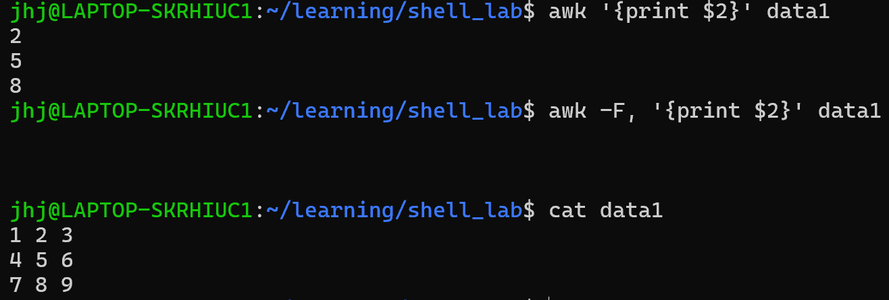
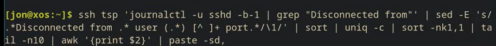
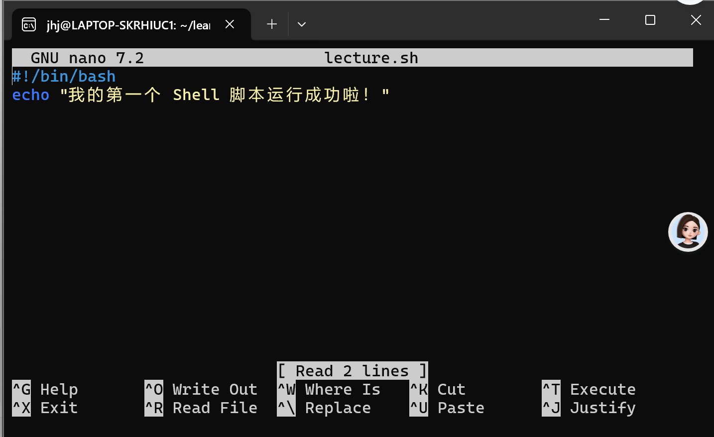

## Goal&why learn&class
- how to use the shell? the text editor?
- besides programming on computer, ==computer can automate itself==
- know about individual tools
- know what tools but not in depth$\implies$ exercises!!

## The Shell
[[relationship between Linux&shell&WSL&ubuntu&terminal]]
### What is it?
- an interface(e.g graphical user interfaces/LLM interfaces）$\implies$ specialized interfaces by the developer so function restricted by the program )
- $\implies$ Shell interface: one level lower , ==textual interface==s (interation:declarative/ ***Command Line interface***) of the computer;core language interating the computer can chain whatever you like!   v.s Windows: ***Geographical User Interface**
- shell: ability to combine program/automate tasks/ interact with opensouce community(to command in the bash)/see the configuration of software
-     [username@host name:(location in the file system)] $(not the root user)
### Some tools
first try
```bash
jhj@LAPTOP-SKRHIUC1:/mnt/c/Windows/system32$ date
Mon May  4 13:04:09 CST 2026 # e.g date are pre-complied programs in the computer; $: you are not the root user
jhj@LAPTOP-SKRHIUC1:/mnt/c/Windows/system32$ echo hellow world
hellow world
jhj@LAPTOP-SKRHIUC1:/mnt/c/Windows/system32$ echo "hello    world"
hello    world   # "hello    world" is seen as a whole
```
- arguements: things that follow the program name in the command e.g hello world
==every white space seperated is an aguement; the first argument is the one program excutes==
- `cmd`:随便一个命令（比如 ls、grep、python(用于运行一个pyhton程序) 等）；不是一个真实命令 而是一个代号

to deal with complicated situations: use `\` :do not treat the character behind it special!

```bash 
jhj@LAPTOP-SKRHIUC1:/mnt/c/Windows/system32$ echo hello\\\\world
hello\\world # the second \ and the fourth \ is literlly"\"
jhj@LAPTOP-SKRHIUC1:/mnt/c/Windows/system32$ echo hello\ \ \ \world
hello   world
# four literally spaces instead of seperation 
jhj@LAPTOP-SKRHIUC1:/mnt/c/Windows/system32$ echo "jhj's   world"
jhj's   world  # deal with mixed ""
```

- man: help explain program/ shorter explain: (program) --help
- `tldr`: a more simple explanation
```bash
jhj@LAPTOP-SKRHIUC1:/mnt/c/Windows/system32$ tldr cat
 Print and concatenate files.
  More information: <https://www.gnu.org/software/coreutils/manual/html_node/cat-invocation.html>.

  Print the contents of a file to `stdout`:

      cat path/to/file

  Concatenate several files into an output file:

      cat path/to/file1 path/to/file2 ... > path/to/output_file

  Append several files to an output file:

      cat path/to/file1 path/to/file2 ... >> path/to/output_file

  Write to a file interactively:

      cat > path/to/file

  Number all output lines:

      cat [-n|--number] path/to/file

  Display all characters, including tabs, line endings, and non-printing characters:

      cat [-A|--show-all] path/to/file

  Pass file contents to another program through `stdin`:

      cat path/to/file | program
```

- cd: change the location of where u are in the file system(change dieactory)
换绝对路径:
```bash
jhj@LAPTOP-SKRHIUC1:/mnt/c/Windows/system32$ cd /bin
jhj@LAPTOP-SKRHIUC1:/bin$ cd /
jhj@LAPTOP-SKRHIUC1:/$
```
`.`   is “this directory”,
`..` : 到前一个地址
`~`: 回到家目录: `/home/jhj`
```bash
jhj@LAPTOP-SKRHIUC1:/mnt/c/Windows/system32$ cd ~
jhj@LAPTOP-SKRHIUC1:~$  # ~ = /home/jhj
jhj@LAPTOP-SKRHIUC1:~$ cd ~/..  
jhj@LAPTOP-SKRHIUC1:/home$
jhj@LAPTOP-SKRHIUC1:/home$ cd ..
jhj@LAPTOP-SKRHIUC1:/$
```

- press `tab` $\implies$ show all potential option
```bash
jhj@LAPTOP-SKRHIUC1:/$ cd b # type tab twice
bin/               bin.usr-is-merged/ boot/
```
- `crul`: grab information from wenbsites
 **本质**：命令行的网络请求工具。
    
 **类比**：一个没有外壳、只有引擎的“纯净版”浏览器。
    
 **黄金搭档**：
    
     `time`：测量网络响应速度（Profiling）。
        
    `&> /dev/null`：丢弃冗长的网页源码，保持终端整洁。
### What is availavle in shell?
- every executable file in: `echo $PATH` ; run  a program, the system searches it in $PATH to find it
```bash
jhj@LAPTOP-SKRHIUC1:/$ echo $PATH
/usr/local/sbin:/usr/local/bin:/usr/sbin:/usr/bin:/sbin:/bin:/usr/games:/usr/local/games:/usr/lib/wsl/lib:/mnt/c/Program Files/WindowsApps/MicrosoftCorporationII.WindowsSubsystemForLinux_2.6.3.0_x64__8wekyb3d8bbwe:/mnt/c/msys64/ucrt64/bin:/mnt/c/Program Files (x86)/NVIDIA Corporation/PhysX/Common:/mnt/c/Windows/System32/HWAudioDriver:/mnt/c/Windows/system32:/mnt/c/Windows:/mnt/c/Windows/System32/Wbem:/mnt/c/Windows/System32/WindowsPowerShell/v1.0/:/mnt/c/Windows/System32/OpenSSH/:/mnt/c/Users/Administrator/AppData/Local/Microsoft/WindowsApps:/mnt/c/Program Files/Microsoft SQL Server/Client SDK/ODBC/170/Tools/Binn/:/mnt/c/Program Files (x86)/Microsoft SQL Server/150/Tools/Binn/:/mnt/c/Program Files/Microsoft SQL Server/150/Tools/Binn/:/mnt/c/Program Files/Microsoft SQL Server/150/DTS/Binn/:/mnt/c/Program Files (x86)/Windows Kits/8.1/Windows Performance Toolkit/:/mnt/c/Program Files/nodejs/:/mnt/c/Program Files/Git/cmd:/mnt/c/Program Files/usbipd-win/:/mnt/c/Users/HW/AppData/Local/Programs/Python/Python310/Scripts/:/mnt/c/Users/HW/AppData/Local/Programs/Python/Python310/:/mnt/c/Users/HW/AppData/Local/Microsoft/WindowsApps:/mnt/c/Program Files/JetBrains/PyCharm Community Edition 2020.2.3/bin:/mnt/c/Users/HW/AppData/Local/GitHubDesktop/bin:/mnt/c/Users/HW/AppData/Local/Programs/Microsoft VS Code/bin:/mnt/c/Users/HW/AppData/Roaming/npm:/snap/bin
```


- type command with progam name  take the name of program  and look it up in the path in all folders one by one $\implies$ run it!
     while `which` shows the program it finds
```bash
jhj@LAPTOP-SKRHIUC1:/$ which date
/usr/bin/date
jhj@LAPTOP-SKRHIUC1:/$ /usr/bin/date #= date
Tue May  5 18:15:38 CST 2026
jhj@LAPTOP-SKRHIUC1:/$ which which
/usr/bin/which
jhj@LAPTOP-SKRHIUC1:/$ which -a sh  # -a: show all; the system runs the first programme it sees
/usr/bin/sh
/bin/sh
```


- ls: list program  lists the content of the directory(not file!)
```bash
jhj@LAPTOP-SKRHIUC1:/$ ls
bin                etc   lib.usr-is-merged  mnt   run                 srv  var        wslbMNLHo  wsllijFBo
bin.usr-is-merged  home  lib64              opt   sbin                sys  wslAKhLGo  wsleLlCCD  wslnOBEED
boot               init  lost+found         proc  sbin.usr-is-merged  tmp  wslBocBIo  wsleeFBED  wslonpGDD
dev                lib   media              root  snap                usr  wslPFE
---------------------------------------------------------
jhj@LAPTOP-SKRHIUC1:/$ ls /home   # without using cd to go to the directory!
jhj
jhj@LAPTOP-SKRHIUC1:/$ ls /home/jhj
learning

```

- `rm`: remove a file
- cat:print out the content of the file(not directory!)
```bash
jhj@LAPTOP-SKRHIUC1:~/learning/shell_lab$ cat data
1
2
3
tree
five
8964
74
7
7
7
8
7
7
777
7877
7787
```


- sort:  print the file content in order lexicographically(not numerically)
```bash
jhj@LAPTOP-SKRHIUC1:~/learning/shell_lab$ sort data

1
2
3
7
7
7
7
7
74
777
7787
7877
8
8964
five
tree
```


- `uniq` only enliminates ==consecutive lines== that are unique
	     - combination:`sort -u`
```bash
jhj@LAPTOP-SKRHIUC1:~/learning/shell_lab$ uniq data
1
2
3
tree
five
8964
74
7
8
7
777
7877
7787
```
- `head -n(lines) (file)`  `tail -n(lines) (file)`
```bash
jhj@LAPTOP-SKRHIUC1:~/learning/shell_lab$ head -n3 data
1
2
3

jhj@LAPTOP-SKRHIUC1:~/learning/shell_lab$ tail -n4 data
777
7877
7787
        # the last line was an empty space
```


- `grep (thing) (file)`  ： searches in file that matches a paricular pattern(can be sofisticated things)


- `grep -r (directory)`: search in every file in the directory


- `sed` line edietor; globs: a simple pattern language
     `sed -i `  (-i inplacement)
     `sed -i ''`
- `find`: search for files
     ```bash
     find ~/Downloads -type f -mtime +30
     # -type f: anything that is a file; 自download开始 逐个搜索它以及其子文件/子子文件。。，中的内容
     find ~/Downloads -type f -name "*.zip" -mtime +30
     # -mtime +30 至少三十天之前创建的 # -name "*.zip" search of `zip` folders
     find ~/Downloads -type f -size +100M -exec ls -lh {} \; -mtime +30
     #   \; :shows the end of find
      find ~/Downloads -type f -size +100M -mtime +30 -exec rm {} \;# (delete any files 30days and 100Ms big)
      find . -name "*.md" -exec grep -l "TODO" {} \;
      # search of any .md files that has TODO inside it；从本文件目录开始
     ```

     there are many more languages to describe the files u want; see in `man find`
     `find` is recursive by default but can be motified(*recursive: 递归的 给它一个文件夹，它会自动往下钻，把里面所有子文件夹、子子文件夹全部遍历一遍*)


- `cntrl+C` terminate the program


- `awk`: parsing file;(解析文件) pulling data out of semi-structured file
```bash
awk '{print $2}' data1 # print the second field of every line(the default seperator of fileds id white space) <-> the second column
awk -F, '{print $1}' data1 # the defalut seperator is ,
```



56:37 an explaination of this


the top 10 ppl username who tried to get in the ssh server


`|` pipe character: put the output of former to be the input of the latter
another: `>`: put the output of former to be the input of the latter(==是覆盖内容 而非添加内容== it overwrites the file)
`>>`: append  not overwrite
`<` : put the content of the latter as the input of the former


```bash
jhj@LAPTOP-SKRHIUC1:~/learning/shell_lab$ date >thedate.txt
jhj@LAPTOP-SKRHIUC1:~/learning/shell_lab$ cat thedate.txt
Wed May  6 10:30:40 CST 2026
==============================
jhj@LAPTOP-SKRHIUC1:~/learning/shell_lab$ date>>thedate.txt   # append instead of overwrute
jhj@LAPTOP-SKRHIUC1:~/learning/shell_lab$ date>>thedate.txt
jhj@LAPTOP-SKRHIUC1:~/learning/shell_lab$ date>>thedate.txt

jhj@LAPTOP-SKRHIUC1:~/learning/shell_lab$ sort <thedate.txt
Wed May  6 10:39:22 CST 2026
Wed May  6 10:43:25 CST 2026
Wed May  6 10:43:29 CST 2026
Wed May  6 10:43:30 CST 2026
```


- simple logic commands
    - if 
```bash
jhj@LAPTOP-SKRHIUC1:~/learning/shell_lab$ if grep 2026 thedate.txt; then echo "yes"; fi # fi: 一个关门提示（和if,与if 成对出现，表示if 的结束)
Wed May  6 10:39:22 CST 2026
Wed May  6 10:43:25 CST 2026
Wed May  6 10:43:29 CST 2026
Wed May  6 10:43:30 CST 2026
yes
```
- while 循环
>[!code]-
>```bash
jhj@LAPTOP-SKRHIUC1:~/learning/shell_lab$ while grep 2026 thedate.txt; do echo 'its still 2026'; date>>thedate.txt; sleep 2.5;done
Wed May  6 11:00:57 CST 2026
Wed May  6 11:01:38 CST 2026
its still 2026
Wed May  6 11:00:57 CST 2026
Wed May  6 11:01:38 CST 2026
Wed May  6 11:07:15 CST 2026
its still 2026
Wed May  6 11:00:57 CST 2026
Wed May  6 11:01:38 CST 2026
Wed May  6 11:07:15 CST 2026
Wed May  6 11:07:18 CST 2026
its still 2026
Wed May  6 11:00:57 CST 2026
Wed May  6 11:01:38 CST 2026
Wed May  6 11:07:15 CST 2026
Wed May  6 11:07:18 CST 2026
Wed May  6 11:07:20 CST 2026
its still 2026
Wed May  6 11:00:57 CST 2026
Wed May  6 11:01:38 CST 2026
Wed May  6 11:07:15 CST 2026
Wed May  6 11:07:18 CST 2026
Wed May  6 11:07:20 CST 2026
Wed May  6 11:07:23 CST 2026
its still 2026
```
```


- for
```bash
jhj@LAPTOP-SKRHIUC1:~/learning/shell_lab$ for var in a b c d; do echo "$var";done
a
b
c
d

jhj@LAPTOP-SKRHIUC1:~/learning/shell_lab$ for a in $(seq 1 10); do echo  #($   ): operate the programm in the() and uses its output
"$a";done
1
2
3
4
5
6
7
8
9
10
```

- judgement `test`/ `[`
```bash 
jhj@LAPTOP-SKRHIUC1:~/learning/shell_lab$ if [ -f thedate.txt ]; then echo "thedate exist"; fi
thedate exist
jhj@LAPTOP-SKRHIUC1:~/learning/shell_lab$ if [ "hello" = "world" ]; then
 echo "equal"; else echo "no";fi
no
```

`if` `pipe` not program: it is built in the shell


- ==run files as command==(all kinds of languanges/do not have to be shell)   
    to run shell :`./lecture.sh`( ==./==：在当前目录中！)
     to run python: `python3 try.py`


```bash
jhj@LAPTOP-SKRHIUC1:~/learning/shell_lab$ nano lecture.sh # create a shell file
jhj@LAPTOP-SKRHIUC1:~/learning/shell_lab$ ./lecture.sh
-bash: ./lecture.sh: Permission denied 
jhj@LAPTOP-SKRHIUC1:~/learning/shell_lab$ ls -l lecture.sh# I can r/w but the execute system has not been told to opeate it
-rw-r--r-- 1 jhj jhj 66 May  6 11:59 lecture.sh
jhj@LAPTOP-SKRHIUC1:~/learning/shell_lab$ chmod +x lecture.sh # +x: add execution
jhj@LAPTOP-SKRHIUC1:~/learning/shell_lab$ ls -l lecture.sh
-rwxr-xr-x 1 jhj jhj 66 May  6 11:59 lecture.sh
jhj@LAPTOP-SKRHIUC1:~/learning/shell_lab$ ./lecture.sh
我的第一个 Shell 脚本运行成功啦！ # run programme
```

```bash
jhj@LAPTOP-SKRHIUC1:~/learning/shell_lab$ python3 try.py
try python!
```


[[Move/rename file]]


``
notes:[Course Overview + Introduction to the Shell · Missing Semester](https://missing.csail.mit.edu/2026/course-shell/)