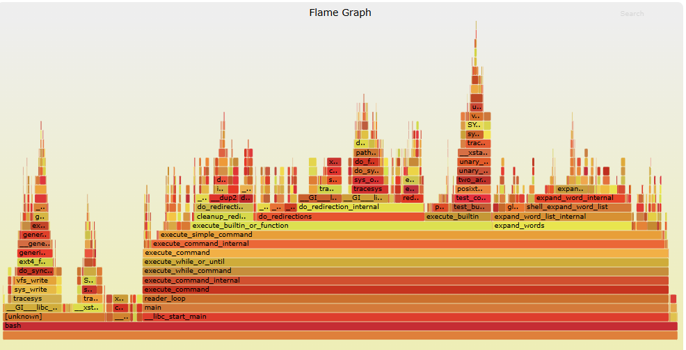

# Debugging
## Printf debugging and logging 

M1: print out the steps and keep iterating until u have extracte enough information to understand the issue
M2: **Logging**(日志记录)：[[Logging]]
a more sofisticated version for debugging and marking the program! u can define the thereshold level and what it pops out and time 
in python: have to import log
e.g . [log](../sourcecode/log.py) (the content log is prented directly) [log2](../sourcecode/log2.py)(the content log is in the file output)

## Debuggers
a tool that helps u interact with the execution of a program as it happens, allows u to:
- Halt execution when it reaches a certain line.
- Step through one instruction at a time.
- Inspect values of variables after a crash.
- Conditionally halt execution when a given condition is met.
- And many more advanced features.


debugger in vscode:
 GUI: already realized by clicking;
 in linux: u have to compile it by commands
 
### general debuggers；
#### Two types of debugger
 1 [`gdb`](https://www.gnu.org/software/gdb/) (GNU Debugger) and [`lldb`](https://lldb.llvm.org/) (LLVM Debugger), which can debug any native binary: e.g C++ rust
 2 **language-specific debuggers** that integrate more tightly with the runtime (like Python’s pdb or Java’s jdb).

#### Special debug
[[gdb cheatcheet]]
 there r also bugs that eem to disappear or change behavior when you try to observe them (e.g timing)
 $\implies$ **Record-replay debugging**: help u reverse and replay execution by *rr*:records everthing the program happens; it works with gdb; 
 most importantly:==u can also debug reversely!== helpful in debugging
 This is incredibly powerful for debugging. Say you have a crash—instead of guessing where the bug is and setting breakpoints, you can:

1. Run to the crash
2. Inspect the corrupted state
3. Set a watchpoint on the corrupted variable
4. `reverse-continue` to find exactly where it was corrupted
 [[rr cheatsheet]]

### System Call Tracing: understand what the program is doing 
Programs make  [system calls](https://en.wikipedia.org/wiki/System_call) (底层调用日志）to request services from the kernel—opening files, allocating memory, creating processes, and more;  *Sometimes we need to understand how our program inyeracts with the operating system* $\implies$ strace

[[Strace cheatsheet]]


### ebpf&bpftrace:
ebpf:little programs that runs in linux that inspects the kernal
==bpftrace: program that controls eBPF==  `sudo +program`
**对比 `strace`：**
- **`strace`**：好上手，但“监听”动作会频繁打断程序，导致程序运行变慢（高开销 High overhead），适合日常 Debug。
    
- **`bpftrace`**：**低开销 (Lower overhead)**。静默监控，不仅能看单个程序的底层调用，还能做**数据聚合**（比如算延迟、统计调用总数）。

have to add `sudo`: since it has to be run in the root!

### Network Debugging
For network issues, [`tcpdump`](https://www.man7.org/linux/man-pages/man1/tcpdump.1.html) and [Wireshark](https://www.wireshark.org/) let you capture and analyze network packets: e.g:wireshar plugin understand the sequence(for online traffic debug)
e.g:
```bash
# Capture packets on port 80
sudo tcpdump -i any port 80

# Capture and save to file for Wireshark analysis
sudo tcpdump -i any -w capture.pcap
```

### Santitizers: extentions to the compiler
to detect errors at runtime
**AddressSanitizer (ASan)** detects:
- Buffer overflows (stack, heap, and global)
- Use-after-free
- Use-after-return
- Memory leaks
```bash
# Compile with AddressSanitizer
gcc -fsanitize=address -g program.c -o program
./program
```

other Sanitizers: 
**ThreadSanitizer (TSan)**:Detects data races in multithreaded code (`-fsanitize=thread`)
**MemorySanitizer (MSan)**:Detects reads of uninitialized memory (`-fsanitize=memory`)
**UndefinedBehaviorSanitizer (UBSan)**:Detects undefined behavior like integer overflow (`-fsanitize=undefined`)

### Valgrind:
[Valgrind](https://valgrind.org/) instead runs your program in something akin to a virtual machine(gives a CPU) to detect memory errors. It’s ==slower== than sanitizers but doesn’t require recompilation:
```bash
algrind --leak-check=full ./my_program
```
Use Valgrind when:
- You don’t have source code
- You can’t recompile (third-party libraries)
- You need specific tools not available as sanitizers

simply put: *a virtual test*

### AI for Debugging： good at finding bugs
**Explaining cryptic error messages**(看不懂的报错信息)
**Traversing language and abstraction boundaries**
**Correlating symptoms with root causes**
**Analyzing crash dumps and stack trace**


## Profiling
看**哪里慢**、**哪里最占内存**、**哪里调用最频繁**
when coding:[[prematur optimizing]] is not preferrable; should: finish the code first and then consider its speed$\implies$ find the  parts that infuluence spped by profiling!


profilers and monitoring tools: Help u understand which parts of your program are taking most of the time and/or resources so you can focus on optimizing those parts.
### Timing: measure the time of running the code
`time`
he `time` command distinguishes between _Real_, _User_, and _Sys_ time:

- **Real** - Wall clock time from start to finish, including time spent waiting
- **User** - Time spent in the CPU running user code
- **Sys** - Time spent in the CPU running kernel code
>[!example]-
>```bash
>$ time curl https://missing.csail.mit.edu &> /dev/null
>real	0m0.272s
>user	0m0.079s
>sys	    0m0.028s
>```
>Here the request took nearly 300 milliseconds (real time) but only 107ms of CPU time (user + sys). The rest was waiting for the network.
>*time* is a [[father cmd program]] , so there are two program time&curl in a single cmd
> &>: redirect the imformation read on the website to the "silent file"; so that u can only see the time of this cmd clearly


### Resouce Monitoring
see the actual resouce consumption of the program; programs often run slowly when they are resource constrained.
#### General Monitoring: 

can only see what is happening in the linxu system: the total amount of Memory and CPU resouces is determined by youreslef(the area cut from the windows system for linux!)
- `htop`:presents various statistics for currently running processes. Useful keybinds: `<F6>` to sort processes, `t` to show tree hierarchy, `h` to toggle threads.
- `btop`: a more visualized, detailed `htop`
#### Memory and I/O
- `free (-h)`displays total free and used memory.
- `iotop`: displays live I/O usage information e.g:`sudo iotop -o` (for visiting hardware `sudo`is a must!)
#### Flie & Networking
- `lsof`:lists file information about files opened by processes. Useful for checking which process has opened a specific file(e.g `lsof +filepath`: shows the process that opened the file)

- `ss` : lets you monitor network connections. A common use case is figuring out what process is using a given port: `ss -tlnp | grep :8080`.
-  [`nethogs`](https://github.com/raboof/nethogs):它会像 `top` 一样排列==进程，==你可以一眼看到是 `curl`、`wget` 还是浏览器正在疯狂消耗你的带宽; 按照进程统计
-  [`iftop`](https://pdw.ex-parrot.com/iftop/): 按照谅解统计；它会显示你的电脑正在和哪个外部 IP 进行大规模数据交换，适合排查网络拥塞


### Visualizing performance Data
record and show the features of program
`perf`: profile a program and tell which CPU is running the program many times in a second; u can also modify the frquency of perf to see it in detail
```bash
perf record -g  +program# record it first
sudo perf stat ./your_program # 它会告诉你程序运行了多少个 CPU 周期（cycles）、执行了多少条指令; 你会看到 **IPC** (Instructions Per Cycle)。如果这个值很低，说明 CPU 虽然很忙，但大部分时间都在“发呆”等数据，这就是代码优化的切入点
perf report: #它会列出占用 CPU 比例最高的函数。你可以像用 `htop` 一样在里面跳转，甚至直接查看对应的汇编代码。
```
`perf report`: combined with flame graph: help visualize
```bash
# Record profile
perf record -g ./my_program

# Generate flame graph (requires flamegraph scripts)
perf script | stackcollapse-perf.pl | flamegraph.pl > flamegraph.svg
```



there r also many tools for spceifc visualization for program analysis so that we can find problems


[Debugging and Profiling · Missing Semester](https://missing.csail.mit.edu/2026/debugging-profiling/)