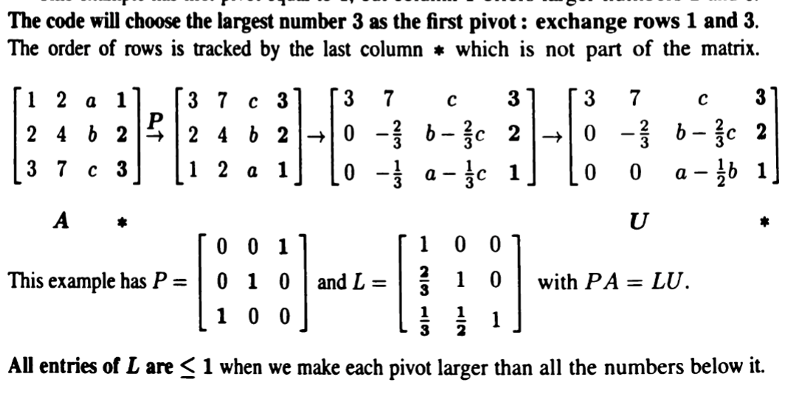
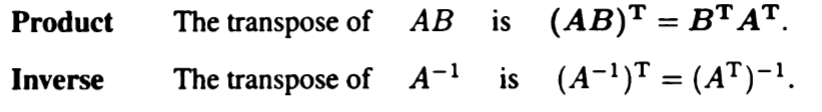
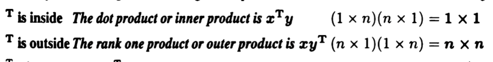
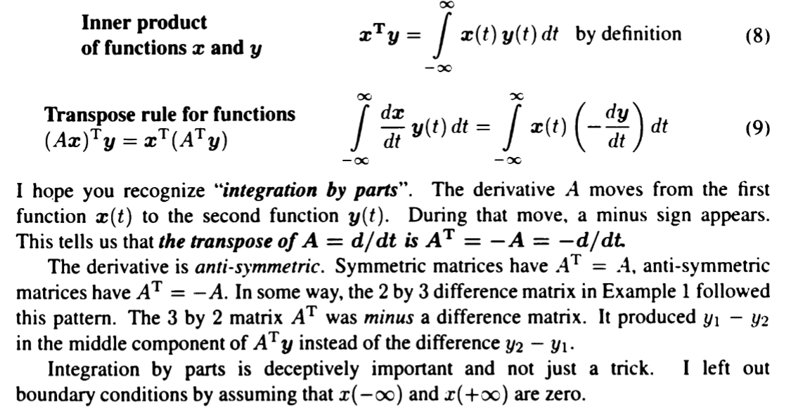
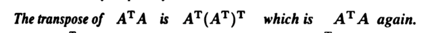
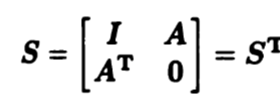
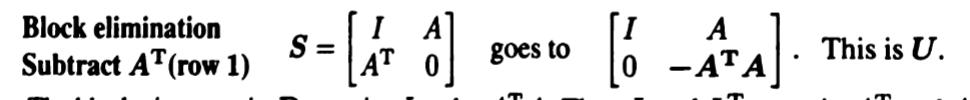
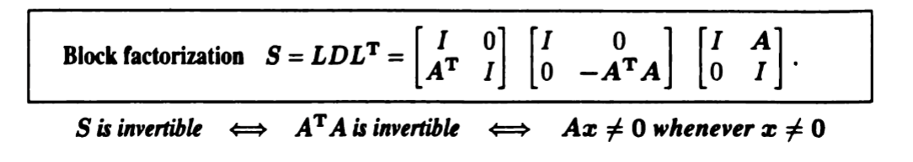

### Permutations
#### Row permutation P
$PA$ ! multiply $A$ by the right
has and only has a $1$ in every row & column($\implies$ the columns of $P$ are orthohonal)
function: changes the order of its components
permutations in the size of $n$: ther r $n!$ different permutation matrices($P$)

- $P^{T}P=I$
- $P^{-1}$ is also a permuation matrix
- the multiplication results of $P$ s is also a permutation matrix
- if rows 两辆对换 $P^{T}=P$
(esence: 移动行的等效替代/分步完成与直接完成)
- If $A$ is invertible, there is a permutation $P$ to order its rows in andvance, so that elimination on $PA$ meets no (the first type of) zeroes in the pivot position$\impllies$ $PA=LU$

In practical computing: we would also use $P$ to choose largeer piviots in the same column as pivots:
>[!example]-
>
> the 1,2,3column on the right: only an additional column used for the key of differnt rows

#### Column permuation Q
$AQ$: multiply A by the left!

### The transpose of A
$A^{T}$ : the columns of it are the rows of $A$

e.g 
$Ax$ combines the columns of $A$ while $x^{T}A^{T}$ combines the rows of $A^{T}$
$A^{T}$ is invertible exactly when $A$ is invertible

### The meaning  of Inner Products
e.g: two column vectors $x$, $y$

#### A better definition for $A^{T}$
$A^{T}$ is the matrix that makes these inner product equal:
$(Ax)^{T}y=x^{T}(A^{T}y)$ 
看作是**在内积（点乘）运算中，可以自由移动的算子**
left: matrix $A$ computes with x first while matrix $A$ computes with y first on the left

$\implies$ 类似于微积分中的分部积分法！
把此定义类比到微积分中：
unify with calculus
[[calculus matrix]]

A is a suqare matrix 
theroetrically $A=A^{T}$
but in some application cases like in calculus: $A^{T}=-A$
 process: (ax)Ty   分部积分  与左侧对照得到$A^{T}$

### Symmetric Martricies
$S^{T}=S$

### Symmetric product $AA^{T}$ $A^{T}A$ and $LDL^{T}$

in elimination process $A=LDU$  
if $A$ is symmetric:
$U=L^{T}$
$\implies$ $S=LDL^{T}$

==**see $S$ in matrix blocks==**(a more broad perspective!
)
e.g for symmetric matrix $S$: 

eliminate $A^{T}$ in the left 

from $U$: get $D$
