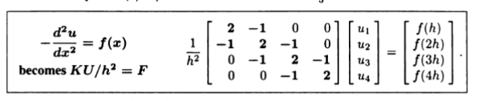
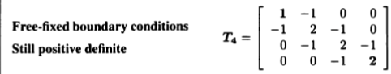
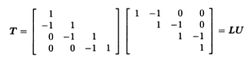
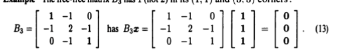
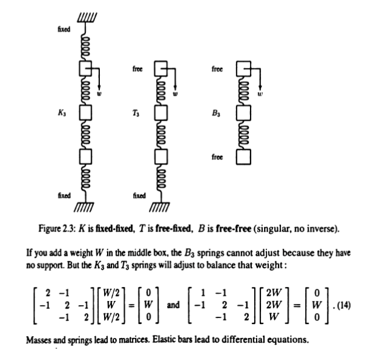

由泰勒展开式近似可知：
$$
	\frac{d^{2}u}{d^{2}x}=\frac{u(x+h)-2u(x)+u(x-h)}{h^{2}}
$$

for $-\frac{d^{2}y}{d^{2}x}$ 
the derivatives transforms into  差分 eqations
$$
	f(x_{i})=\frac{-u_{i-1}+2u_{i}-u_{i+1}}{h^{2}}
$$
near the area around $x$: mesh it into $N$ parts
e.g: $x$=0; in $[0,1]$  into $N+1$parts
define: $u_{0}=0$ $u_{N+1}=0$
the first function:$\frac{2u_{1}-u_{2}}{h^{2}}=f(x_{1})$
last function: $\frac{-u_{i-1}+2u_{i}}{h^{2}}=f(x_{N})$
the other rows of the matrix we create: have -1,2,-1 together in different places!

e.g when $N=4$:
$$K = \begin{bmatrix} 2 & -1 & 0 & 0 \\ -1 & 2 & -1 & 0 \\ 0 & -1 & 2 & -1 \\ 0 & 0 & -1 & 2 \end{bmatrix}$$

$\implies$

in calculus: the right is $f(x)$  : a smooth line
in LA: the right is some dots: discrete!

essence: in computing: By discretizing the derivatives, a complex differential equation problem is transformed into solving a large sparse matrix(only three diagnals  other places are zero). $U = h^2 K^{-1} F$

**The Free-Free matrix $K$**
the three property of matrix $K$(the boundaries are zero!):
symmetry,sparsity and constant diagnals(the three right-left dignals all are of the same number); are also invertible(its inverse is also semmtric)!

**The Free-Fixed matricies $K_{n}$**
change on part of the boundary condition(e.g: change into $\frac{du}{dx}=0$)

for $T_{{4}}$ :

obvious that $L$ $U$ are invertible; 
$\implies$ $T$ is invertible

**The Free-Free Matricies $B_{n}$ are singular**(奇异矩阵)

the two sides are determined by  $\frac{du}{dx}=C$
not inverible!
e.g

e.g: the model of springs:

define $K=1$
the $U$  solved out in the two fractions are the movement length of the three boxes

