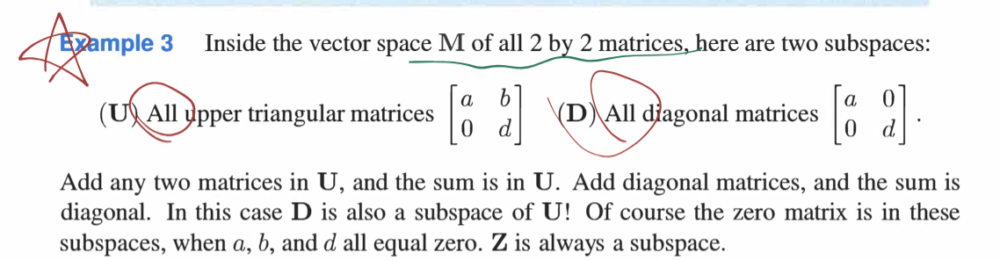

look at "spaces" of vectors
### Spaces of Vectors
a closure system: the lin combs of vectors in the space is still in the space

The space $R^{n}$ consists of all column vectors $v$ with $n$ components
the letter $R$: compare to real numbers(实数) in the nuber systerm

In the column space: we can add any vectors in $R^{n}$ and we can multiply any vector $v$ by any scalar $c$

column space: a part of vector space; (e.g: The vector space of all 2 by 2 matrices/zero vector/vector space of all real functions r also types of vector spaces)

### Subspaces
subspace: A set of vectors(including 0) that satisfies:
	if $v$ and $w$ r vectors in the subspace and $c$ is any scalar, then:(closed)
	(i) $v+w$ is in the subspace  (ii) $cv$ is in the subspace $\implies$ contain all linear combinations $cv+dw$

Every subspace contains the zero vector!

e.g:

not the column space of the 2*2 matrices!

subspaces are also vector spaces

### The column space of A 
a vector space made up of all column vectors; they fill the column space $C(A)$
$\implies$ $Ax=b$  is solvable onlu if $b$ is in the column space of $A$
for $m*n$ matrices: the column space of $A$ is a subspace of $R^{m}$

for any set of vector $S$ in a vector space $V$; $SS$: is all the combs of vectos in vector set $S$, called the subspace of $V$ spanned by $S$

