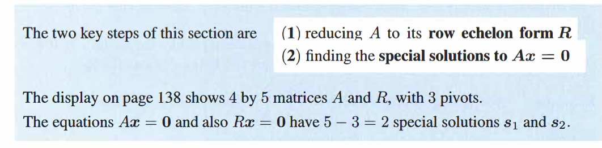
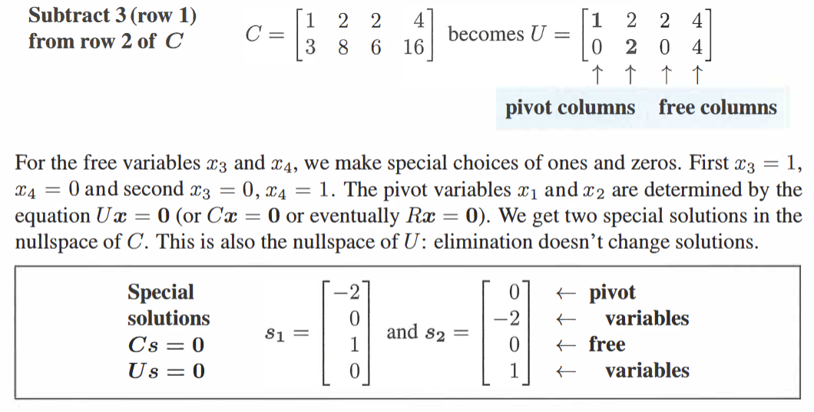
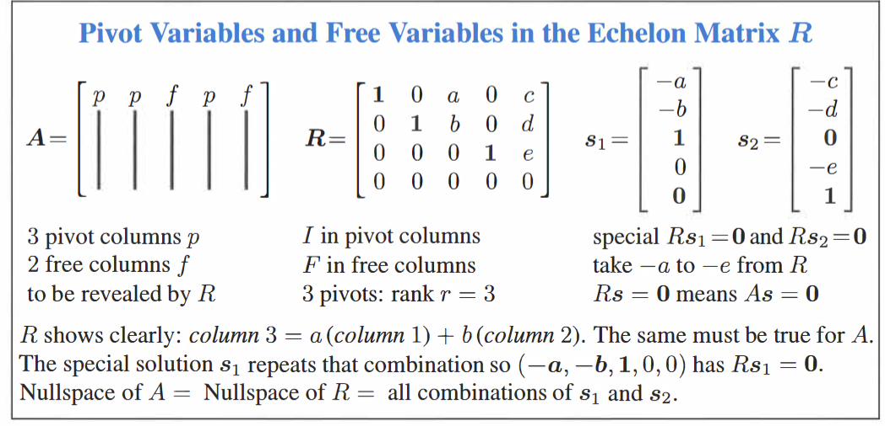
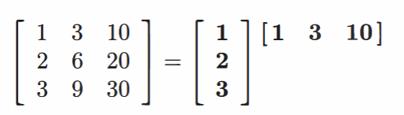
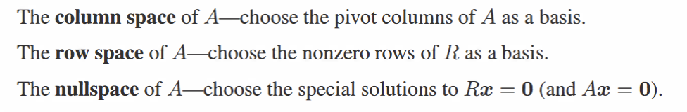

### Definition
A: can be square or rectangular

The *nullspace* fo $N(A)$ consisits of all solutions to $Ax=0$ These vectors $x$ are in $R^{n}$  (not $R^{m}$) ,column space : $n-r$ dimentions($x$:only related to n!!:因为分析对象从$A$变成了$x$)（有n-r个自由解)!

but $r$<=$min(m,n)$ : also a restriction!

(remenber!:for invertible matrices $A$ the only nullspace is zero; independent!)
its also a subspace of $R^{n}$ (x has $n$ columns)
$\implies$ The nullspace of $A$ consisits of all combs of the sepcoal solutions to $Ax=0$
we often use finding special results to find the Nullspace of $A$

steps:

### Piviot Columns and Free Columns
**The free components correspond to columns with no pivots**
notice! "columns with no pivots, not rows!"
we first give values to them randomly(foten 0s and 1s)
and then solve fixed piviots

$\implies$ $N(A)$ is all combinations of s1 and s2
### The Reduced Roe Echelon Form $R$
for rectangular matricies $A$ , after reaching $U$ by row elimination like squares; wo often continue to make it simplier into matrix $R$:
after reaching $U$:
1. Produce zeros above the pivots: use pivot rows to eliminate upwards
2. Produce ones in the pivots: divide the pivot rows by its pivot

With$n>m$ there is at least one free variable, $Ax=0$ has at least one special solution and is not zero!
(方程数量大于未知数数量)
 $r$<=$min(m,n)$ : also a restriction!
### Rank
The rank of $A$ is the number of pivots
$\implies$ the final matrix $R$ will have $r$ nonzero rows
every free column is a combination of earlier piviot columns!
$\implies$ nullspace has $n-r$ dimentions
$rank(AB)\leq rank(A)$
$rank(AB)\leq rank(B)$
### Rank One
Matricies that have only one piviot

the columns r the multiples of one column
$A=$ columns times row=$uv^{T}$ 

**the nullspace of A**: $Ax=0$ $\implies$ $u(v^{T}x)=0$
$\implies$ All vectors $x$ in the nullspace must be orthogonal to $v$ in the row space, so it is a plane
### Amount relations:
rank $r$ is the dimention of column space\row space
$n-r$ is the dimension of the nullspace(number of special solutions/the nuber of special solutions)

## The Big Picture of elimination
Q1: Is this column s comb of previous cols?
Q2: Is this row a comb of previous rows?
the answers to both questions r answered in $A$ to $U$ then to $R$
$U$: tells us what r independent and what r dependent
$R$: tells us how to form it

also: $R$ tells us about the special solutions to $Ax=0$

also: learn rank $r$: 
also: the process of reducing $[A I]$ into $[R E]$ 
$E$ keeps track of the enlimation process;
when $A$ is an independent square; $E$=$A^{-1}$

