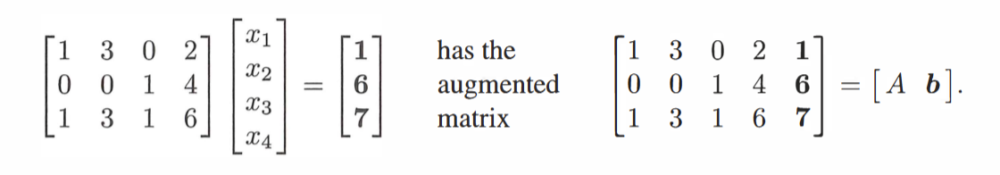
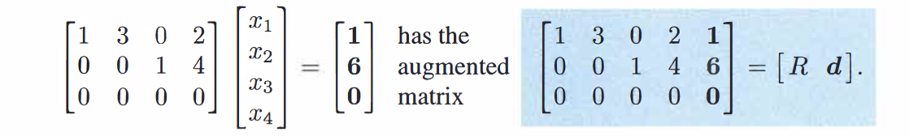
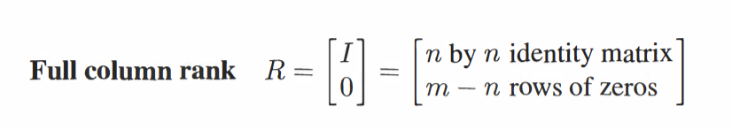
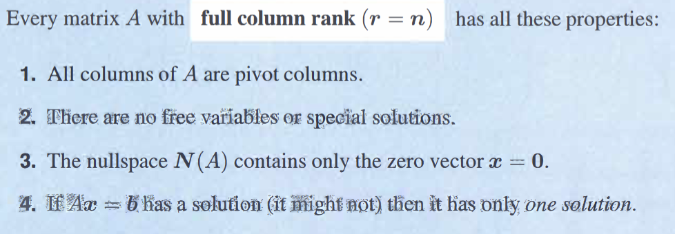
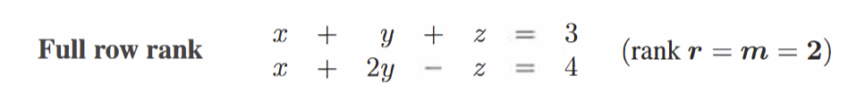
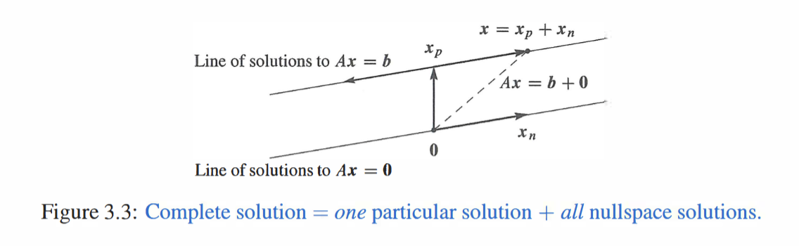
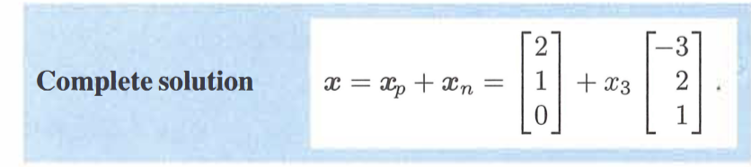
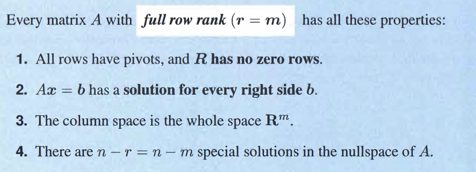
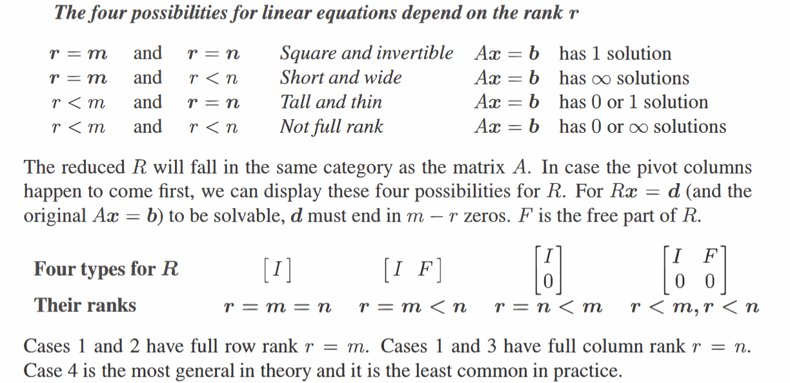

change $b$ into nonezero:
for $Ax=b$ reduce it into a simpler system $Rx=d$

during this process, we often simplify the process by only dealing with an *argumented matrix* $[A b]$ and eliminate into $[R d]$
e.g:

### One Partucular solution $Ax_{p}=b$

**For a solution to exitst, zero rows in $R$ must also be zero in $b$**
then give any number(系数) to the free columns(often all zero)
solve a *particular solution* $x_{p}$ (not equivilant to the special solutions in $Ax=0$)

### Solve $Ax=b$
solve $Ax=0$ (nullspace)[3.2 The Nullspace of A](3.2%20The%20Nullspace%20of%20A.md)
$x=x_{p}+(linear combinations of)x_{n}$ 

#### e.g: when r=n: ($m\geq r=n$) thin matrix
**The matrix has full column rank**
to have only one solution or no solution

if  has solution：

$N(A)=0$ $x=x_{p}+0$; no free variables

a spcial case: square inverible matrix (chap2)

#### e.g: when $r=m<=n$ flat matrix
**Full row rank**
have one or infinate solutions!
e.g:

 geometrically: the solution is a line; the particular solution is a point on it; adding $x_{n}$ will move us along the line

### Summary

