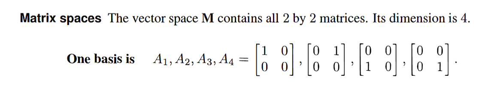
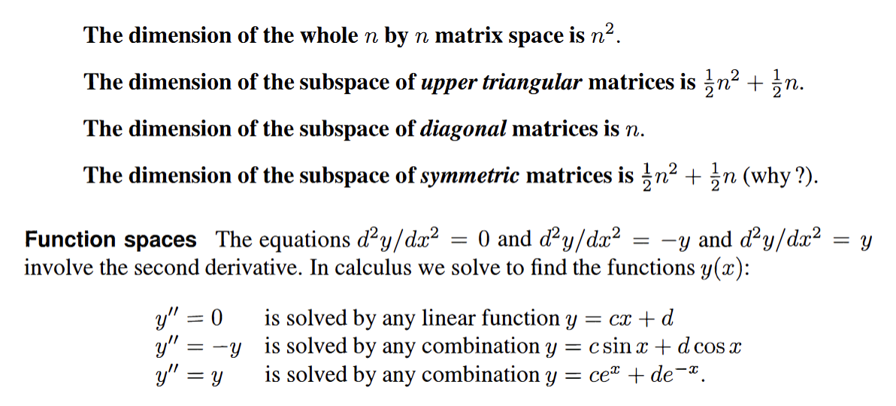

1. Independent Vectors (no other vectors)
2. Spanning a Space(enough to produce the rest)(可有盈余)
3. Basis for a space(not too many or too few)
4. Dimention of a space(the number of vectors in a space)

Span:
row space/ column space
The row space of $A$ =the column space of $A^{T}$

Basis for a vector space:
span a space+ linear independent
Dimention:
The dimension of s space is the number of vectors in every basis
超出几何概念的理解：

