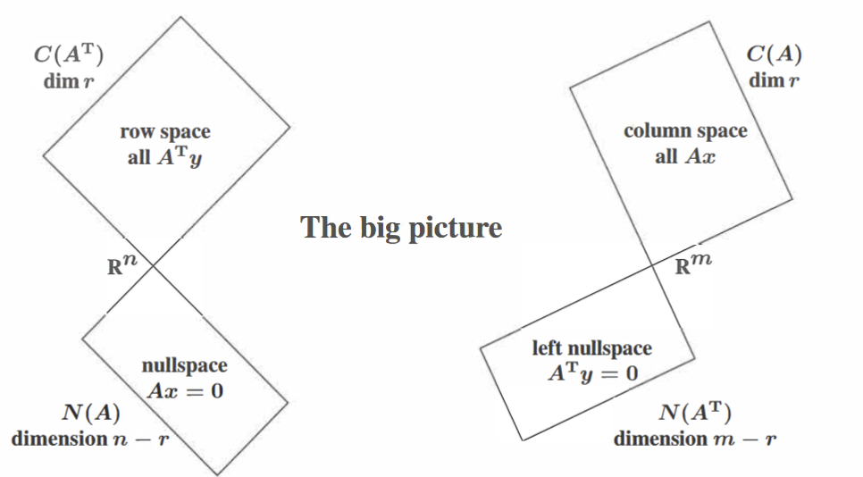
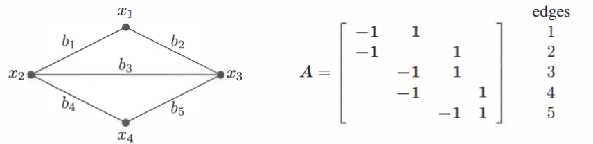
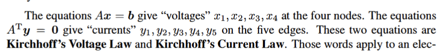

*Four fundemental subspaces*
- row space of $A$: $C(A^{T})$  , a subspace of $R^{n}$
- column space fo $A$: $C(A)$, a subspace of $R^{m}$
- nullspace of $A$ $N(A)$, a subspace of $R^{n}$
- left nullspace of $A$: $N(A^{T})$ ; the combination of the rows of $A$, a subspace of $R^{m}$

$A,A^{T}$ are usually different; but their column spaces and nullspaces are connected!
### The Four Subspaces for $R$
- The dimention of the row space is $r$; The nonezero rows of $R$ form a basis
- The dimention of the column space is $r$  The piviot columns form a basis
- The nullspace of $R$ has dimention $n-r$
- The nullspace of $R^{T}$ has dimention m-r
### From $R$ to $A$

notice:  understand row sapce/coumn space= all $Ax$/ $A^{T}y$
the right side can be described in a space while the left side can be disacribed in another
1. $A$ has the same row space of $R$; Same dimention and same basis
2. The column space of $A$ has dimention $r$ The column rank=row rank; but: $C(A)$ probably do not equal $C(R)$
 e.g:
 $A = \begin{bmatrix} 1 & 2 \\ 2 & 4 \end{bmatrix}$ and $R = \begin{bmatrix} 1 & 2 \\ 0 & 0 \end{bmatrix}$
  Their column spaces are of the same dimention but they are different lines
3. $A$ has the same nullspace as $R$ Same dimention $n-r$ and the same basis
   (dimention of the column space)+(dimention of the nullspace)=dimention of $R^{n}$
4. The left nullsapce of $A$ has dimention $m-r$

another perspective: node&edges

row: edges; columns: nodes
in the pic: edges 1,2,3 form a loop: row 1,2,3 are independent
edges 1,2,4 form a tree(have no loops): row 1,2,4 are independent

